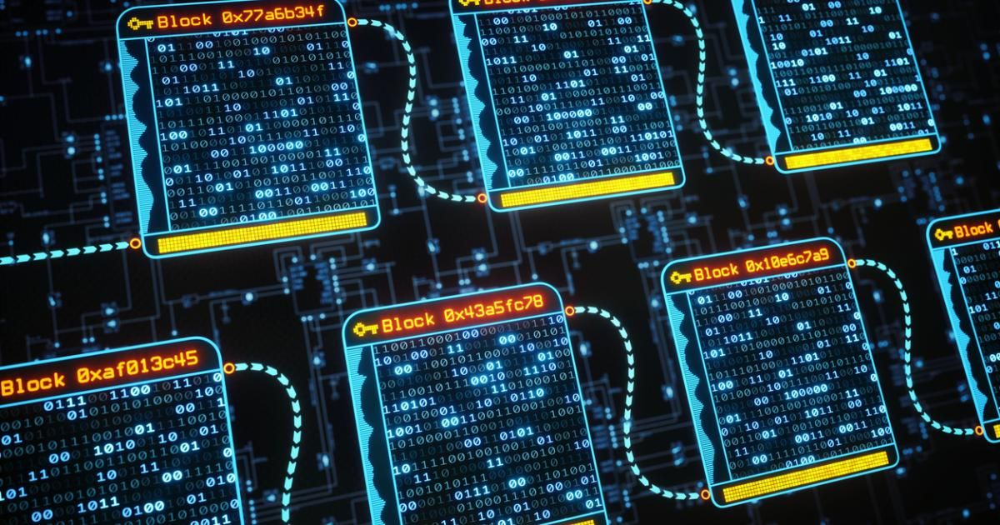
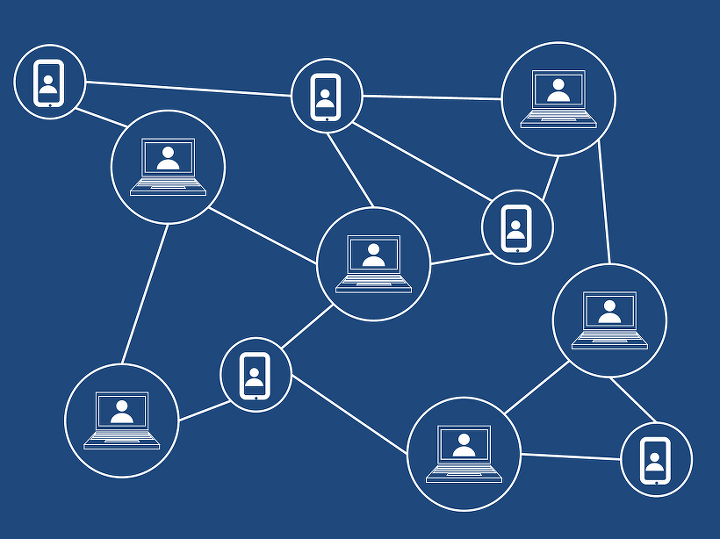
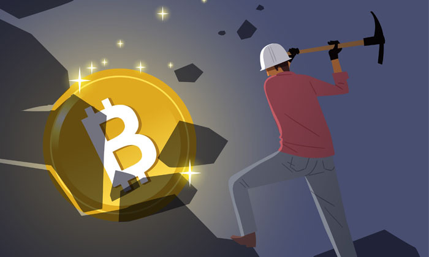
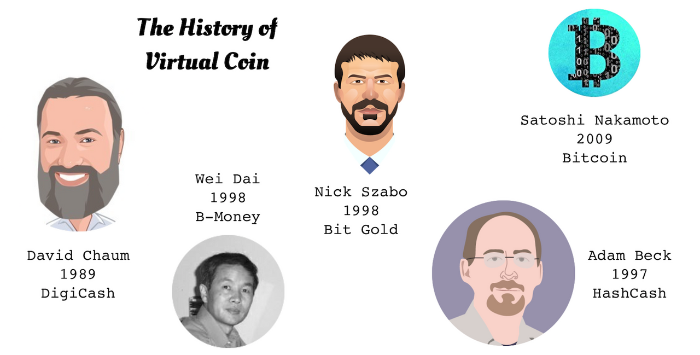
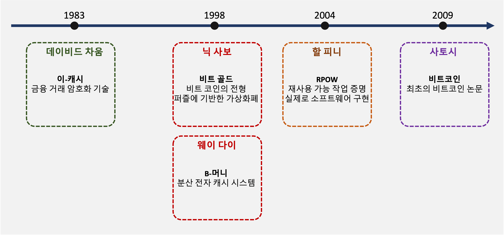
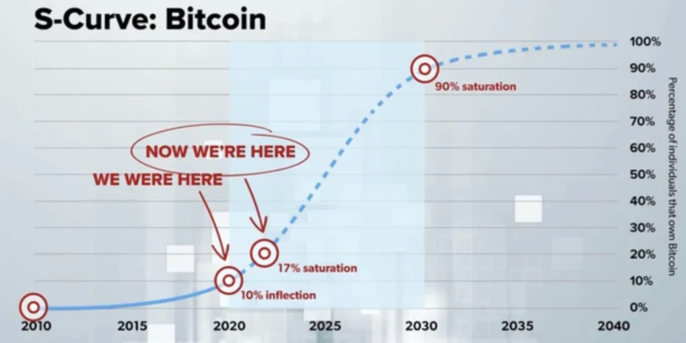

---

**Table of Contents**
{: #toc }
*  TOC
{:toc}

---

# 블록체인이란
**블록체인(blockchain)이란 다수의 거래내역을 묶어 블록을 구성하고, 해시를 이용하여 여러 블록들을 체인처럼 연결한 뒤, 다수의 사람들이 복사하여 분산 저장하는 알고리즘이다.**   

블록체인은 **비트코인과 이더리움 등 암호화폐**에 사용된 핵심 기술이다. 은행 등 제3의 중개기관이 없더라도 블록체인 기술을 이용하면 누구나 신뢰할 수 있는 안전한 거래를 할 수 있다. 블록체인은 암호화폐뿐 아니라, 온라인 거래내역이 있고 이력관리가 필요한 모든 데이터 처리에 활용할 수 있다. 블록체인 기반의 **스마트 계약, 물류관리 시스템, 문서관리 시스템, 의료정보관리 시스템, 저작권관리 시스템** 등 다양한 활용이 가능하다.  

블록체인은 간략히 **'분산원장'(分散元帳, distributed ledger) 기술**이라고 한다. 즉, 거래내역을 기록한 원장을 다수의 사람들에게 분산하여 저장·관리하는 기술이다. 자세히 설명하면, 블록체인이란 다수의 온라인 거래 기록을 묶어 하나의 데이터 블록(block)을 구성하고, 해시(hash) 값을 이용하여 이전 블록과 이후 블록을 마치 체인(chain)처럼 연결한 뒤, 이 정보의 전부 또는 일부를 피투피(P2P) 방식으로 전 세계 여러 컴퓨터에 복사하여 분산 저장·관리하는 기술이다.  

{: width="70%"}

# 블록체인에 대한 오해
위의 내용은 [(해시넷: 블록체인)](http://wiki.hash.kr/index.php/블록체인){:target="_blank"}에서 작성한 글의 일부를 가져온 것입니다.  

'제 3자가 필요 없어지고, 이에 따라 수수료도 사라지는 이상적인 플랫폼'. 많은 사람들은 블록체인을 이용하면 그동안의 거래 시스템 전반에 많은 혁신을 가져다 줄 것으로 기대했습니다. **하지만 현실은 그렇지 않았습니다. 블록체인의 등장은 그동안 불필요했던 새로운 형태의 중개인을 양산했고, 암호화폐 재단, 채굴업자, 중개소에 종속되며 빠르게 중앙화되어갔습니다**. 또한 독립적인 화폐를 내세웠던 암호 화폐는 선채굴을 악용한 채굴업자들이 암호화폐 대부분을 장악한 후 전 세계 중개소를 통해 일반인들을 선동, 호도하며 내다팔아 막대한 수익을 얻었습니다.  

저는 이번 BlockChain Series를 준비하며 앞으로 블록체인의 미래가 어떻게 될지 한 번 알아보려고 합니다.  

# 블록체인 용어 바로 알기

## 분산 vs 탈중앙화
블록체인을 공부하다 보면 분산, 탈중앙화라는 단어가 많이 사용되는 것을 보게 됩니다. 하지만 블록체인과 일반적인 분산 시스템과는 약간 다른 점이 있습니다. **분산 시스템은 데이터를 여러 노드에 분산해 나누어 처리하기 때문에 효율적입니다.** 하지만 **블록체인은 같은 데이터(거래 내역 등)를 모든 노드가 중복 처리합니다. 이 방법은 데이터의 신뢰도를 높일 수는 있지만 비효율적입니다.**  

|**특징**|**분산**|**탈중앙화**|
|저장|여러 노드에 분산 저장|여러 노드에 중복 저장|
|처리|여러 노드가 분산 처리|여러 노드가 중복 처리|
|장점|높은 효율성|높은 신뢰성|

## 디지털화 vs 블록체인
블록체인을 공부하면서 블록체인의 장점으로 시스템의 효율성과 안전한 데이터 저장이라는 글을 본 적이 있습니다. 하지만 이는 디지털화(digitalization)의 장점이며 블록체인은 정확히 이것과 반대입니다. **블록체인은 효율성을 포기하고 데이터의 신뢰성을 높인 것이며, 데이터는 보안되지 않고 모든 사용자에게 공개되어 저장됩니다.** 따라서 블록체인은 보안과 효율을 위한 도구가 아니고 신뢰받는 제 3자 없이 거래가 가능한 플랫폼을 만들기 위한 실험적 과정에 있는 개념이라고 생각하면 됩니다.  

## 가상 화폐 vs 암호 화폐
가상 화폐는 어떤 실물의 가치를 디지털화한 것을 의미하며, **암호 화폐는 가상 화폐의 일부로 블록 체인을 기반으로 만들어진 화폐**를 의미합니다. 암호화 되었다는 뜻은 암호 화폐를 보내는 송신인과 수신인이 암호화된 공개키를 통해서만 거래를 하기 때문으로 이는 금융 시스템의 투명성을 해치고 악용될 여지가 많습니다.

## 거래소 vs 중개소
거래소는 금융 거래소에서 가져온 단어로 금융 거래소는 거래 시스템에 필요한 환경과 제도가 잘 갖춰져 있습니다. 하지만 암호 화폐 거래소의 경우 암호 화폐의 가격이 단일화 되어 있지도 않고, 거래소 안에 엄격한 규정이 적용되어 있지도 않습니다. 그래서 정확한 명칭은 **암호 화폐 중개소 정도가 적합합니다.** 그리고 온라인 상에 있는 많은 중개소들은 블록체인과는 별 관련이 없습니다. 중개소는 그저 암호 화폐를 이용하는 지갑이라는 소프트웨어와 온라인 주식 매매에 이용되는 HTS 기능 중 일부를 사용해 거래를 중개하는 브로커일 뿐입니다. 

## 트랜잭션 vs 거래내역
IT 분야에서는 트랜잭션을 보통 업무 처리의 단위로 얘기 하고 특히 데이터베이스 분야에서는 더 이상 쪼갤 수 없는(또는 더 쪼개면 심각한 오류가 발생할 수 있는)최소한의 업무 처리 단위를 의미합니다. **블록체인에 있어서 트랜잭션은 '정의된 이벤트가 발생하는 것'을 의미하며 거래 내역을 포함한 더 포괄적인 의미입니다.** 

## 디지털 자산
암호 화폐는 디지털 자산이 아닙니다. 디지털 자산은 저작권, 소유권 등의 권리를 디지털화 한 것으로 이는 실질적인 가치를 내재하고 있습니다. 하지만 **암호 화폐는 내재 가치가 0인 디지털 숫자에 불과합니다.** 하지만 내재 가치가 0인 경우에도 가치를 가질 수 있습니다. 그러기 위해 필요한 것이 바로 '신뢰'입니다. 따라서 **암호 화폐가 실제로 가치를 가지기 위해서는 사람들로부터의 신뢰가 필요합니다.** 예를 들어 지폐가 있습니다. 지폐는 종이에 불과하지만 그 뒤에 그 지폐를 발행한 국가의 법령과 신뢰가 뒷받침하기 때문에 실질적인 가치를 가질 수 있는 것입니다. 주식도 온라인 증명서에 불과하지만 주식을 발행한 기관의 신뢰 덕분에 가치를 가지게 됩니다. 

# 블록체인의 역사

## 사이퍼펑크
블록체인은 사이퍼펑크(cypherpunk) 운동에 뿌리를 두고 있습니다. 사이퍼펑크란 중앙집권화된 국가와 거대 기업들에 대항하여 개인의 프라이버시를 보호하기 위해 암호기술을 이용하여 익명성을 보장하는 탈중앙화 시스템을 만드려는 행동주의자들을 말합니다. 

## 비트코인의 탄생
2008년 사토시 나카모토란 가명으로 암호화 커뮤니티에 논문이 하나 올라왔습니다. 제목은 **비트코인: P2P 전자 캐시 시스템**으로 사토시는 이 논문에서 코인을 그 누구의 간섭도 받지 않는 결제 수단이라고 설명했습니다. 그리고 2009년 1월 비트코인의 개념을 실제로 소프트웨어로 구현되어 최초의 블록(제네시스 블록 또는 0번 블록)이 생성되었습니다. 비트코인은 현재까지 10분에 하나꼴로 블록이 만들어지고 있으며 2019년 10월 기준 70만개의 블록이 만들어졌습니다. (참고로 사토시의 정체는 아직까지 밝혀지지 않았다고 합니다)

# 블록? 블록체인? 비트코인?
블록체인을 공부하다 보면 블록의 정체가 무엇인지 또 나는 블록체인을 공부하는데 왜 자꾸 나도 모르는 사이에 비트코인이라는 단어가 등장하는 건지 의아했었습니다. (참고로 사토시가 공개한 비트코인에 관한 논문에는 '블록'과 '체인'이라는 명사가 독립적으로 사용되기는 했지만 '블록체인'이라는 단어는 한 번도 등장하지 않았습니다.)   

## 블록
블록은 전산학에서 보통 **한꺼번에 처리되는 논리적 데이터 단위**를 일컫습니다. 비트코인에서는 트랜잭션들을 1메가바이트를 넘지 않는 선에서 계속 묶었다가 **1메가바이트 직전이 되면 블록**으로 만듭니다. 보통 이렇게 하나의 블록이 만들어지는데 **10분 정도**가 걸립니다.  

|**블록**|**설명**|
|정의|한꺼번에 처리되는 데이터 단위|
|크기|최대 1MB|
|트랜잭션 수|2000~3000개|
|생성 시간|평균 10분|

## 블록체인
트랜잭션 데이터를 포함하는 **블록을 앞의 블록의 해시값을 이용해 연결한 것을 블록체인**이라고 합니다. 블록은 각각의 노드에서 자신이 가지고 있는 트랜잭션들을 묶다가 블록을 만들 수 있는 시점이 되면 **비동기적으로 블록을 만들기 위해 경쟁**합니다. **이 때의 경쟁을 채굴(mining)이라고 하며 가장 먼저 블록을 만든 노드의 블록만을 모든 노드의 블록체인에 추가합니다.**  

## 비트코인
비트코인 생태계(네트워크)에서 **채굴로 얻게되는 보상을 '비트코인'**이라고 합니다. 이 보상을 얻기 위해 채굴자들이 그렇게 앞다투어 채굴을 했던 것입니다. 여기서 채굴은 블록을 만들 때 블록에 필요한 해시값을 찾는 과정을 일컫습니다. 채굴에 대한 보상으로 얻게되는 비트코인의 수량은 어떻게 책정될까요? **보상금은 보조금과 수수료의 합**으로 이루어지는데, 보조금은 채굴로 얻게되는 고정 수익을 말하고, 수수료는 비트코인 거래 시 송신자로부터 얻게 되는 것으로 수수료는 송신자가 스스로 정하게 됩니다. 그래서 보통 더 높은 수수료를 지불한 트랜잭션이 먼저 블록에 포함되게 됩니다. 보조금의 경우 제네시스 블록이 생성됐을 때에는 50BTC 였으나, 보조금은 블록이 21만개 생성될 때마다 반감되도록 설정되어 현재는 블록을 하나 생성할 때마다 6.25BTC를 얻게 됩니다.  

블록은 평균 10분 마다 한 개씩 생성되고 보조금은 21만개 마다 계속 반감되기 때문에 시간이 지나면 블록을 생성해도 더 이상 비트코인이 (거의) 발행되지 않게 될 것입니다. 이론적으로 **2033년에 거의 포화되는 시점에 다다를 것으로 보며 그 때까지 누적된 비트코인의 양은 2100만BTC**라고 합니다. 이렇게 채굴에 대한 보상이 극도로 낮아질 경우, 채굴자가 급격히 줄어들게 될 것이고, 이는 비트코인 시스템의 안전성을 급격하게 저하시키게 됩니다. 

# 마치며
지금까지 블록체인에 대해 공부하기 전에 알고가면 좋은 지식들에 대해 살펴보았습니다. 다음 포스트에서는 블록체인의 동작원리에 대해 알아보겠습니다.  

# 참고
- [블록체인 해설서 책](http://www.kyobobook.co.kr/product/detailViewKor.laf?ejkGb=KOR&mallGb=KOR&barcode=9791161752709&orderClick=LAG&Kc=){:target="_blank"}  
- [해시넷: 블록체인](http://wiki.hash.kr/index.php/블록체인){:target="_blank"}  
