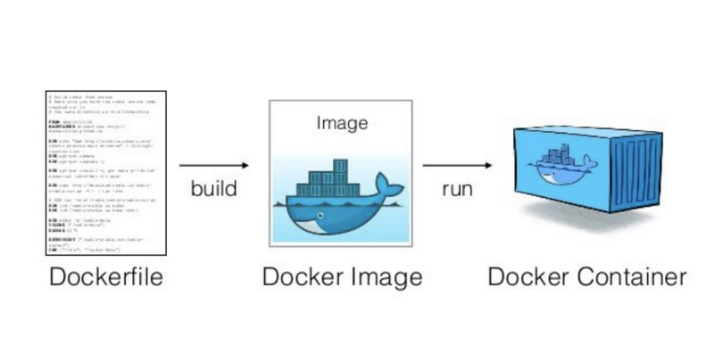

---

**Table of Contents**
{: #toc }
*  TOC
{:toc}

---
# 도커 소개  

**Docker는 컨테이너 기술을 이용해 개개인의 인프라 환경에 상관없이 모든 애플리케이션을 독립적으로 배포, 실행** 가능하도록 해줍니다. 컨테이너 기술은 가상화를 위한 방법 중 하나인데 이에 관한 더 자세한 내용은 추후에 다루어 보도록 하겠습니다.  

개발자들에게 있어 골칫거리 중 하나는 새로 만든 애플리케이션을 개발 환경에서 테스트 환경으로, 테스트 환경에서 운영환경으로 옮길 때마다 온갖 이상한 오류를 만난다는 것입니다. 그 이유는 인프라 환경마다 네트워크 기술과 보안 정책, 스토리지가 모두 제각각이어서 그렇습니다. 그래서 '소프트웨어를 한 컴퓨팅 환경에서 다른 컴퓨팅 환경으로 이동하면서도 안정적으로 실행하는 방법이 없을까?'라는 고민이 커졌고 그 대답이 바로 컨테이너였습니다.  

개념은 간단합니다. 애플리케이션과 그 실행에 필요한 라이브러리, 바이너리, 구성 파일 등을 패키지로 묶어 배포하는 것입니다. 이렇게 하면 노트북-테스트 환경-실제 운영환경으로 바뀌어도 실행에 필요한 파일이 함께 따라다니므로 오류를 최소화할 수 있습니다. **운영체제를 제외하고 애플리케이션 실행에 필요한 모든 파일을 패키징**한다는 점에서 운영체제 위에서 구현된 가상화, 즉 **'운영체제 레벨 가상화'**라고 부르기도 합니다.  

참고로 도커 이전에도 컨테이너 기술을 이용한 운영체제 레벨의 가상화는 있었습니다. 구글에서는 도커가 등장하기 전부터 이러한 기술을 회사 내부적으로 이용하고 있었다고 합니다. 그러나 기술적으로 높은 진입 장벽 때문에 대중화되지 않았던 것 뿐입니다.  

이러한 상황 속에서 도커가 등장하게 되면서 **컨테이너 기술**에 대한 접근성이 훨씬 좋아지게 되었고, 개발자들은 이제 모든 애플리케이션을 컨테이너화하여 사용하기 시작했습니다. 이렇게 도커는 인프라 세계를 컨테이너 세상으로 바꿔버렸습니다. 필요한 모든  애플리케이션들을 **도커파일을 이용해 이미지를 만들고 컨테이너로 배포하는 게 흔한 개발 프로세스**가 되었습니다.  

# 도커의 장점  

- 애플리케이션을 인프라 환경에 상관없이 빠르게 배포할 수 있습니다.
- 어플리케이션을 실행하기 위한 독립적인 컨테이너 환경을 제공해 서비스간 디펜던시 오류를 해결해줍니다.   
- 별다른 운영체제 소프트웨어가 필요없어 가볍습니다.  

# 도커의 구조
- 도커의 아키텍처는 클라이언트-서버 아키텍처입니다. 
- 도커 클라이언트(`docker`)는 도커 (REST) API를 사용해 도커 데몬(`dockerd`)에게 요청 메시지를 보냅니다. 
- `dockerd`은 요청을 받으면 이미지, 컨테이너, 네트워크, 볼륨과 같은 도커 오브젝트를 생성하고 관리합니다.   
- 도커 레지스트리는 public한 곳(docker hub)도 있고, private(AWS의 ECR)한 곳도 있습니다.   

  

# 도커의 구성요소

## 도커 데몬
도커 데몬(`dockerd`)은 클라이언트로부터 API 요청을 수신하고 Image, Container, Network 및 Volume과 같은 Docker Object를 관리합니다.  

## 도커 클라이언트
도커 클라이언트(`docker`)는 사용자가 도커 데몬과 통신하는 주요 방법입니다. `docker run`과 같은 명령을 사용하면 도커 클라이언트는 해당 명령을 도커 데몬에게 전송하고 도커 데몬은 명령을 수행하게 됩니다.  

## 도커 오브젝트

  
[(출처: 오웬의 개발 이야기)](https://devowen.com/249){:target="_blank"}  

### 이미지
도커 이미지는 도커 컨테이너를 생성하기 위한 읽기 전용 템플릿입니다. 기본 이미지 위에 원하는 커스터마이징을 통해 새로운 이미지를 만들 수도 있으며, 이렇게 만들어진 이미지는 Docker Registry에 Push하여 공유할 수 있습니다. 이미지를 만들때에는 Dockerfile에 필요한 명령어를 정의하여 만들 수 있습니다. Dockerfile에 정의된 각각의 명령어들은 이미지의 Layer를 생성하며, 이러한 Layer들이 모여 이미지를 구성합니다. Dockerfile을 변경하고 이미지를 다시 구성하면 변경된 부분만 새로운 Layer로 생성됩니다. 이러한 Image의 Layer구조는 Docker가 타 가상화 방식과 비교할 때, 매우 가볍고 빠르게 기동할 수 있는 요인이 됩니다.  

### 컨테이너
컨테이너는 Docker API 사용하여 생성, 시작, 중지, 이동 또는 삭제 할 수 있는 이미지의 실행가능한 인스턴스를 나타냅니다. 컨테이너를 하나 이상의 네트워크에 연결하거나, 저장 장치로 묶을 수 있으며, 현재 상태를 바탕으로 새로운 이미지를 생성할 수도 있습니다. 기본적으로 컨테이너는 Host 또는 다른 컨테이너로부터 격리되어 있습니다. 컨테이너가 제거될 때는 영구 저장소에 저장되지 않은 변경 사항은 모두 해당 컨테이너와 같이 사라집니다.  

도커 내부에 대해 조금 더 알아보고 싶으시다면 [**[Docker의 아키텍처 이해하기]**](https://jaykim0510.github.io/docker-series7)포스트를 참고하셔도 좋습니다.  

# 참고
- [도커 공식문서](https://docs.docker.com/get-started/overview/){:target="_blank"}
- [Rain.i님의 도커 컨테이너 까보기(1) – Protocol, Registry 포스트](http://cloudrain21.com/examination-of-docker-protocol-registry){:target="_blank"}
- [yjs0997님의 [Docker 기본(2/8)] Docker’s Skeleton 포스트](https://medium.com/dtevangelist/docker-기본-2-8-dockers-skeleton-649f818b5c3e){:target="_blank"}
- [ITWorld 용어풀이: 컨테이너(container), IT World](https://www.itworld.co.kr/t/62077/VDI/103469){:target="_blank"}