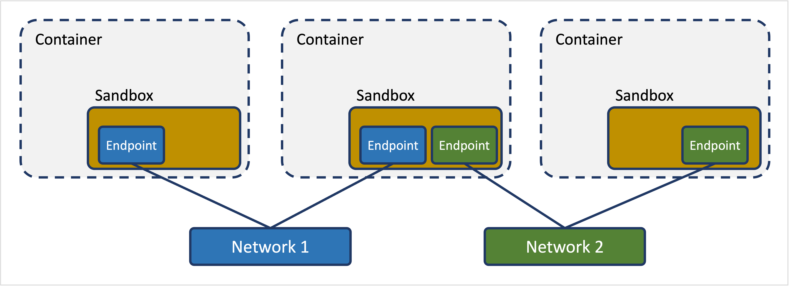
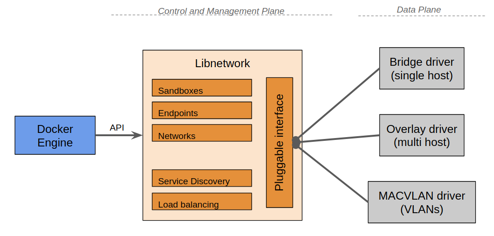
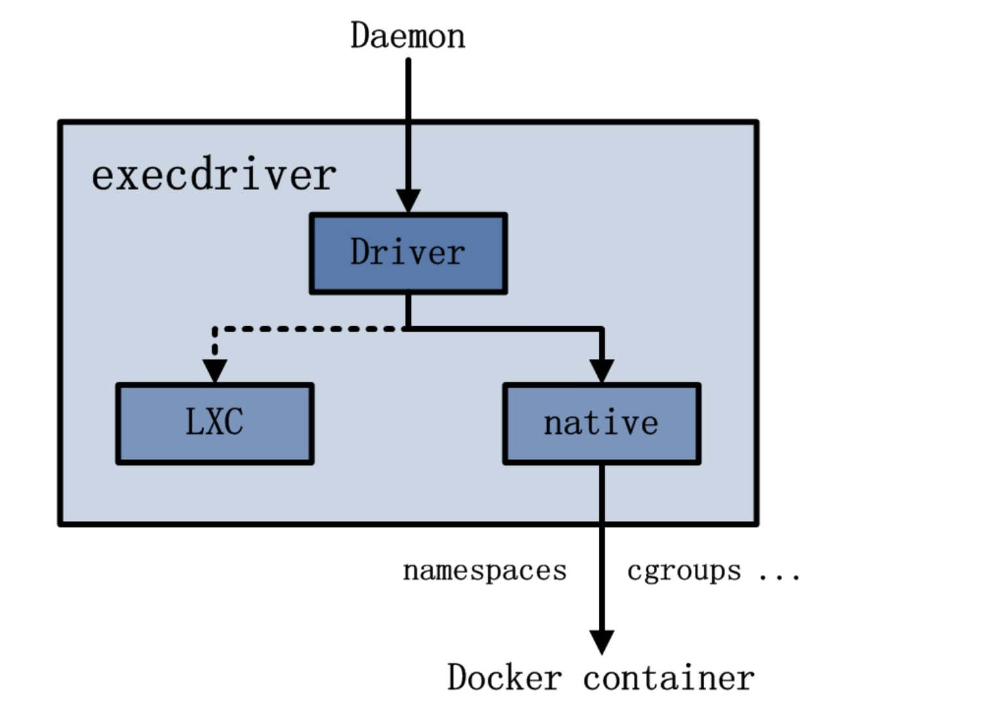

**Table of Contents**
{: #toc }
*  TOC
{:toc}

---

# Desktop, Engine, Server, Host, Daemon

도커를 공부하면서 Docker Desktop, Engine, Server, Host, Daemon이라는 용어들의 관계가 조금 헷갈렸었습니다. 지금까지 배웠던 내용을 토대로 다음 용어들을 짧게 정리해볼까 합니다. 

  

- **Docker Desktop**  
Mac, Windows 환경에서의 도커 애플리케이션입니다. 도커는 리눅스 기반의 운영체제에서 동작하는 어플리케이션이지만 Docker Desktop을 통해 Mac, Windows에서도 사용할 수 있도록 해줍니다. 또한 Docker Engine뿐 아니라 Docker Compose도 기본적으로 함께 설치되며 Kubernetes도 클릭 한 번으로 설치가능하도록 해줍니다.  

- **Docker Engine**  
일반적으로 저희가 도커를 생각할 때 가지고 있는 기능들을 곧 Docker Engine이라고 합니다. 다시 말해 도커 컨테이너를 생성하기 위해 요청하는 Client, 실제 컨테이너를 생성하고 관리하는 Server를 포함하는 Client-Server Application을 말합니다.  

- **Docker Server**  
Docker Client로 부터 REST API 형태로 요청을 받았을 때 그 요청을 토대로 실제로 컨테이너를 생성하고 관리하는 부분을 말합니다.  

- **Docker Host**  
Docker Host는 Docker Engine이 설치된 곳을 말합니다. 제 컴퓨터가 Linux기반의 운영체제였다면 제 컴퓨터 자체가 Host가 되었을 것이고, 만약 클라우드 환경에서 서버를 하나 빌려서 거기에 도커를 설치했다면 빌린 서버가 Host가 될 것입니다.  

    참고로 제가 지금 사용하고 있는 환경은 Mac입니다. Mac의 운영체제는 Unix 계열의 운영체제로 Linux와는 사용하는 커널이 약간 달라서 결론적으로 도커를 다이렉트로 설치할 수 없습니다. 그래서 macOS 위에 Linux Virtual Machine을 하나 더 띄우고 그 위에서 도커를 설치 사용하게 됩니다. 이렇게 사용하면 기본적으로 Linux VM에 2GB 정도의 메모리가 사용된다고 합니다.  
    [(참고: How much overhead from running Docker on a Mac?)](https://www.reddit.com/r/docker/comments/rhorhs/how_much_overhead_from_running_docker_on_a_mac/)

- **Docer Daemon**  
Docker Daemon은 Docker Server 안에 있는 핵심 요소 중 하나로 클라이언트로부터 API 요청을 수신하고 Image, Container, Network 및 Volume과 같은 Docker Object를 관리합니다.  


지금까지 도커의 큰 그림에서의 구성요소에 대해 살펴보았습니다. 지금부터는 그 중 Docker Server의 내부에 대해서 조금 더 살펴보려고 합니다. 위의 그림을 보면 Docker Client가 요청을 하면 나머지는 Docker Server에서 실행이 이루어지는데 Docker Server가 요청을 수행하기 위해 내부적으로 어떤 과정을 거치는지 한 번 알아보겠습니다.  

# Docker Server
아래 그림은 Docker Server의 아키텍처를 보여주는 좋은 그림입니다. 비록 2014년도에 그려진 그림이어서 최근 버전의 도커와는 차이가 있을 수 있지만 도커의 기본 구성요소를 공부하는 데에는 좋은 자료라고 생각합니다.  

크게 두 개의 사각형 덩어리가 각각 Docker Daemon과 Docker Driver입니다.(~~개인적으로 Engine이라고 적힌 부분은 마치 엔진과 같은 역할을 한다는 뜻일 뿐 저희가 위에서 배운 Docker Engine을 뜻하는 건 아니라고 생각합니다.~~)

  

## Docker Daemon
Docker daemon 은 docker engine 내에서 주로 client 및 registry, driver 의 중심에서 작업의 분배를 담당하는 중심점이라고 보면 됩니다. client 로부터의 HTTP 요청을 내부 job 단위(가장 기본적인 작업 실행 단위)로 처리할 수 있도록 분배합니다. 즉, HTTP server 의 역할과 함께 client 요청을 분배(route and distribute), scheduling 하고, 요청에 대한 적합한 Handler 를 찾습니다. 요청에 대해 실질적인 처리는 Handler 를 통해 다른 모듈 들에게 전달하여 수행하고 그 결과를 응답으로 작성하여 client 에게 제공합니다.  

## Docker Driver  
Docker Driver 는 크게 세 가지 범주로 나눌 수 있습니다.

- **graphdriver** : container image 관리
- **networkdriver** : 가상 bridge 등 container 의 network 관리
- **execdriver** : container 생성 관리  

### Storage Driver
graphdriver는 Storage Driver 라고 이해하면 됩니다. `/var/lib/docker` 내에 저장되어 있는 container, image 관련 정보들을 이용하여 사용자에게 통합된 File System으로 제공하는 드라이버입니다. built-in graphdriver 로는 `btrfs`, `vfs`, `auts`, `devmapper`, `overlay2` 등이 있습니다. Storage Driver에 관한 내용은 [**이 포스트**](https://jaykim0510.github.io/docker-series6)를 참고하시면 됩니다.  

### Network Driver
도커의 네트워크의 철학은 **CNM(Container Network Model)**을 따릅니다. CNM은 컨테이너를 사용하는 환경에서 사용자가 네트워크 설계를 쉽게 하기 위한 것입니다. 다시 말해, 복잡한 물리적인 환경을 고려할 필요없이 사용자는 네트워크를 설계할 때 추상적인 개념만을 이용해 설계할 수 있게 됩니다. 이러한 추상화는 운영체제나 인프라 환경에 구애받지 않는 설계를 가능하도록 해줍니다. CNM을 구성하는 요소는 크게 다음과 같이 3가지가 있습니다.  

  

- **Sandbox**: 컨테이너의 Network의 많은 Endpoint를 설정하는 곳으로 Linux network namespace와 비슷한 개념으로 구현
- **Endpoint**: 컨테이너 내의 eth 와 외부의 vth의 페어
- **Network**: 네트워크는 직접적으로 통신을 할 수 있는 엔드포인트를 연결하는 역할  

2개의 Sandbox 안에 각각 Endpoint 요소를 하나 씩 만들고, 그 Endpoint 둘을 Network 이라는 요소에 연결해 컨테이너 간의 통신을 위한 네트워크를 구현할 수 있습니다. **이러한 개념(CNM)으로 네트워크를 구현해 놓은 것이 libnetwork이고 사용자가 사용할 수 있도록 기능을 제공하는 드라이버가 Networkdriver 입니다.**    

 

Libnetwork provides the network control and management plane (native service discovery and load balancing). It accepts different drivers to provide the data plane (connectivity and isolation).  

Some of the network drivers that we can choose are:  

- **bridge**: it creates single-host bridge networks. Containers connect to these bridges. To allow outbound traffic to the container, the Kernel iptables does NAT. For inbound traffic, we would need to port-forward a host port with a container port.  

```
🦊 **Note**  
Every Docker host has a default bridge network (docker0).  
All new container will attach to it unless you override it (using --network flag).   
```

- **MACVLAN**: Multi-host network. Containers will have its own MAC and IP addresses on the existing physical network (or VLAN). Good things: it is easy and does not use port-mapping. Bad side: the host NIC has to be in promiscuous mode (most cloud provider does not allow this).
- **Overlay**: it allows containers in different hosts to communicate using encapsulation. It allows you to create a flat, secure, layer-2 network.


Note: Docker creates an Embedded DNS server in user-defined networks. All new containers are registered with the embedded Docker DNS resolver so can resolve names of all other containers in the same network.  

### Execdriver
Execdriver는 컨테이너 생성 및 관리에 관한 역할을 담당합니다. 즉, 커널의 격리 기술을 이용하여 컨테이너를 생성하고 실행하는 역할을 합니다. Execdriver의 하위 드라이버인 Runtime driver로는 예전에는 리눅스의 `LXC`를 이용했지만 최근버전의 도커는 도커내에서 개발한 Docker native runtime driver인 `libcontainer`나 `runc`를 이용합니다.  

Execdriver에서 선택된 LXC 또는 native driver는 Linux Kernel 에서 제공하는 cgroups, namespace 등의 기능을 이용할 수 있는 interface를 제공하고, 이를 통해 도커는 컨테이너 생성 및 관리에 필요한 실질적인 기능들을 제공합니다.
docker run 을 실행하면 이는 결국 execdriver -> runtime driver -> cgroups, namespace 등의 기능을 이용하는 인터페이스에 의해 container 환경이 마련되고 기동되는 것이다.  

  

# 참고
- [Rain.i님의 도커 컨테이너 까보기(4) – Docker Total Architecture 포스트](http://cloudrain21.com/examination-of-docker-total-architecture){:target="_blank"}
- [Maria Valcam, Docker: All you need to know — Containers Part 2](https://medium.com/hacking-talent/docker-all-you-need-to-know-containers-part-2-31120eeb296f){:target="_blank"}