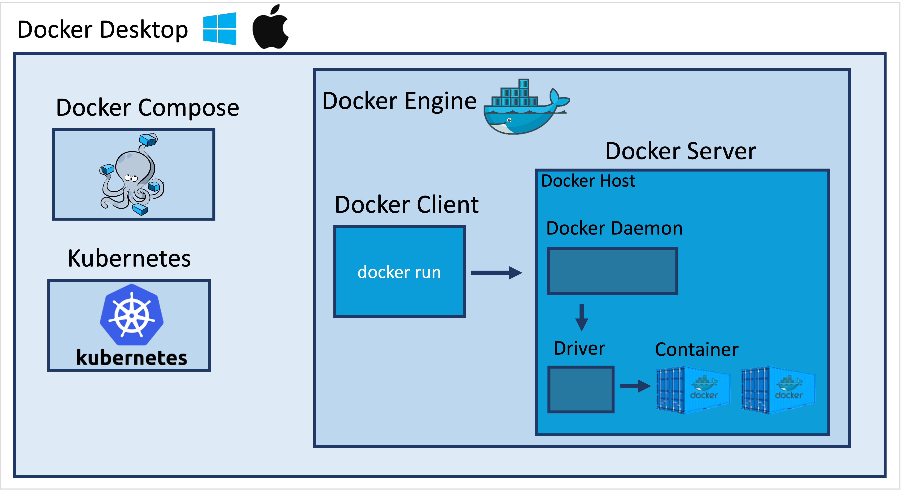

**Table of Contents**
{: #toc }
*  TOC
{:toc}

---

# Desktop, Engine, Server, Host, Daemon

도커를 공부하면서 Docker Desktop, Engine, Server, Host, Daemon이라는 용어들의 관계가 조금 헷갈렸었습니다. 지금까지 배웠던 내용을 토대로 다음 용어들을 짧게 정리해볼까 합니다. 

  

- **Docker Desktop**  
Mac, Windows 환경에서의 도커 애플리케이션입니다. 도커는 리눅스 기반의 운영체제에서 동작하는 어플리케이션이지만 Docker Desktop을 통해 Mac, Windows에서도 사용할 수 있도록 해줍니다. 또한 Docker Engine뿐 아니라 Docker Compose도 기본적으로 함께 설치되며 Kubernetes도 클릭 한 번으로 설치가능하도록 해줍니다.  

- **Docker Engine**  
일반적으로 저희가 도커를 생각할 때 가지고 있는 기능들을 곧 Docker Engine이라고 합니다. 다시 말해 도커 컨테이너를 생성하기 위해 요청하는 Client, 실제 컨테이너를 생성하고 관리하는 Server를 포함하는 Client-Server Application을 말합니다.  

- **Docker Server**  
Docker Client로 부터 REST API 형태로 요청을 받았을 때 그 요청을 토대로 실제로 컨테이너를 생성하고 관리하는 부분을 말합니다.  

- **Docker Host**  
Docker Host는 Docker Engine이 설치된 곳을 말합니다. 제 컴퓨터가 Linux기반의 운영체제였다면 제 컴퓨터 자체가 Host가 되었을 것이고, 만약 클라우드 환경에서 서버를 하나 빌려서 거기에 도커를 설치했다면 빌린 서버가 Host가 될 것입니다.  

    참고로 제가 지금 사용하고 있는 환경은 Mac입니다. Mac의 운영체제는 Unix 계열의 운영체제로 Linux와는 사용하는 커널이 약간 달라서 결론적으로 도커를 다이렉트로 설치할 수 없습니다. 그래서 macOS 위에 Linux Virtual Machine을 하나 더 띄우고 그 위에서 도커를 설치 사용하게 됩니다. 이렇게 사용하면 기본적으로 Linux VM에 2GB 정도의 메모리가 사용된다고 합니다.  
    [(참고: How much overhead from running Docker on a Mac?)](https://www.reddit.com/r/docker/comments/rhorhs/how_much_overhead_from_running_docker_on_a_mac/)

- **Docer Daemon**  
Docker Daemon은 Docker Server 안에 있는 핵심 요소 중 하나로 클라이언트로부터 API 요청을 수신하고 Image, Container, Network 및 Volume과 같은 Docker Object를 관리합니다.  