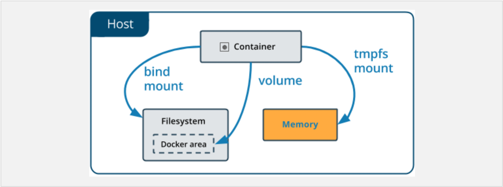

**Table of Contents**
{: #toc }
*  TOC
{:toc}

---

- 도커파일 VOLUME
- docker run 옵션(-v, -mount)
- docker compose volumes
- docker compose services volumes

# 도커에서 데이터 관리하기  

기본적으로 컨테이너 안에서 생성된 모든 파일은 **컨테이너 레이어에 저장**됩니다. 다시 말해,

- 해당 컨테이너가 더 이상 존재하지 않으면 데이터가 유지되지 않으며 다른 프로세스에서 데이터를 컨테이너에서 꺼내기가 어려울 수 있습니다.
- 컨테이너 계층은 컨테이너가 실행 중인 호스트 머신에 긴밀하게 연결됩니다. 데이터를 다른 곳으로 쉽게 이동할 수 없습니다.
- 컨테이너 계층에 쓰려면 파일 시스템을 관리할 스토리지 드라이버가 필요합니다. 저장소 드라이버는 리눅스 커널을 사용하여 통합된 단일 파일 시스템을 제공합니다. 이러한 추상화는 호스트 파일 시스템에 직접 쓰는 데이터 볼륨을 사용하는 것에 비해 성능이 저하됩니다.

Docker에서 볼륨을 위해 제공해주는 옵션 중 **volume** 또는 **bind mount**를 사용하면 컨테이너가 중지된 후에도 파일을 호스트 머신에 파일을 저장함으로써 유지할 수 있습니다.  

도커에서 **tmpfs mount**를 사용하면 호스트의 시스템 메모리에 인-메모리 형식으로 파일을 저장할 수 있습니다. 

# 마운트 종류
 

어떤 종류의 마운트를 사용하더라도 컨테이너 안에서 데이터의 모습은 같습니다. 각 마운트 종류의 차이를 이해하는 쉬운 방법은 데이터가 도커 호스트 내에서 어디 존재하는지 생각해보는 것 입니다. 

  

- **Volume**을 사용하면 도커에 의해 관리되는 호스트 파일 시스템(Linux기준 `/var/lib/docker/volumes/`)에 데이터가 저장됩니다. 비-도커 프로세스들은 여기 파일들을 수정해서는 안됩니다.  

- **Bind mount**는 호스트 시스템 어디든 저장될 수 있습니다. 비-도커 프로세스들도 여기 파일들을 언제든 수정할 수 있습니다. 

- **tmpfs mount**는 호스트 메모리 시스템에만 저장됩니다. 호스트 파일 시스템에는 절대 저장되지 않습니다.  

# Volume  

  

Volume은 `docker volume create` 명령어를 이용해 명시적으로 볼륨을 생성할 수도 있고, 컨테이너를 생성할 때 같이 볼륨을 생성할 수도 있습니다.  

볼륨을 만들 때 볼륨은 도커 호스트 내의 디렉토리에 저장됩니다. 컨테이너에 마운트되는 볼륨이 바로 이것 입니다. 볼륨은 bind mount와 비슷하지만 다른 점은 도커에 의해 관리 되고 호스트 머신으로부터 고립되었다는 점입니다.  

주어진 볼륨은 여러 컨테이너에 동시에 마운트 될 수 있습니다. 볼륨을 사용해 실행 중인 컨테이너가 없더라도 볼륨이 저절로 제거되지 않습니다. 만약 사용하지 않는 볼륨을 제거하고 싶다면 `docker volume prune` 명령어를 사용하면 됩니다. 

볼륨 드라이버를 사용해 클라우드 또는 리모트 호스트에 데이터를 저장할 수도 있습니다.  

# Bind Mount

  

도커 초창기부터 사용 가능. 바인딩 마운트는 볼륨에 비해 기능이 제한됩니다. 바인딩 마운트를 사용하면 호스트 시스템의 파일 또는 디렉토리가 컨테이너에 마운트됩니다. 파일 또는 디렉토리는 호스트 시스템의 전체 경로에서 참조됩니다. 

파일 또는 디렉토리가 도커 호스트에 아직 존재하지 않아도 됩니다. 아직 존재하지 않는 경우 요청 시 생성됩니다. 바인드 마운트는 성능이 매우 뛰어나지만 사용 가능한 특정 디렉토리 구조가 있는 호스트 시스템의 파일 시스템에 의존합니다. 

새 Docker 응용 프로그램을 개발하는 경우 명명된 볼륨을 대신 사용하는 것이 좋습니다. 도커 CLI 명령을 사용하여 바인드 마운트를 직접 관리할 수는 없습니다. 

바인드 마운트 중요한 파일에 대한 액세스 허용

좋든 나쁘든 바인드 마운트를 사용하면 중요한 시스템 파일 또는 디렉토리를 생성, 수정 또는 삭제하는 등 컨테이너에서 실행되는 프로세스를 통해 호스트 파일 시스템을 변경할 수 있습니다. 이는 호스트 시스템에 Docker가 아닌 프로세스에 영향을 미치는 등 보안에 영향을 미칠 수 있는 강력한 기능입니다.

# tmpfs Mount

  

tmpfs 마운트는 도커 호스트 또는 컨테이너 내에서 디스크에 유지되지 않습니다. 컨테이너 수명 동안 컨테이너가 비영구 상태 또는 중요한 정보를 저장하는 데 사용할 수 있습니다. 예를 들어, 내부적으로, swarm 서비스는 tmpfs 마운트를 사용하여 서비스의 컨테이너에 비밀을 탑재한다.

# 참고

- [도커 공식문서: Manage data in Docker](https://docs.docker.com/storage/){:target="_blank"}
- [DaleSeo: Docker 컨테이너에 데이터 저장 (볼륨/바인드 마운트)](https://www.daleseo.com/docker-volumes-bind-mounts/){:target="_blank"}
- [Dockerfile에서의 volume](https://darkrasid.github.io/docker/container/volume/2017/05/10/docker-volumes.html){:target="_blank"}