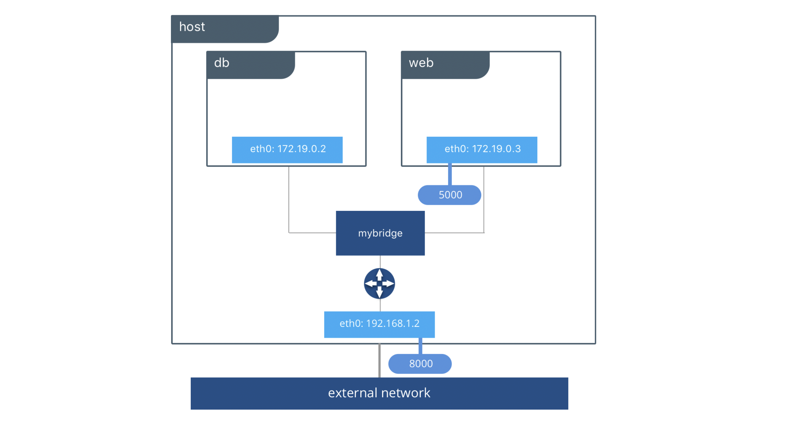
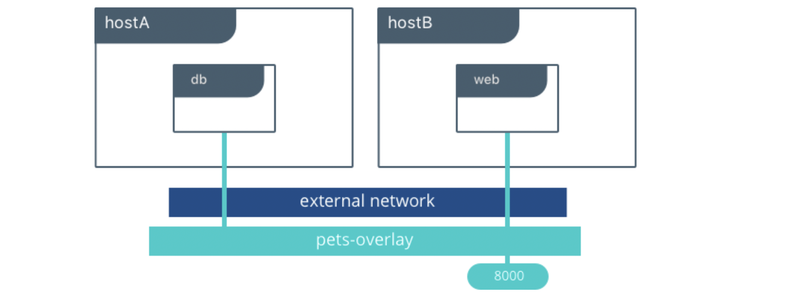
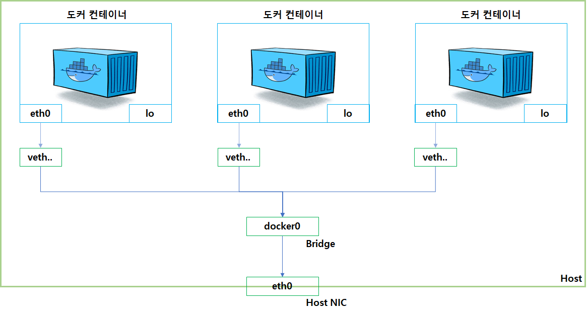

---

**Table of Contents**
{: #toc }
*  TOC
{:toc}

---

도커의 네트워크의 철학은 **CNM(Container Network Model)**을 따릅니다. CNM은 컨테이너를 사용하는 환경에서 사용자가 네트워크 설계를 쉽게 하기 위한 것입니다. 다시 말해, 복잡한 물리적인 환경을 고려할 필요없이 사용자는 네트워크를 설계할 때 추상적인 개념만을 이용해 설계할 수 있게 됩니다. 이러한 추상화는 운영체제나 인프라 환경에 구애받지 않는 설계를 가능하도록 해줍니다. 

이러한 개념(CNM)으로 네트워크를 구현해 놓은 것이 libnetwork이고 사용자가 사용할 수 있도록 기능을 제공하는 드라이버가 Networkdriver입니다.  

당연히 다음 질문은 **어떤 네트워크 드라이버를 사용해야 하는가** 하는 것입니다. 각 드라이버는 트레이드오프를 제공하며 사용 사례에 따라 다른 장점이 있습니다. 도커 엔진과 함께 제공되는 내장 네트워크 드라이버가 있으며 네트워킹 벤더와 커뮤니티에서 제공하는 플러그인 네트워크 드라이버도 있습니다. 가장 일반적으로 사용되는 내장 네트워크 드라이버는 `bridge`, `overlay`, `macvlan`입니다. 이번 포스트에서는 비교적 간단한 드라이버인 `bridge`와 `overlay`에 대해서만 살펴보겠습니다.   

# Bridge Network Driver

`bridge` 네트워크 드라이버가 우리 목록의 첫 번째 드라이버입니다. 이해하기 쉽고, 사용하기 쉽고, 문제 해결이 간단하기 때문에 개발자와 Docker를 처음 접하는 사람들에게 좋은 네트워킹 선택이 됩니다. `bridge` 드라이버는 **private 네트워크를 호스트 내부에 생성해 컨테이너들이 생성한 네트워크 안에서 통신할 수 있도록 합니다**. 컨테이너에 포트를 노출함으로써 외부 액세스가 허용됩니다. 도커는 서로 다른 도커 네트워크 간의 연결을 차단하는 규칙을 관리하여 네트워크를 보호합니다.   

내부적으로 도커 엔진은 **리눅스 브리지, 내부 인터페이스, iptables 규칙 및 호스트 경로**를 만들어 컨테이너 간의 연결을 가능하게 합니다. 아래 강조 표시된 예에서는 도커 브리지 네트워크가 생성되고 두 개의 컨테이너가 이 네트워크에 연결됩니다. 도커 엔진은 **별도의 설정 없이 필요한 연결을 수행하고 컨테이너에 대한 서비스 디스커버리를 제공**하며 다른 네트워크와의 통신을 차단하도록 보안 규칙을 구성합니다.  

  

우리의 애플리케이션은 현재 호스트 8000번 포트에서 서비스되고 있습니다. 도커 브리지는 컨테이너 이름으로 `web`이 `db`와 통신할 수 있도록 하고 있습니다. 브릿지 드라이버는 같은 네트워크에 있기 때문에 자동으로 우리를 위해 서비스 디스커버리를 합니다.  

브리지 드라이버는 로컬 범위 드라이버이므로 단일 호스트에서 서비스 디스커버리, IPAM 및 연결만 제공합니다. 다중 호스트 서비스 검색을 수행하려면 컨테이너를 호스트 위치에 매핑할 수 있는 외부 솔루션이 필요합니다. 이 때 필요한 것이 바로 `overlay` 드라이버입니다.  

# Overlay Network Driver

`overlay` 네트워크 드라이버는 **multi-host 네트워킹**의 많은 복잡성을 획기적으로 단순화합니다. **Swarm 스코프 드라이버**로, 개별 호스트가 아닌 전체 Swarm 또는 UCP 클러스터에서 작동합니다.  

`overlay` 드라이버는 컨테이너 네트워크를 물리적 네트워크와 분리해주는 VXLAN data plane을 사용합니다. 덕분에 다양한 클라우드, 온-프레미스 네트워크 환경 속에서 최고의 이식성을 제공해줍니다.  

  

# 도커 네트워크 실습

  
[(라우드 엔지니어 Won의 성장 블로그 참고)](https://captcha.tistory.com/70)  

## 도커 네트워크의 몇 가지 특징

- 도커는 컨테이너에 내부 IP(`eth0`)를 순차적으로 할당
- 컨테이너 외부에 노출시킬 엔드포인트로 `veth`(Virtual Ethernet) 생성
- 컨테이너마다 `veth` 네트워크 인터페이스 자동 생성
- `docker0`는 기본 생성되는 디폴트 브리지로 각 `veth` 인터페이스와 호스트의 기본 네트워크인 `eth0`와 연결

## Bridge 드라이버 사용해보기

## Overlay 드라이버 사용해보기

# 참고
- [도커 공식문서](https://docs.docker.com/network/){:target="_blank"}
- [MARK CHURCH, Understanding Docker Networking Drivers and their use cases](https://www.docker.com/blog/understanding-docker-networking-drivers-use-cases/){:target="_blank"}
- [클라우드 엔지니어 Won의 성장 블로그, 06. 도커 네트워크 포스트](https://captcha.tistory.com/70){:target="_blank"}
- [DaleSeo: Docker 네트워크 사용법](https://www.daleseo.com/docker-networks/){:target="_blank"}
- [Julie의 Tech블로그, 도커 - 네트워킹 / bridge와 overlay](https://julie-tech.tistory.com/50){:target="_blank"}
- [How To Communicate Between Docker Containers](https://www.tutorialworks.com/container-networking/){:target="_blank"}