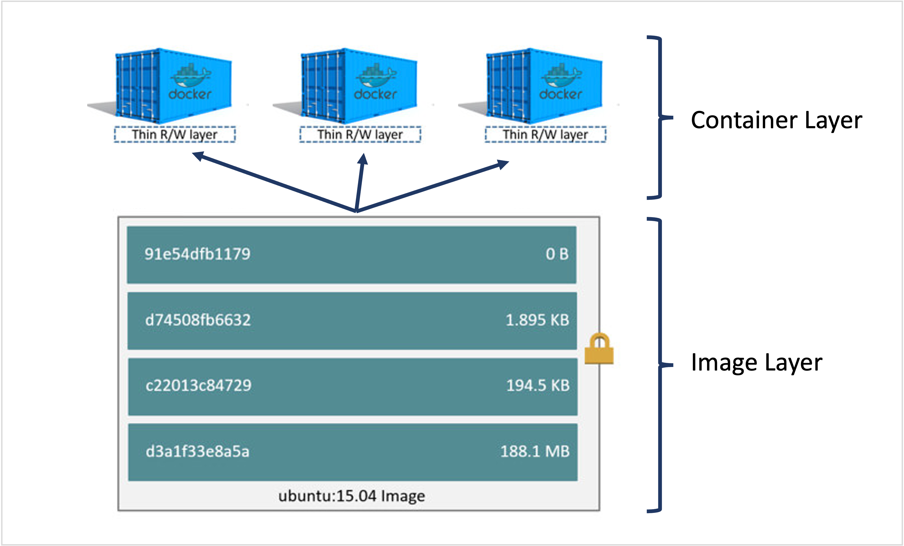
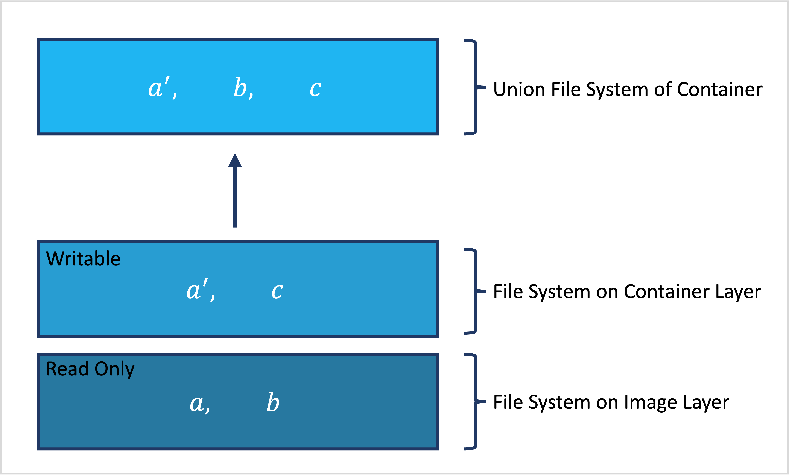
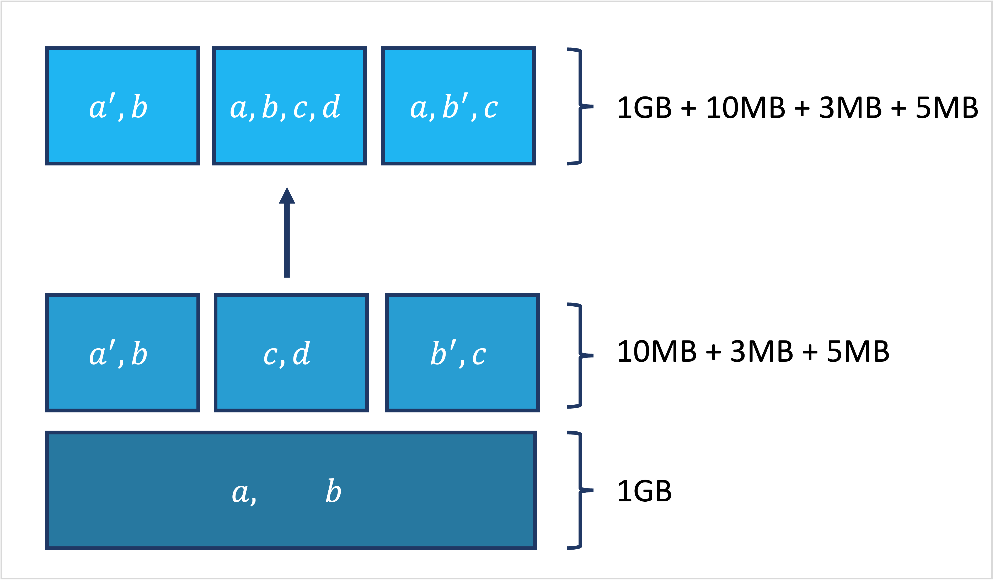
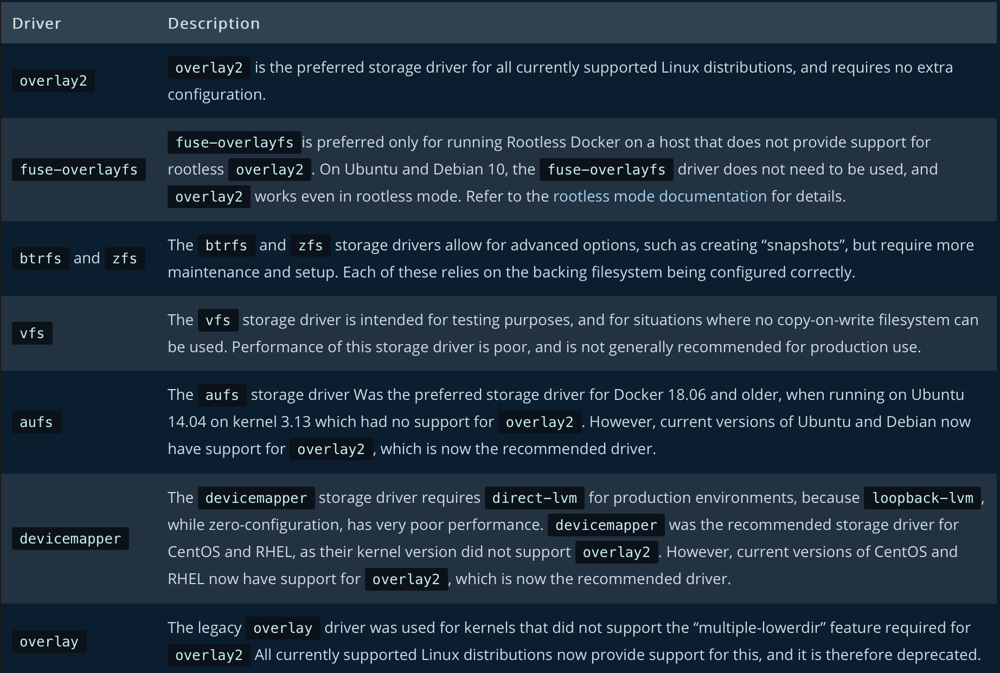
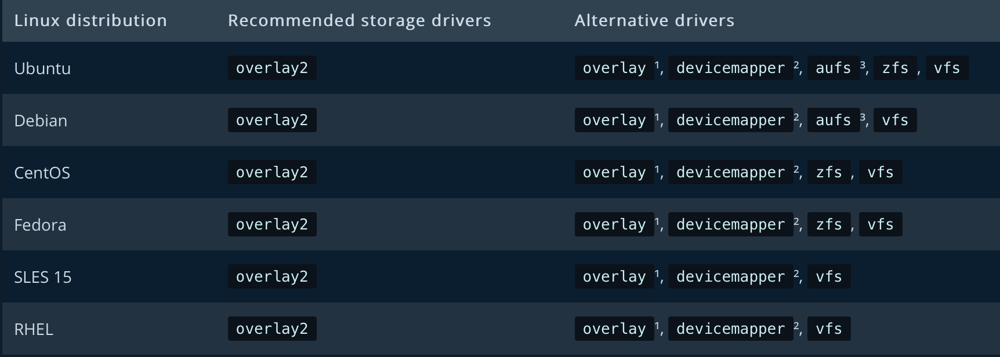
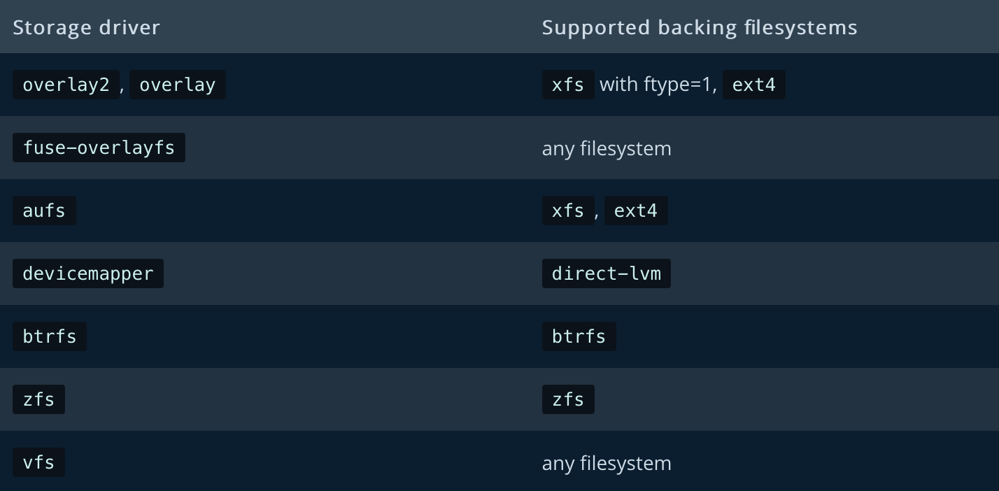
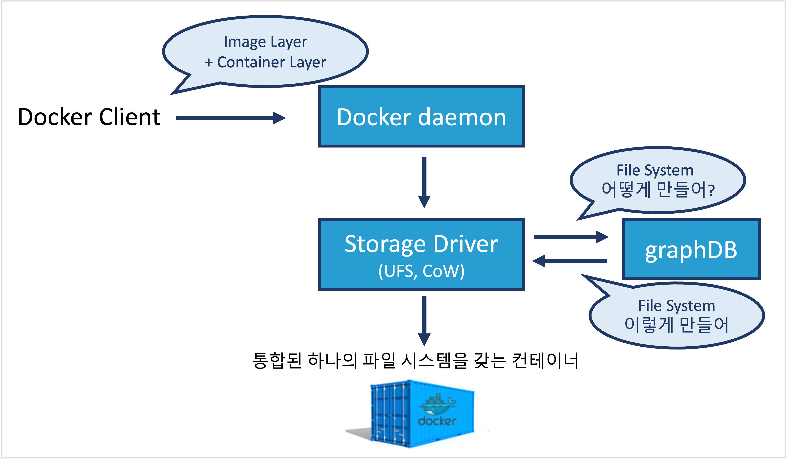

---

**Table of Contents**
{: #toc }
*  TOC
{:toc}

---

도커를 공부하면서 궁금했던 것 중에 하나가 *컨테이너에서 생성된 파일은 어디에 저장되어 있는걸까?* 였습니다. 그동안 저는 도커에 다른 저장소를 마운트하면 컨테이너에서 생성된 데이터를 저장할 수 있고 그렇지 않다면 컨테이너가 삭제되면서 같이 사라진다라고 알고 있었는데 그러면 **컨테이너가 사라지기 전까지는 어디에 저장**되어 있는지 궁금해졌습니다.  

그러던 중 좋은 글을 공유해 놓은 블로그를 알게되어 이와 관련해 정리해보았습니다. [(참고: Rain.i 블로그)](http://cloudrain21.com/examination-of-docker-containersize-ufs){:target="_blank"}  

# Container Layer  

도커 컨테이너는 도커 이미지로부터 만들어진 인스턴스입니다. 도커 이미지를 토대로 여러 개의 컨테이너를 만들 수 있습니다. 예를 들어 우분투 운영체제를 제공하는 이미지를 이용해 어떤 컨테이너에는 파이썬을 설치하고, 어떤 곳에는 nginx를 설치해 웹 서버로 사용할 수도 있습니다. 이렇게 새로운 소프트웨어를 설치하거나 파일을 생성하는 등의 작업은 **Container Layer** 위에서 이루어집니다. ~~이걸 보면 도커는 각각의 서비스를 컨테이너화 했을 뿐 아니라 컨테이너도 또 컨테이너화 한 것 같은 느낌이 드네요.~~  

  

도커가 컨테이너를 이런식으로 구현한 이유는 이미지의 상태를 최대한 그대로 보존하여 컨테이너를 계속 생성하더라도 토대가 변하지 않아 **예상치 못한 오류를 예방할 수 있고 관리하기도 편합니다.** 사용하는 입장에서도 어차피 컨테이너를 삭제하면 원래 기본 이미지 상태로 돌아가니까 **걱정없이 컨테이너를 조작할 수 있을 것 입니다.**  

우선 컨테이너를 생성하고 새로운 데이터를 생성하면 도커 상에서는 Container Layer에 저장된다는 것을 알았습니다. 그런데 Container Layer도 결국 도커를 띄운 호스트의 자원을 이용하기 때문에 제 컴퓨터(로컬이라면 데스크탑이나 노트북, 리모트라면 AWS의 EC2 정도) 어딘가에 저장이 되어 있을 것입니다. 이렇게 컨테이너들이 사용하는 이미지나 변경사항들은 모두 호스트 File system 의 `/var/lib/docker` 디렉토리 내에 저장된다. 이 영역을 **Docker area** 또는 **Backing Filesystem** 이라고 부르기도 한다.  

만약 컨테이너에서 생성된 파일을 버리지 않고 저장하고 싶다면 다음의 두 가지 방법을 사용할 수 있습니다.   

- **Commit**: 컨테이너 상에서 변경을 수행한 후 새로운 이미지로 만들어둔다.  
- **Volume**: 변경사항을 로컬 또는 외부 볼륨에 저장하도록 한다.

# UFS  
위의 내용을 읽다보면 이러한 의문이 생길 수 있습니다. *ubuntu 이미지가 가지고 있던 Filesystem이 아닌 별도의 Filesystem에 Container Layer의 데이터가 저장이 되는데 왜 우리는 컨테이너를 사용할 때 이러한 사실을 몰랐을까?* 그 이유는 바로 도커에서는 **UFS(Union File System)**라는 방식을 이용해 **Image Layer와 Container Layer의 Filesystem을 하나로 통합**해서 저희에게 제공해줍니다. 

  

이러한 UFS 방식의 장점은 무엇일까요? 가장 큰 장점은 Image Layer의 데이터를 여러 컨테이너가 공유할 수 있다는 점입니다. 공유한다는 것은 **여러 개의 컨테이너를 띄우더라도 Image Layer의 데이터 용량은 단 1개만큼만 저장**된다는 말입니다.  

  

# CoW
위의 그림과 같이 Image Layer의 *`a`*라는 파일을 *`a'`*으로 수정할 때 Image Layer에서 파일이 수정되지 않고 Container Layer 위에서 새로 파일을 복사한 후 수정하는 것을 **CoW(Copy on Write)**라고 합니다. 이러한 기법을 통해 **기존의 이미지에 대한 변경을 막을 수 있습니다.** 하지만 Copy-on-Write 기법은 그 동작 구조 상 다음의 단점이 있습니다.  

- **Performance Overhead**: data 를 먼저 복제(Copy)한 후 변경을 수행해야함
- **Capacity Overhead**: 원본 데이터 뿐 아니라, 변경된 데이터도 저장해야함  

따라서 되도록이면 **중복 사용되고 수정되지 않을만한 데이터들을 이미지 레이어로 구성하**는 것이 좋습니다. 

# Storage Driver
위에서 그동안 배운 **UFS와 CoW 방식을 도커에서 쉽게 이용할 수 있는 것은 도커의 Storage Driver 덕분입니다.** Storage Driver는 컨테이너 내에서의 파일 I/O 처리를 담당하는 드라이버입니다. Storage Driver는 Pluggable한 구조로 되어 있고 특성도 다릅니다. 또한 리눅스 배포판마다 지원하는 드라이버도 다르므로 자신의 workload에 맞는 Storage Driver를 선택해아 합니다.  

**Storage Driver의 종류**  

  
[(참고: 도커 공식문서)](https://docs.docker.com/storage/storagedriver/select-storage-driver/){:target="_blank"}

**리눅스 배포판별 지원하는 Storage Driver**  

  
[(참고: 도커 공식문서)](https://docs.docker.com/storage/storagedriver/select-storage-driver/){:target="_blank"}

**Storage Driver와 Backing File System**  

Storage Driver는 Container Layer의 데이터를 Backing filesystem(`/var/lib/docker`)으로 저장하고 사용자에게 layered filesystem으로 제공해 줍니다.     
(참고로 볼륨 마운트는 이러한 Storage Driver의 도움없이 직접 Host의 Filesystem에 접근 가능합니다.)

참고로 Storage Driver와 Backing filesystem 간에도 종속성이 있습니다.  

  
[(참고: 도커 공식문서)](https://docs.docker.com/storage/storagedriver/select-storage-driver/){:target="_blank"}  

**Storage Driver와 graphDB**  
Storage Driver는 사용자에게 최적의 통합된 파일 시스템을 제공하기 위해서는 layer 별 관계를 조회하고 key를 통해 특정 image를 검색하는 등, 이러한 일련의 정보 검색 및 관리하는 데이터베이스가 필요합니다. 이런 정보를 저장하고 있는 데이터베이스를 graphDB라고 합니다. (~~graphDB는 Storage Driver의 뇌와 같은 역할?~~)

  

# 정리  
- **UFS**: Container Layer와 Image Layer의 파일이 통합되어 보인다
- **CoW**: Image Layer 내의 파일을 원본은 유지하는 방향으로 파일을 수정할 수 있다
- **Storage Driver**: 위의 기능들을 실제로 수행하는 드라이버
- **graphDB**: Storage Driver가 최적의 실행을 하는데 필요한 정보를 저장하고 있는 SQLite기반 DB  

# 참고
- [도커 공식문서 About Storage Driver](https://docs.docker.com/storage/storagedriver/){:target="_blank"}
- [Rain.i님의 도커 컨테이너 까보기(2) – Container Size, UFS 포스트](http://cloudrain21.com/examination-of-docker-containersize-ufs){:target="_blank"}
- [Davaom's Tech Blog, [Docker] 컨테이너의 구조 포스트](https://devaom.tistory.com/5){:target="_blank"}