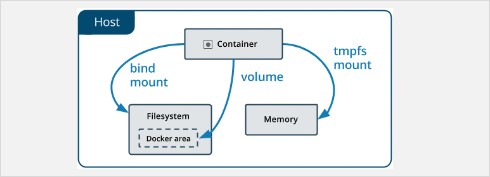
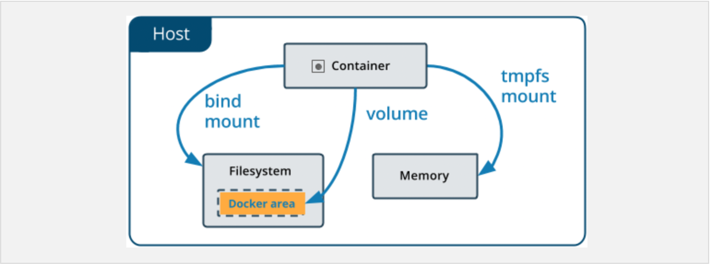
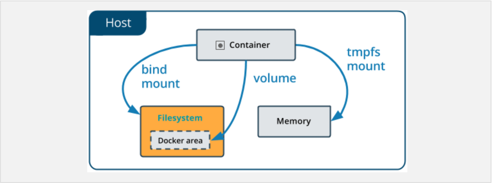

---

**Table of Contents**
{: #toc }
*  TOC
{:toc}

---

# 도커에서 데이터 관리하기  

- 기본적으로 컨테이너 안에서 생성된 모든 파일은 **컨테이너 레이어에 저장**된다
- 그래서, 해당 컨테이너가 삭제되면 데이터도 함께 사라진다 (컨테이너 종료는 데이터를 삭제하지 않는다)
- 따라서 컨테이너의 생명 주기와 관계없이 데이터를 영구적으로 저장하기 위한 방법이 필요하다
- 또한 여러 컨테이너가 데이터를 공유할 수 있으면 데이터를 컨테이너별로 중복 저장할 필요가 없어 컨테이너를 더욱 효율적으로 관리할 수 있게 될 것이다  
- 이러한 이유로 도커는 영구적인 요소와의 마운트를 다음의 두 가지 방법으로 제공한다
  - 볼륨(volume)
  - 바인드(bind)

  


# Volume  

  

- 도커 볼륨은 도커에서 스토리지를 다루는 단위다
- 데이터베이스처럼 영구성이 필요한 애플리케이션을 컨테이너로 실행하려면 볼륨을 사용해야 한다
- 볼륨을 사용하면 컨테이너의 데이터가 호스트 컴퓨터 내에 있는 도커에 의해 관리되는 파일 시스템(Linux기준 `/var/lib/docker/volumes/`)에 데이터가 저장된다
- 볼륨은 **완전히 도커에 의해서만 관리**되어 **호스트 머신의 디렉토리 구조나 OS에 독립적**인, 도커에서 데이터를 유지하기 위한 권장되는 메커니즘이다  
- 볼륨 드라이버를 사용해 클라우드 또는 리모트 호스트에 데이터를 저장할 수도 있다


<div class="bell-para">
    <div class="bell-bar">
      <i class="fa-solid fa-bell"></i>
      볼륨을 사용하기 좋은 경우  
    </div>
    <div class="bell-content">
      <ul>
        <li>여러 컨테이너에 마운트하고 싶은 경우 (명시적으로 표현한 볼륨이 없으면 자동으로 생성하고 마운트 해준다)</li>
        <li>도커 호스트의 파일 구조를 모르는 경우 (bind mount와 달리 Volume은 볼륨 명으로 관리)</li>
        <li>백업, 데이터 통합이 필요한 경우</li>
      </ul>
    </div>
</div>

## 실습

### 볼륨 생성

- 볼륨은 도커에서 이미지나 컨테이너와 동급인 요소다

#### Dockerfile VOLUME 인스트럭션

- Dockerfile 의 `VOLUME` 인스트럭션으로 만들 수 있다
- 하지만 이 방법은 볼륨명(source)을 지정할 수 없고, 컨테이너의 마운트 지점(target)만 지정할 수 있다
- Dockerfile에서 `VOLUME`의 용도는 이미지가 데이터베이스 같은 유상태 애플리케이션의 경우 사용자가 볼륨을 지정하지 않더라도 데이터를 유실하지 않기 위한 안전장치 용도이다
- 컨테이너를 실행할 때 볼륨을 새로 정의하면 `VOLUME` 은 무시된다

#### docker volume 명령어

- `docker volume` 명령어를 사용해 볼륨을 만들고 확인하고 삭제할 수 있다
- 볼륨은 `docker volume create` 명령어를 이용해 명시적으로 볼륨을 생성할 수 있다

```sh
# 볼륨 생성
docker volume create my-volume

# 볼륨 마운트
docker container run -v my-volume:/data <이미지명>
```

#### docker compose


```yml
version: "3.9"
services:
  frontend:
    image: node:lts
    volumes:
      - my-volume:/data # 볼륨 마운트
volumes:
  my-volume: # 볼륨 생성
```

### 볼륨 삭제

- 특정 볼륨을 삭제할 때는 `docker volume rm <볼륨명>` 명령어를 사용한다
- 만약 사용하지 않는 불특정 볼륨들을 제거하고 싶다면 `docker volume prune` 명령어를 사용하면 된다

### 볼륨 확인

- 특정 볼륨을 확인할 때는 `docker volume inspect <볼륨명>` 명렁어를 사용한다
- 볼륨 목록을 확인할 때는 `docker volume ls` 명령어를 사용한다

### 볼륨 마운트

- 볼륨(바인드 포함)을 마운트 할 때는 `-v` 옵션과 `--mount` 옵션 두 가지가 있다
- `-v`는 기존에 있던 옵션이고, `--mount`는 이 후에 나온 좀 더 명시적인 옵션이다 (도커에서 `--mount` 옵션 권장)
- 차이점은 `-v`는 콜론(`:`)으로 값들을 구분하고, `--mount`는 키-밸류 페어로 구분해 조금 더 명시적이다
- 바인드 마운트의 경우 `-v`는 명시한 디렉터리가 존재하지 않으면 생성하고, `--mount`는 에러를 발생한다

```sh
-v <볼륨명>:<컨테이너 마운트 지점>:<옵션 ex. ro> # 볼륨 마운트
-v <호스트 디렉터리>:<컨테이너 마운트 지점>:<옵션 ex. ro> # 바인드 마운트

--mount type=volume, source=<볼륨명>, target=<컨테이너 마운트 지점>, readonly # 볼륨 마운트
--mount type=bind, source=<호스트 디렉터리>, target=<컨테이너 마운트 지점>, readonly # 바인드 마운트
```

```sh
docker volume inspect my-vol

[
    {
        "Driver": "local",
        "Labels": {},
        "Mountpoint": "/var/lib/docker/volumes/my-vol/_data",
        "Name": "my-vol",
        "Options": {},
        "Scope": "local"
    }
]
```

# Bind Mount

  


- 바인드 마운트는 호스트 컴퓨터 파일 시스템의 디렉터리를 컨테이너 파일 시스템의 디렉터리로 만든다
- (볼륨은 볼륨명이라는 가상의 식별자를 사용하고, 바인드는 호스트 컴퓨터 파일 시스템의 절대 경로를 사용한다)
- 바인드 마운트는 양방향으로 동작한다. 컨테이너에서 만든 파일을 호스트 컴퓨터에서 수정할 수도 있고, 반대로 호스트에서 만든 파일도 컨테이너에서 수정할 수 있다
- 만약 컨테이너의 마운트 경로에 이미지에서 만들어뒀던 파일이 이미 존재하는 경우, 이 파일들은 완전히 대체된다 (볼륨, 바인드 모두)
- 컨테이너에서 호스트 파일 시스템에 접근할 수 있다는 점 때문에 보안에 안좋은 영향을 끼칠 수 있다

<div class="bell-para">
    <div class="bell-bar">
      <i class="fa-solid fa-bell"></i>
      바인드를 사용하기 좋은 경우  
    </div>
    <div class="bell-content">
      <ul>
        <li>컨테이너의 애플리케이션에 필요한 설정 파일을 호스트 컴퓨터에서 관리할 때 유용하다</li>
      </ul>
    </div>
</div>

## 실습

- 바인드는 말그대로 호스트 컴퓨터의 경로와 바인드만 하면된다. 볼륨처럼 따로 생성할 필요 없다

```sh
-v <호스트 디렉터리>:<컨테이너 마운트 지점>:<옵션 ex. ro> # -v 옵션

--mount type=bind, source=<호스트 디렉터리>, target=<컨테이너 마운트 지점>, readonly # --mount 옵션 (권장방식)
```

# 참고

- [도커 공식문서: Manage data in Docker](https://docs.docker.com/storage/){:target="_blank"}
- [도커 공식문서: Docker-compose volume configuration](https://docs.docker.com/compose/compose-file/compose-file-v3/#volume-configuration-reference){:target="_blank"}
- [DaleSeo: Docker 컨테이너에 데이터 저장 (볼륨/바인드 마운트)](https://www.daleseo.com/docker-volumes-bind-mounts/){:target="_blank"}
- [stack overflow: Understanding "VOLUME" instruction in DockerFile](https://stackoverflow.com/questions/41935435/understanding-volume-instruction-in-dockerfile){:target="_blank"}
