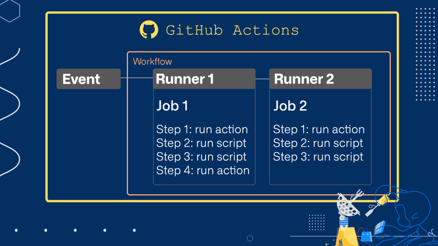
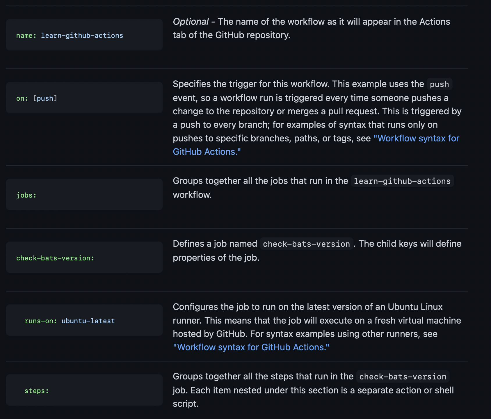
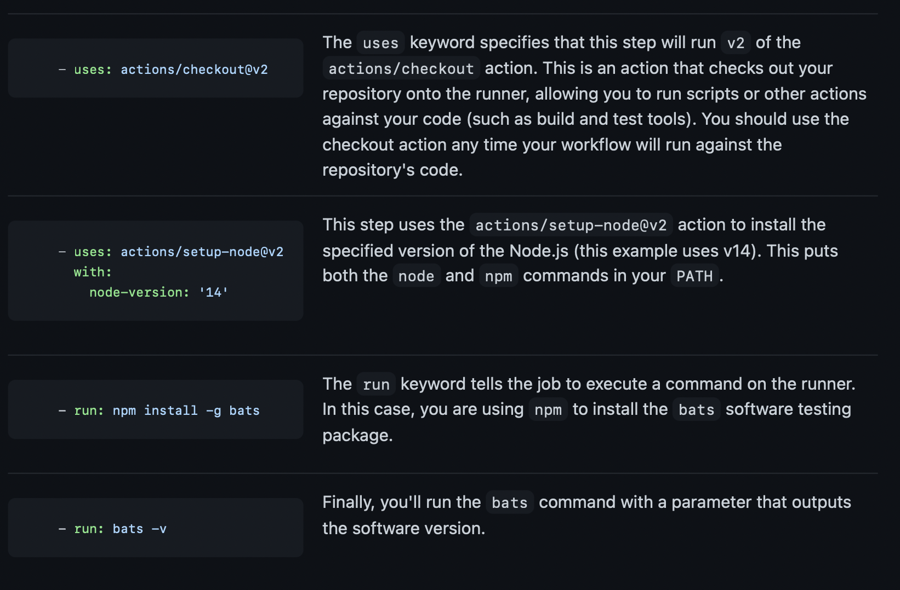

**Table of Contents**
{: #toc }
*  TOC
{:toc}

---

# Github Actions 소개
GitHub Actions은 CI/CD 플랫폼으로 build, test, deployment 파이프라인을 자동화 시켜줍니다. Github Actions은 Github repository에서 어떤 event(ex. push, pull request)가 발생했을 때 설정한 workflow를 실행하도록 할 수 있습니다. 이러한 workflow를 실행하기 위해 Github에서는 Linux, Windows, macOS와 같은 주요 운영체제 기반의 가상머신을 제공해주고, 원한다면 self-hosted runner를 이용할 수도 있습니다.  

# Github Actions 주요 구성요소
You can configure a GitHub Actions workflow to be triggered when an event occurs in your repository, such as a pull request being opened or an issue being created. Your workflow contains one or more jobs which can run in sequential order or in parallel. Each job will run inside its own virtual machine runner, or inside a container, and has one or more steps that either run a script that you define or run an action, which is a reusable extension that can simplify your workflow.  
[(Github Actions 공식문서 참고)](https://docs.github.com/en/actions/learn-github-actions/understanding-github-actions)



## Workflow
자동화된 전체 프로세스. 하나 이상의 Job으로 구성되고, Event에 의해 예약되거나 트리거될 수 있는 자동화된 절차를 말한다.
Workflow 파일은 YAML으로 작성되고, Github Repository의 `.github/workflows` 폴더 아래에 저장된다. Github에게 YAML 파일로 정의한 자동화 동작을 전달하면, Github Actions는 해당 파일을 기반으로 그대로 실행시킨다.  

## Event
Workflow를 트리거(실행)하는 특정 사건. 예를 들어, pull, push, creating issue와 같은 것들로 Workflow를 실행시킬 수 있다.  

## Job
Job은 여러 Step으로 구성되고, 단일 가상 환경에서 실행된다. 다른 Job에 의존 관계를 가질 수도 있고, 독립적으로 병렬로 실행될 수도 있다. Step에서는 shell script를 실행시킬 수도 있고, action을 실행시킬 수도 있다.  

## Action
Action은 반복적인 코드를 하나로 묶어 재사용 가능하도록 만들어 놓은 블럭입니다. Action을 직접 커스텀하여 사용할 수도 있고, Github Marketplace에 올라와 있는 것을 사용해도 됩니다.  


## Runner
Runner는 Gitbub Action Runner 어플리케이션이 설치된 머신으로, Workflow가 실행될 인스턴스입니다.  

# Workflow 예제  

```yaml
name: learn-github-actions
on: [push]
jobs:
  check-bats-version:
    runs-on: ubuntu-latest
    steps:
      - uses: actions/checkout@v2
      - uses: actions/setup-node@v2
        with:
          node-version: '14'
      - run: npm install -g bats
      - run: bats -v
```


  

- `yaml 파일` 하나가 `Workflow`이다
- `on`이 `Event`이다
- `jobs 안에 정의된 이름`이 각각의 `Job`이다
- steps안에 정의된 `uses`가 `Action`이다
- step안에 정의된 `run`이 쉘 명령어이다
- job안에 정의된 `runs-on`이 `Runner`이다


# 참고

- [Github Actions 공식문서](https://docs.github.com/en/actions/learn-github-actions/understanding-github-actions){:target="_blank"}
- [ggong.log 블로그](https://velog.io/@ggong/Github-Action에-대한-소개와-사용법){:target="_blank"}