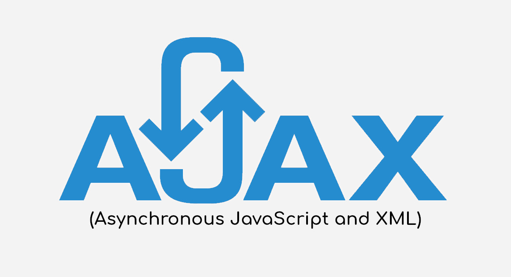

**Table of Contents**
{: #toc }
*  TOC
{:toc}

---

{: width="50%"}

# 자바스크립트의 탄생
1995년 웹 브라우저 시장을 지배하고 있던 넷스케이프 커뮤니케이션즈는 웹 페이지의 보조적인 기능을 수행하기 위해 **브라우저에서 동작하는 경량 프로그래밍 언어**를 도입하기로 결정한다. 그래서 탄생한 것이 브렌던 아이크(Brendan Eich)가 개발한 자바스크립트다.  

# 자바스크립트의 표준화
1996년 마이크로소프트에서 마이크로소프트에서 인터넷 익스플로러의 점유율을 높이고자 자바스크립트의 파생 버전인 Jscript를 인터넷 익스플로러에 탑재했다. 이로 인해 브라우저에 따라 웹페이지가 정상적으로 동작하지 않는 크로스 브라우징 이슈가 발생하기 시작했다.  

넷스케이프 커뮤니케이션즈는 컴퓨터 시스템의 표준을 관리하는 비영리 표준화 기구인 ECMA 인터내셔널에 자바스크립트의 표준화를 요청한다.  

1997년 ECMA-262라 불리는 표준화된 자바스크립트 초판이 완성되었고, 상표권 문제로 자바스크립트는 **ECMAScript**로 명명되었다.  

|**버전**|**출시연도**|**특징**|
|ES1|1997|초판|
|ES2|1998|ISO/IEC 16262 국제 표준과 동일한 규격을 적용|
|ES3|1999|정규표현식, try ... catch|
|ES5|2009|HTML5와 함께 출연한 표준안, JSON, strict mode, 접근자 프로퍼티, 프로퍼티 어트리뷰트 제어, 향상된 배열 조작 기능(forEach, map, filter, reduce, some, every)|
|ES6(ECMAScript 2015)|2015|let/const, 클래스, 화살표 함수, 템플릿 리터럴, 디스트럭처링 할당, 스프레드 문법, rest파라미터, 심벌, 프로미스, Map/Set, 이터러블, for...of, 제너레이터, Proxy, 모듈 import/export|

# 자바스크립트의 역사
초창기 자바스크립트는 웹페이지의 보조적인 기능을 수행하기 위한 한정적인 용도로 사용되었다. 이 시기에 대부분의 로직은 주로 웹 서버에서 실행되었고, 브라우저는 서버로부터 전달받은 HTML과 CSS를 단순히 렌더링하는 수준이었다.  

## Ajax  

1999년, 자바스크립트를 이용해 서버와 브라우저가 비동기방식으로 데이터를 교환할 수 있는 통신 기능인 Ajax(Asynchoronous JavaScript and XML)가 **XMLHttpRequest**라는 이름으로 등장했다.  

이전의 웹페이지는 html 태그로 시작해서 html 태그로 끝나는 완전한 HTML 코드를 서버로부터 다시 전송받아 웹페이지 전체를 렌더링하는 방식으로 동작했다. 이러한 방식은 변경할 필요가 없는 부분까지 서버로부터 코드를 다시 전송받기 때문에 성능면에서 부족한 점이 있었다.  

Ajax의 등장 이후, 웹 페이지에서 변경할 필요가 없는 부분은 다시 렌더링하지 않고, **필요한 부분만 렌더링하는 방식이 가능**해졌다. 이로써 웹 브라우저에서도 데스크톱 애플리케이션과 유사한 빠른 성능과 부드러운 화면 전환이 가능해졌다.  

## jQuery

2006년 jQery의 등장으로 다소 번거로웠던 DOM(Document Object Model)을 더욱 쉽게 제어할 수 있게 되었고, 크로스 브라우징 이슈도 어느 정도 해결되었다. jQuery는 많은 사용자 층을 확보하게 되었고, 다소 배우기 까다로웠던 자바스크립트보다 jQuery를 더 선호하는 개발자가 양산되기도 했다.  

## 자바스크립트 엔진 V8

그동안 웹 애플리케이션은 데스크톱 애플리케이션에 비해 성능상의 한계점이 있다는 인식이 있어왔지만 Ajax의 등장으로 웹 애플리케이션의 가능성을 확인하게 되었고, 이 후 자바스크립트로 웹 애플리케이션을 구축하려는 시도가 늘면서 자바 스크립트를 구동하는 자바스크립트 엔진의 성능을 더 높이고자 하는 요구가 생기게 되었다.  

이에 구글은 2008년 **V8이라는 자바스크립트 엔진을 개발**하였고 V8의 등장으로 자바스크립트를 이용해 개발한 웹 애플리케이션이 기존의 데스크톱 애플리케이션과 유사한 UX를 제공할 수 있게 되었다.

## Node.js

Node.js는 라이언 달(Ryan Dahl)이 2009년 개발한 **자바스크립트 엔진 V8로 빌드된 자바스크립트 런타임 환경**이다.

Node.js는 브라우저의 자바스크립트 엔진에서만 동작하던 자바스크립트를 **브라우저 이외의 환경에서도 동작할 수 있도록 했다**.  

Node.js는 다양한 플랫폼에 적용할 수 있지만 서버 사이드 애플리케이션 개발에 주로 사용되며, 이에 필요한 모듈, 파일 시스템, HTTP 등 빌트인 API를 제공한다.  

프론트엔드와 백엔드 영역을 모두 자바스크립트로 개발할 수 있다는 동형성(isomorphic)은 개발 속도를 향상시켰다.  

그동안 브라우저에서만 동작하는 반쪽짜리 프로그래밍 언어 취급을 받았지만 Node.js의 등장으로 서버 사이드 애플리케이션 개발에도 사용할 수 있게 됨에따라 현재는 프론트영역 백엔드 영역을 아우르는 웹 프로그래밍 언어의 표준으로 자리잡았다.  

Node.js는 비동기 I/O을 지원하며, 단일 스레드 이벤트 루프 기반으로 동작함으로써 요청 처리 성능이 좋다. 따라서 Node.js는 데이터를 실시간으로 처리하기 위해 **I/O이 빈번하게 발생하는 SPA(Single Page Application)에 적합**하다. 

## SPA

자바스크립트의 발전으로 웹 어플리케이션을 이용한 개발이 활발해지다보니 복잡한 규모의 개발에 점점 대처하기가 어려워졌다. 이러한 요구에 발맞춰 여러 기업에서는 CBD(Component Based Development) 방법론을 기반으로 하는 SPA가 대중화 되면서 Angular, React, Vue.js등 다양한 프레임워크/라이브러리가 등장하게 되었다

# ECMAScript
ECMAScript는 자바스크립트의 표준 사양인 ECMA-262를 말합니다. 각 브라우저 제조사는 ECMAScript 사양을 준수해 브라우저의 자바스크립트 엔진을 구현한다.  

자바스크립트는 ECMAScript와 브라우저가 별도 지원하는 클라이언트 사이드 Web API(DOM, XMLHttpRequest, fetch 등)을 아우르는 개념이다.  

# 자바스크립트의 특징

자바스크립트는 **웹브라우저에서 동작**하는 유일한 프로그래밍 언어다.  

자바스크립트는 개발자가 별도의 컴파일 작업을 수행하지 않는 **인터프리터 언어**다.  

자바스크립트는 명령형, 함수형, 프로토타입 기반 객체지향 프로그래밍을 지원하는 **멀티 패러다임 프로그래밍 언어**다.  

# 자바스크립트 실행 환경  

자바스크립트를 실행하기 위해서는 자바스크립트 엔진이 필요한데 이는 **브라우저**와 **Node.js**에만 있다.  

자바스크립트를 개발/테스트할 때는 주로 크롬의 **개발자 도구, Node.js, 비주얼 스튜디오 코드의 Live Server 확장 플러그인**을 사용한다. Live Server를 사용하면 별도의 가상 서버가 기동되고 서버에 있는 브라우저에 HTML 파일을 로딩한다.  