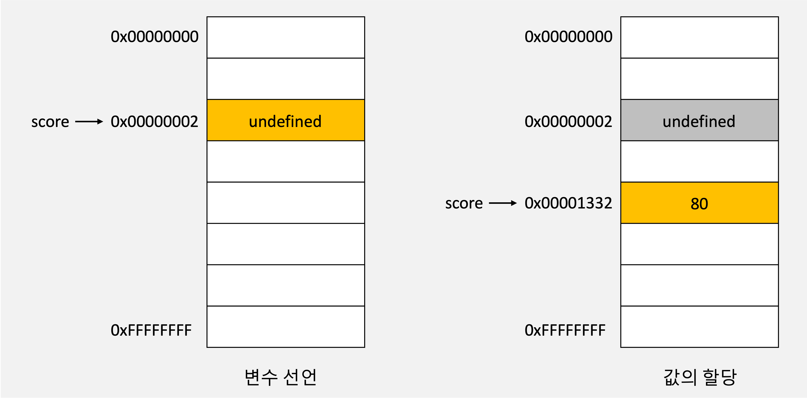

---

**Table of Contents**
{: #toc }
*  TOC
{:toc}

---

{: width="50%"}  

# 변수란 무엇인가? 왜 필요한가?  

사람은 계산과 기억을 모두 두뇌에서 하지만, 컴퓨터는 연산과 기억을 수행하는 부품이 나눠져 있다. 컴퓨터는 CPU를 사용해 연산하고, 메모리를 사용해 데이터를 기억한다.  

메모리는 데이터를 저장할 수 있는 메모리 셀의 집합체다. 메모리 셀 하나의 크기는 1바이트이다. 각 셀은 고유의 메모리 주소를 갖는다. 모든 값은 메모리 상의 임의의 위치에 저장되고 CPU는 이 값을 읽어들여 연산을 수행한다. 연산 결과로 생성된 값도 메모리 상의 임의의 위치에 저장된다. 하지만 문제는 이 값을 재사용하기 위해서는 어디 저장되어야 하는지 알아야 하는데 모른다는 것이다. 설령 안다고 하더라도 개발자가 직접적으로 메모리에 접근하는 것은 위험하다. 그래서 자바스크립트는 직접적인 메모리 제어를 허용하지 않는다.  

프로그래밍 언어는 기억하고 싶은 값을 메모리에 저장하고, 저장된 값을 읽어 들여 재사용하기 위해 변수라는 메커니즘을 제공한다.  

변수는 하나의 값을 저장하기 위해 확보한 **메모리 공간을 식별하기 위해 붙인 이름**을 말한다.  

변수는 컴파일러 또는 인터프리터에 의해 메모리 공간의 주소로 치환되어 실행된다. 따라서 개발자가 직접 메모리 주소를 통해 값을 저장하고 참조할 필요가 없고 변수를 통해 안전하게 값에 접근할 수 있다.  

# 변수 선언
변수 선언이란 변수를 생성하는 것을 말한다. 좀 더 자세히 말하면 메모리에는 값을 저장하기 위한 공간을 확보하고, 변수 이름을 메모리 공간의 주소로 연결(name binding)하는 것을 말한다.  

변수를 사용하려면 반드시 선언이 필요하다. 변수를 선언할 때는 `var`, `let`, `const` 키워드를 사용한다. ES6에서 let, const 키워드가 도입되기 전까지는 var 키워드가 변수 선언을 위한 유일한 키워드였다.  

```
🦄 **var 키워드의 단점**  
var 키워드의 가장 대표적인 단점은 블록 레벨 스코프를 지원하지 않고, 함수 레벨 스코프만 지원한다는 것이다.  
``` 

자바스크립트 엔진은 변수 선언을 다음과 같은 2단계에 걸쳐 수행한다.  
- **선언 단계**: 변수 이름을 등록해서 자바스크립트 엔진에 변수의 존재를 알린다.  
- **초기화 단계**: 값을 저장하기 위한 메모리 공간을 확보하고 암묵적으로 `undefined`를 할당해 초기화한다.  

이렇게 초기화 단계를 거침으로써 이전에 다른 애플리케이션이 사용했던 값(garbage value)이 재사용되는 것을 방지해줄 수 있다.  

# 변수 호이스팅

```js
console.log(score);

var score;
```

위의 코드를 보면 변수 선언문보다 변수를 참조하는 코드가 앞에 있다. 그럼에도 결과는 에러가 아닌 `undefined`다.

자바스크립트에서는 **변수 선언이 런타임(소스코드가 실행되는 시점)이 아니라 그 이전 단계에서 먼저 실행**된다.  

자바스크립트 엔진은 소스코드를 실행하기에 앞서 먼저 소스코드의 평가 과정을 거치면서 소스코드를 실행하기 위한 준비를 한다. 이 과정에서 엔진은 변수 선언을 포함한 모든 선언문을 소스코드에서 찾아서 먼저 실행한다. 그리고 이 과정이 끝나면 비로소 모든 선언문을 제외한 나머지 코드를 한 줄씩 순차적으로 실행한다.

이처럼 모든 선언문(`var`, `let`, `const`, `function`, `function*`, `class`이 코드의 선두로 끌어 올려진 것처럼 동작하는 자바스크립트의 특징을 **변수 호이스팅**이라 한다. 

# 값의 할당  

변수에 값을 할당할 때는 연산자 `=`를 사용한다.  

```js
var score; // 변수 선언
score = 80; // 값의 할당
```

```js
var score = 80; // 변수 선언과 값의 할당
```

자바스크립트 엔진은 변수 선언과 값의 할당을 하나의 문으로 단축 표현해도 2개의 문으로 나누어 각각 실행한다. 이 때 주의할 점은 변수 선언과 값의 할당의 실행 시점이 다르다는 것이다. 변수 선언은 값의 할당이 일어나는 런타임 이전에 이루어진다.  

```js
console.log(score); // undefined

var score = 80;

console.log(score); // 80
```

또한 변수의 선언과 값의 할당을 하나의 문으로 단축 표현해도 자바스크립트 엔진은 나누어 실행하므로, 변수에 먼저 `undefined`가 할당되어 초기화되는 것은 변함이 없다. 그리고 값이 할당될 때에는 새로운 메모리 공간을 확보하고 그 곳에 할당 값을 저장한다.  

  

이렇게 되고나면 `undefined`는 가비지 컬렉션에 의해 메모리에서 자동 해제된다. 

# 변수 네이밍
자바스크립트는 변수 네이밍을 할 때에 카멜 케이스와 파스칼 케이스를 권장한다. 

# 참고
- [name-binding](https://ko.wikipedia.org/wiki/네임_바인딩){:target="_blank"}  