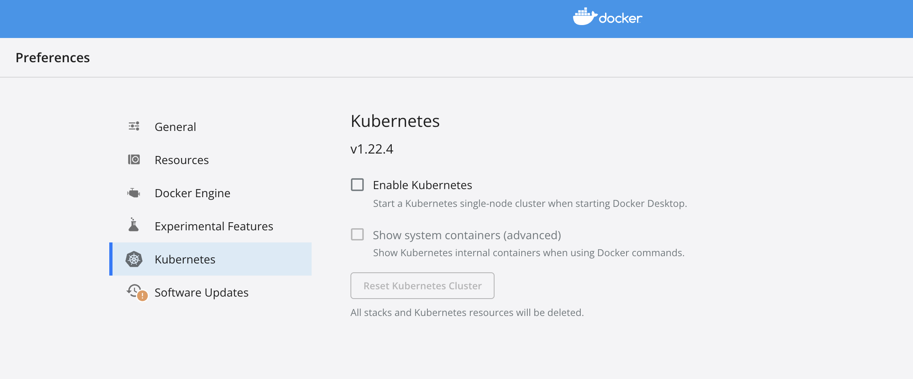

**Table of Contents**
{: #toc }
*  TOC
{:toc}

---  

# Kafka on Kubernetes

# 쿠버네티스 클러스터 구축
쿠버네티스 클러스터를 구축하는 방법에 대해서는 [Kubernetes Series [Part4]: Kubernetes 실습환경 구축하기](http://jaykim0510.github.io/kubernetes-series4)를 참고하시면 됩니다.  

## 단일 노드 클러스터
### minikube
미니큐브는 물리 머신에 로컬 쿠버네티스를 쉽게 구축하고 실행할 수 있는 도구입니다. 실행되는 쿠버네티스는 **단일 노드 구성**이기 때문에 여러 대의 구성이 필요한 쿠버네티스 기능은 사용할 수 없습니다. 또한 미니큐브는 로컬 가상 머신 위에 쿠버네티스를 설치하기 때문에 **하이퍼바이저(Docer, Hyperkit, VirtualBox, ..)가 필요**합니다. 제가 현재 사용하고 있는 맥 환경에서는 기본적으로 하이퍼킷이 설치되어 있습니다. 하지만 m1칩의 경우에는 아직 하이퍼킷을 지원하지 않기 때문에 먼저 도커를 설치, 실행한 후 미니큐브를 실행하셔야 합니다.

```sh
brew install minikube

minikube version
# minikube version: v1.25.1

minikube start --driver=docker # --kubernetes-version 옵션으로 버전 선택 가능
--------------------------------------------------------------------------------
😄  Darwin 12.1 (arm64) 의 minikube v1.25.1
✨  유저 환경 설정 정보에 기반하여 docker 드라이버를 사용하는 중
👍  minikube 클러스터의 minikube 컨트롤 플레인 노드를 시작하는 중
🚜  베이스 이미지를 다운받는 중 ...
💾  쿠버네티스 v1.23.1 을 다운로드 중 ...
    > preloaded-images-k8s-v16-v1...: 417.88 MiB / 417.88 MiB  100.00% 9.58 MiB
    > gcr.io/k8s-minikube/kicbase: 343.02 MiB / 343.02 MiB  100.00% 3.90 MiB p/
🔥  Creating docker container (CPUs=2, Memory=7903MB) ...
🐳  쿠버네티스 v1.23.1 을 Docker 20.10.12 런타임으로 설치하는 중
    ▪ kubelet.housekeeping-interval=5m
    ▪ 인증서 및 키를 생성하는 중 ...
    ▪ 컨트롤 플레인이 부팅...
    ▪ RBAC 규칙을 구성하는 중 ...
🔎  Kubernetes 구성 요소를 확인...
    ▪ Using image gcr.io/k8s-minikube/storage-provisioner:v5
🌟  애드온 활성화 : storage-provisioner, default-storageclass
🏄  끝났습니다! kubectl이 "minikube" 클러스터와 "default" 네임스페이스를 기본적으로 사용하도록 구성되었습니다.
```

이제 도커로 띄운 가상머신 위에서 쿠버네티스가 돌아가고 있습니다. 한 번 확인해보겠습니다.  

```sh
minikube status
--------------------
minikube
type: Control Plane
host: Running
kubelet: Running
apiserver: Running
kubeconfig: Configured

minikube ip
# 192.168.49.2
```

정지하고 삭제하는 명령어도 간단합니다.  

```
minikube stop

minikube delete
```  

### Docker Desktop
Docker Desktop은 도커를 맥/윈도우에서 사용하기 위한 목적으로 만들어졌습니다. 그리고 Docker Desktop 버전 18.06.0부터는 쿠버네티스도 사용할 수 있도록 지원하고 있습니다. 사용 방법은 간단합니다. Docker Desktop을 설치, 실행한 뒤 Enable Kubernetes 목록을 클릭해줍니다.  

  

(쿠버네티스를 Docker Desktop으로 실행할 때는 도커에서 제공하는 가상 머신위에 쿠버네티스 클러스터를 구성하는 것 같다. 그래서 클러스터 외부에서 쿠버네티스에 접속하려 할 때, 먼저 도커의 가상 머신 안으로 엔드포인트로 접근해야 하는데 이를 도커에서 localhost로 접근하도록 해준다. 그래서 별도로 도커 가상머신의 IP주소를 알려고 할 필요가 없다. 뇌피셜)  

## 멀티 노드 클러스터

### kind
kind는 도커 컨테이너를 여러 개 띄워서 컨테이너 각각을 노드로 사용함으로써 **멀티 노드 클러스터**를 구축할 수 있습니다.  
[(kind 공식문서 참고)](https://kind.sigs.k8s.io){:target="_blank"}  

```
apiVersion: kind.x-k8s.io/v1alpha4
kind: Cluster
nodes:
- role: control-plane
  image: kindest/node:v1.23.1
- role: worker
  image: kindest/node:v1.23.1
- role: worker
  image: kindest/node:v1.23.1
```  

```sh
kind create cluster --config kind.yaml --name kindcluster
----------------------------------------------------------------------
Creating cluster "kindcluster" ...
 ✓ Ensuring node image (kindest/node:v1.23.1) 🖼
 ✓ Preparing nodes 📦 📦 📦
 ✓ Writing configuration 📜
 ✓ Starting control-plane 🕹️
 ✓ Installing CNI 🔌
 ✓ Installing StorageClass 💾
 ✓ Joining worker nodes 🚜
Set kubectl context to "kind-kindcluster"
You can now use your cluster with:

kubectl cluster-info --context kind-kindcluster

Have a nice day! 👋
```
클러스터가 성공적으로 구축되었습니다.  
쿠버네티스에서 실행중인 노드를 확인해보겠습니다.  

```
kubectl get nodes
----------------------------------------------------------------------------
NAME                        STATUS   ROLES                  AGE   VERSION
kindcluster-control-plane   Ready    control-plane,master   58s   v1.23.1
kindcluster-worker          Ready    <none>                 25s   v1.23.1
kindcluster-worker2         Ready    <none>                 25s   v1.23.1
```

클러스터는 다음 명령어로 삭제하시면 됩니다.  

```sh
kind delete cluster --name kindcluster
------------------------------------------
Deleting cluster "kindcluster" ...
```
### 클라우드 환경(GKE, EKS)  

## 쿠버네티스 GUI 도구: Lens

```sh
brew install lens
```

# 카프카 메니페스트 작성

## LoadBalancer 생성
```
kubectl apply -f https://raw.githubusercontent.com/metallb/metallb/v0.9.3/manifests/namespace.yaml

kubectl apply -f https://raw.githubusercontent.com/metallb/metallb/v0.9.3/manifests/metallb.yaml

kubectl create -f ./metallb/configmap.yaml
```

```yaml
# configmap.yaml
apiVersion: v1
kind: ConfigMap
metadata:
  namespace: metallb-system
  name: config
data:
  config: |
    address-pools:
    - name: default
      protocol: layer2
      addresses:
      - 192.168.72.102
```

## Zookeeper 설치

```yaml
# deployment.yaml
kind: Deployment
apiVersion: apps/v1
metadata:
  name: zookeeper-deploy
spec:
  replicas: 2
  selector:
    matchLabels:
      app: zookeeper-1
  template:
    metadata:
      labels:
        app: zookeeper-1
    spec:
      containers:
      - name: zoo1
        image: zookeeper:latest
        ports:
        - containerPort: 2181
        env:
        - name: ZOOKEEPER_ID
          value: "1"
---
# zooservice.yaml
apiVersion: v1
kind: Service
metadata:
  name: zookeeper-service
  labels:
    app: zookeeper-1
spec:
  ports:
  - name: client
    port: 2181
    protocol: TCP
  - name: follower
    port: 2888
    protocol: TCP
  - name: leader
    port: 3888
    protocol: TCP
  selector:
    app: zookeeper-1
```

## Kafka Broker 설치
```yaml
# kafkaservice.yaml
apiVersion: v1
kind: Service
metadata:
  name: kafka-service
  annotations:
    metallb.universe.tf/address-pool: default
    metallb.universe.tf/allow-shared-ip: shared
  labels:
    name: kafka
spec:
  type: LoadBalancer
  ports:
  - name: kafka-port
    protocol: TCP
    port: 9092
    targetPort: 9092
  selector:
    app: kafka
    id: "0"
---
# deployment.yaml
apiVersion: apps/v1
kind: Deployment
metadata:
  name: kafka-broker0
spec:
  replicas: 1
  selector:
    matchLabels:
        app: kafka
        id: "0"
  template:
    metadata:
      labels:
        app: kafka
        id: "0"
    spec:
      hostname: kafka-host0
      containers:
      - name: kafka
        image: wurstmeister/kafka
        ports:
        - containerPort: 9092
        env:
        - name: KAFKA_LISTENERS
          value: INTERNAL_LISTENER://kafka-host0:19092, EXTERNAL_LISTENER://localhost:9092
        - name: KAFKA_ADVERTISED_LISTENERS
          value: INTERNAL_LISTENER://kafka-host0:19092, EXTERNAL_LISTENER://localhost:9092
        - name: KAFKA_INTER_BROKER_LISTENER_NAME
          value: INTERNAL_LISTENER
        - name: KAFKA_LISTENER_SECURITY_PROTOCOL_MAP
          value: INTERNAL_LISTENER:PLAINTEXT, EXTERNAL_LISTENER:PLAINTEXT
        - name: KAFKA_ZOOKEEPER_CONNECT
          value: zookeeper-service:2181
        - name: KAFKA_BROKER_ID
          value: "0"
        - name: KAFKA_CREATE_TOPICS
          value: admintome-test:1:1
```

```sh
# 위치: opt/kafka_버전

# 주키퍼 실행
bin/zookeeper-server-start.sh ./config/zookeeper.properties

# 카프카 실행
bin/kafka-server-start.sh ./config/server.properties

# 토픽 생성
bin/kafka-topics.sh --create --zookeeper zookeeper-service:2181 --replication-factors 1 --partitions 1 --topic test-topic
```
# 카프카 클라이언트  

```sh
# 카프카 클라이언트 파이썬 버전 설치
pip install kafka-python
```

```python
# producer.py

from kafka import KafkaProducer

producer = KafkaProducer(security_protocol="PLAINTEXT", bootstrap_servers=['192.168.111.2:9092'], api_version=(0,1,0))

producer.send('test', b'finally working kafka') # 현재 이부분에서 안넘어감 (bootstrap_servers의 host에 어떤거 넣어야 할지 모르겠음)

producer.flush()
```
# 카프카 모니터링

# 참고자료

- [옥탑방의 일상로그 블로그](https://js94.tistory.com/entry/kafka-에러-해결){:target="_blank"}
- [Towards Data Science 블로그](https://towardsdatascience.com/how-to-install-apache-kafka-using-docker-the-easy-way-4ceb00817d8b){:target="_blank"}
- [pcjayasinghe 깃허브](https://gist.github.com/pcjayasinghe/d1319f0135d197a42d770480e0a5701b#file-zookeeper-kafka-cluster-yml){:target="_blank"}
- [PharosProduction 깃허브](https://github.com/PharosProduction/tutorial-apache-kafka-cluster){:target="_blank"}
- [Deploy Apache Kafka and Zookeeper Cluster on Kubernetes 블로그 글](https://medium.com/@pcjayasinghe/deploy-apache-kafka-and-zookeeper-cluster-on-kubernetes-df9f0757b608){:target="_blank"}