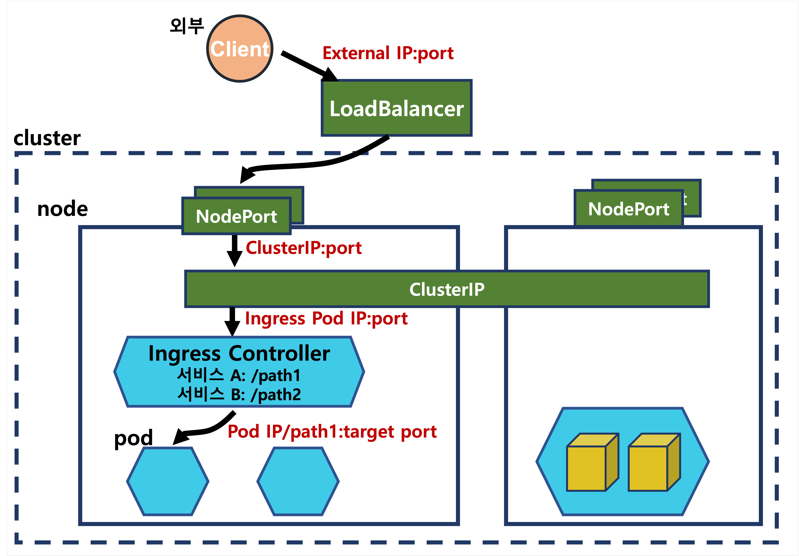

---
**Table of Contents**
{: #toc }
*  TOC
{:toc}

---

# Kubernetes Network  
쿠버네티스에서 파드 내부에는 여러 컨테이너가 존재할 수 있는데, 같은 파드 내에 있는 컨테이너는 동일한 IP 주소를 할당받게 됩니다. 따라서 같은 파드의 컨테이너로 통신하려면 **localhost**로 통신할 수 있고, 다른 파드의 컨테이너와 통신하려면 **파드의 IP 주소**로 통신하면 됩니다. 또한 노드 간의 통신은 **ClusterIP**를 이용할 수 있습니다.   

  

이렇게 쿠버네티스에서는 클러스터 내부에서는 네트워크가 자동으로 구성되어 Service 리소스를 이용하지 않고도 파드 간 통신이 가능합니다. 그러나 Service 리소스를 이용하면 다음과 같은 장점을 얻을 수 있습니다.  

- 로드 밸런싱
- 서비스 디스커버리
- 클러스터 내부 DNS  

# ClusterIP
ClusterIP는 서비스의 기본 타입입니다. ClusterIP 서비스를 생성하면 **클러스터 내부에서만 통신 가능한 가상 IP**가 할당됩니다. kube-proxy는 노드 안에서 ClusterIP에서 들어온 트래픽을 원하는 파드로 전송합니다.  

# NodePort  
NodePort는 모든 노드의 IP주소:포트에서 수신한 트래픽을 컨테이너에 전송하는 형태로 외부와 통신할 수 있습니다. NodePort는 전체 노드 N개 중 임의의 노드의 IP주소를 외부에 노출합니다. 그럼에도 ClusterIP를 통해 다른 노드의 파드로 통신하는데에는 문제 없습니다. 그러나 **노출된 IP주소의 노드는 단일 장애점(Single Point of Failure)**이 되기 때문에 NodePort만을 이용해 외부와 통신하는 것은 분명한 한계점이 있습니다. 또한 NodePort는 쿠버네티스에서 **지정한 범위(30000~32767)** 안에서만 지정할 수 있기 때문에 서비스로 활용하기에는 포트 번호가 예쁘지는 않습니다. 노드 포트 번호는 범위 안에서 직접 지정 가능하지만 쿠버네티스에서는 노드 포트 번호를 직접 지정하는 것을 지양합니다.  

# LoacBalancer  
LoadBalancer에서는 NodePort와 다르게 별도로 외부 로드 밸런서를 사용하기 때문에 노드 장애가 발생해도 크게 문제가 되지 않습니다. 노드에 장애가 발생한 경우 해당 노드를 목적지에서 제외 처리하고 트래픽을 전송하지 않게됩니다. LoadBalancer서비스를 생성하면 컨테이너 내부에서의 통신을 위해 ClusterIP도 자동 할당됩니다. 실제 서비스 운영 환경에서는 외부로부터 요청을 수신하는 External IP 주소를 DNS 설정 등의 이유로 고정하는 것을 선호하고 LoadBalancer 서비스는 이를 지원합니다.  

 
# Ingress
인그레스는 L7(application layer) 로드 밸런싱을 제공하는 리소스입니다. 인그레스는 서비스들을 묶는 상위 객체로, `kind: Ingress`타입 리소스를 지정합니다. 인그레스를 이용하면 하나의 IP주소로 N개의 애플리케이션을 로드 밸런싱할 수 있습니다.  
## 클러스터 외부의 로드 밸런서만을 이용한 Ingress
- GKE 인그레스  

외부 로드 밸런서로 인그레스를 사용한다면, 인그레스 리소스 생성만으로 충분합니다.  

## 클러스터 내부의 Ingress 파드를 곁들인 Ingress
- Nginx 인그레스  
 
클러스터 내부에서 인그레스를 이용해 로드 밸런싱을 할 경우 인그레스용 파드를 클러스터 내부에 생성해야 합니다. 또 내부의 인그레스용 파드를 외부에서 접속할 수 있도록 하기 위해 별도의 LoadBalancer 서비스를 생성해야 합니다.  

Nginx 인그레스 컨트롤러는 이름은 컨트롤러이지만 L7 수준의 로드 밸런싱을 직접 처리하기도 합니다.  

# 참고자료
- [쿠버네티스 완벽 가이드 책](http://www.kyobobook.co.kr/product/detailViewKor.laf?ejkGb=KOR&mallGb=KOR&barcode=9791165216283){:target="_blank"}  
- [subicura님의 kubenetes안내서](https://subicura.com/k8s/guide/){:target="_blank"}
- [NodePort vs LoadBalancer stackoverflow](https://stackoverflow.com/questions/65887993/when-to-choose-loadbalancer-over-nodeport-service-typeor-vice-versa-in-kub){:target="_blank"}  
- [Google Kubernetes Engine 가이드](https://cloud.google.com/kubernetes-engine/docs/concepts/network-overview){:target="_blank"}  
- [Confluent 블로그](https://www.confluent.io/blog/kafka-listeners-explained/){:target="_blank"} 