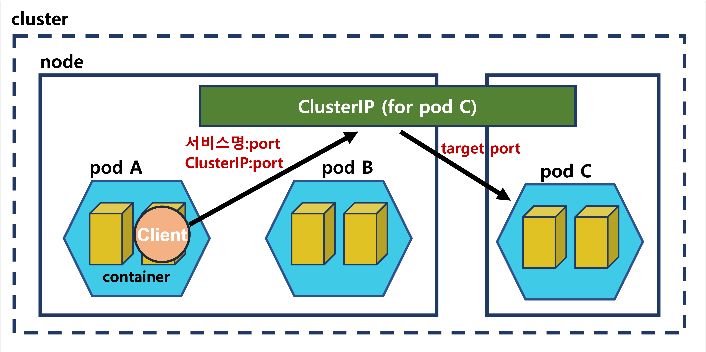

---
**Table of Contents**
{: #toc }
*  TOC
{:toc}

---

# Kubernetes Network  

> In many use cases, a workload has to be accessed by other workloads in the cluster or exposed to the outside world.

  

쿠버네티스에서 파드 내부에는 여러 컨테이너가 존재할 수 있는데, 같은 파드 내에 있는 컨테이너는 동일한 IP 주소를 할당받게 됩니다. 따라서 같은 파드의 컨테이너로 통신하려면 **localhost**로 통신할 수 있고, 다른 파드의 컨테이너와 통신하려면 **파드의 IP 주소**로 통신하면 됩니다.  

Service는 네트워크와 관련된 오브젝트입니다. Pod은 자체 IP를 가지고 다른 Pod와 통신할 수 있지만, 쉽게 사라지고 생성되는 특징 때문에 직접 통신하는 방법은 권장하지 않습니다. 쿠버네티스는 Pod와 직접 통신하는 방법 대신, 별도의 고정된 IP를 가진 서비스를 만들고 그 서비스를 통해 Pod에 접근하는 방식을 사용합니다.  
Pod을 외부 네트워크와 연결해주고 여러 개의 Pod을 바라보는 내부 로드 밸런서를 생성할 때 사용합니다. 내부 DNS에 서비스 이름을 도메인으로 등록하기 때문에 서비스 디스커버리 역할도 합니다.  

- ClusterIP: Pod가 동적으로 소멸/생성 되더라도 IP는 고정될 수 있도록 하는 역할
- NodePort: 외부에서 접근가능하도록 하는 포트 역할
- LoadBalancer: 살아있는 노드로 자동으로 연결해주는 역할

NodePort는 기본적으로 ClusterIP의 기능을 포함하고 있고, LoadBalancer는 NodePort의 기능을 포함하고 있습니다.  


  

# Network 오브젝트를 사용하는 이유

이렇게 쿠버네티스에서는 클러스터 내부에서는 네트워크가 자동으로 구성되어 Service 리소스를 이용하지 않고도 파드 간 통신이 가능합니다. 그러면 Network 오브젝트를 굳이 사용하는 이유는 뭘까요?  

## 외부 클라이언트와의 통신

- 파드가 가지고 있는 IP는 클러스터 내부에서 유효한 IP 주소
- 클러스터 외부에 있는 클라이언트와 통신하기 위해서는 **외부로 노출시킬 IP 주소**가 필요하다
- 이를 위해 쿠버네티스에서는 LoadBalancer, Ingress를 제공한다

## 파드 집합에 대한 엔드포인트 제공

- 파드 IP 주소로 통신한다는 말은 특정 파드 한 개 하고만 통신을 한다는 뜻이다
- 이렇게 되면, 해당 파드가 위치한 노드가 장애가 난 경우, 대처가 불가능하다
- 트래픽도 모두 그 파드 한 곳에만 모두 몰리게 될 것이다
- 이를 해결하기 위해서 쿠버네티스 서비스 오브젝트는 **파드 집합에 대한 단일 엔드포인트**를 제공한다

## 파드 엔드포인트 추상화

- 파드는 중간에 장애가 날 경우, 해당 파드를 종료하고 새로운 파드를 실행한다
- 또한 중간에 업데이트가 발생하면, 또 새로운 파드를 실행한다
- 이렇게 파드는 계속 변경되기 때문에 파드 IP 주소를 직접 사용할 경우 계속 수동으로 업데이트 해줘야 한다

## kube-dns


- 쿠버네티스는 서비스명으로 통신을 제공하기 위해 마스터 노드에 kube-dns라는 서버를 가지고 있다
- 쿠버네티스는 서비스 오브젝트 정보를 kube-dns에 저장하고 있다
- 워커 노드에 실행되고 있는 컨테이너들은 `/etc/resolv.conf` 파일에 이 kube-dns 네임서버 정보를 가지고 있다
- 컨테이너는 서비스 디스커버리가 필요하면 `/etc/resolv.conf` 파일에 있는 네임서버(kube-dns)로 이동하고, 네임서버에 저장되어 있는 서비스를 디스커버리한다


# ClusterIP

- ClusterIP는 서비스의 기본 타입
- ClusterIP 서비스를 생성하면 **클러스터 내부에서만 통신 가능한 가상 IP**가 할당 
- kube-proxy는 노드 안에서 ClusterIP에서 들어온 트래픽을 원하는 파드로 전송
- (위의 장점중 파드 집합에 대한 엔드포인트, 엔드포인트 추상화 이점을 제공)



(개발 단계에서는 `kubectl port-forward service/<서비스명> <target port>:<service port>`로 포트 포워딩해서 `localhost:<target port>` 로 접근 가능)

## 메니페스트 파일

```yaml
# ClusterIP
# redis라는 Deployment 오브젝트에 IP할당
apiVersion: v1
kind: Service
metadata:
  name: redis
spec:
  ports:
    - port: 6379 # clusterIP의 포트 (targetPort따로 없으면 targetPort(pod의 포트)도 6379가 됨)
      protocol: TCP
  selector: # 어떤pod로 트래픽을 전달할지 결정
    app: counter
    tier: db
```

# NodePort  
- 외부에서 접근할 수 있도록 모든 노드에 `node port` 포트를 열어둔다
- 클러스터 외부의 클라이언트는 `<임의의 노드 IP>:node port` 로 클러스터와 통신
- 해당 트래픽은 ClusterIP 서비스 오브젝트에게 전달되고, ClusterIP 서비스 오브젝트를 이를 파드 집합으로 포워딩
- **노출된 IP주소의 노드는 단일 장애점(Single Point of Failure)**이 된다
- NodePort는 쿠버네티스에서 **지정한 범위(30000~32767)** 안에서만 지정 가능
- 노드 포트 번호는 범위 안에서 직접 지정 가능하지만 쿠버네티스에서는 노드 포트 번호를 직접 지정하는 것을 지양 


## 메니페스트 파일


```yaml
# NodePort
apiVersion: v1
kind: Service
metadata:
  name: counter-np
spec:
  type: NodePort
  ports:
    - port: 3000 # ClusterIP, Pod IP의 포트
      protocol: TCP
      nodePort: 31000 # Node IP의 포트
  selector:
    app: counter
    tier: app
```


# LoacBalancer  

- 외부에서 접근 가능한 External IP를 할당 받는다
- LoadBalancer서비스를 생성하면 컨테이너 내부에서의 통신을 위해 ClusterIP도 자동 생성 (Interal IP)


 
## 메니페스트 파일


```yaml
# LoadBalancer
apiVersion: v1
kind: Service
metadata:
  name: counter-lb
spec:
  type: LoadBalancer
  ports:
    - port: 30000
      targetPort: 3000
      protocol: TCP
  selector:
    app: counter
    tier: app
```


# Ingress

인그레스는 L7(application layer) 로드 밸런싱을 제공하는 리소스입니다. 인그레스는 서비스들을 묶는 상위 객체로, `kind: Ingress`타입 리소스를 지정합니다. 인그레스를 이용하면 하나의 IP주소로 N개의 애플리케이션을 로드 밸런싱할 수 있습니다.  

Ingress는 경로 기반 라우팅 서비스를 제공해주는 오브젝트입니다.  

LoadBalancer는 단점이 있습니다. LoadBalancer는 한 개의 IP주소로 한 개의 서비스만 핸들링할 수 있습니다. 그래서 만약 N개의 서비스를 실행 중이라면 N개의 LoadBalancer가 필요합니다. 또한 보통 클라우드 프로바이더(AWS, GCP 등)의 로드밸런서를 생성해 사용하기 때문에 로컬서버에서는 사용이 어렵습니다.   

Ingress는 경로 기반 라우팅 서비스를 통해 N개의 service를 하나의 IP주소를 이용하더라도 경로를 통해 분기할 수 있습니다.  

Ingress는 Pod, ReplicaSet, Deployment, Service와 달리 별도의 컨트롤러를 설치해야 합니다. 컨트롤러에는 대표적으로 `nginx`, `haproxy`, `traefik`, `alb`등이 있습니다.

## 클러스터 외부의 로드 밸런서만을 이용한 Ingress
- GKE 인그레스  

외부 로드 밸런서로 인그레스를 사용한다면, 인그레스 리소스 생성만으로 충분합니다.  


## 클러스터 내부의 Ingress 파드를 곁들인 Ingress
- Nginx 인그레스  
 
클러스터 내부에서 인그레스를 이용해 로드 밸런싱을 할 경우 인그레스용 파드를 클러스터 내부에 생성해야 합니다. 또 내부의 인그레스용 파드를 외부에서 접속할 수 있도록 하기 위해 별도의 LoadBalancer 서비스를 생성해야 합니다.  

Nginx 인그레스 컨트롤러는 이름은 컨트롤러이지만 L7 수준의 로드 밸런싱을 직접 처리하기도 합니다.  


## 메니페스트 파일


```yaml
apiVersion: networking.k8s.io/v1
kind: Ingress
metadata:
  name: echo-v1
spec:
  rules:
    - host: v1.echo.192.168.64.5.sslip.io
      http:
        paths:
          - path: /
            pathType: Prefix
            backend:
              service:
                name: echo-v1
                port:
                  number: 3000
# 들어오는 요청의 host가 v1.echo.192.168.64.5.sslip.io이면 host echo-v1이라는 서비스가 가지는 IP 주소의 3000번 포트로 보내라
```

spec에는 `rules`, `defaultBackend`(어느 rule에도 속하지 않을 경우) 등이 있습니다.  
[(Ingress 공식문서 참고)](https://kubernetes.io/docs/reference/kubernetes-api/service-resources/ingress-v1/){:target="_blank"}


# Headless

# 참고자료
- [쿠버네티스 완벽 가이드 책](http://www.kyobobook.co.kr/product/detailViewKor.laf?ejkGb=KOR&mallGb=KOR&barcode=9791165216283){:target="_blank"}  
- [subicura님의 kubenetes안내서](https://subicura.com/k8s/guide/){:target="_blank"}
- [NodePort vs LoadBalancer stackoverflow](https://stackoverflow.com/questions/65887993/when-to-choose-loadbalancer-over-nodeport-service-typeor-vice-versa-in-kub){:target="_blank"}  
- [Google Kubernetes Engine 가이드](https://cloud.google.com/kubernetes-engine/docs/concepts/network-overview){:target="_blank"}  
- [Confluent 블로그](https://www.confluent.io/blog/kafka-listeners-explained/){:target="_blank"} 