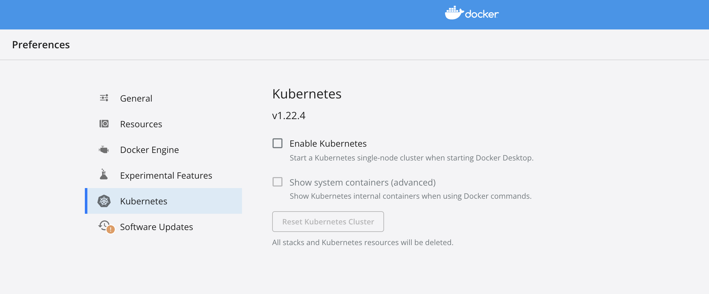

**Table of Contents**
{: #toc }
*  TOC
{:toc}

---
# 로컬환경
쿠버네티스는 여러 플랫폼 환경에서 클러스터를 구성하여 사용할 수 있습니다. 로컬 쿠버네티스는 별다른 비용 발생 없이 간단하게 클러스터를 구축해 테스트해 볼 수 있어서 `테스트, 개발 환경에 적합`합니다.  

## 미니큐브(minikube)
미니큐브는 물리 머신에 로컬 쿠버네티스를 쉽게 구축하고 실행할 수 있는 도구입니다. 실행되는 쿠버네티스는 `단일 노드 구성`이기 때문에 여러 대의 구성이 필요한 쿠버네티스 기능은 사용할 수 없습니다. 또한 미니큐브는 로컬 가상 머신 위에 쿠버네티스를 설치하기 때문에 `하이퍼바이저(Docer, Hyperkit, VirtualBox, ..)가 필요`합니다. 제가 현재 사용하고 있는 맥 환경에서는 기본적으로 하이퍼킷이 설치되어 있습니다. 하지만 m1칩의 경우에는 아직 하이퍼킷을 지원하지 않기 때문에 먼저 도커를 설치, 실행한 후 미니큐브를 실행하셔야 합니다.

```sh
brew install minikube

minikube version
# minikube version: v1.25.1

minikube start --driver=docker # --kubernetes-version 옵션으로 버전 선택 가능
--------------------------------------------------------------------------------
😄  Darwin 12.1 (arm64) 의 minikube v1.25.1
✨  유저 환경 설정 정보에 기반하여 docker 드라이버를 사용하는 중
👍  minikube 클러스터의 minikube 컨트롤 플레인 노드를 시작하는 중
🚜  베이스 이미지를 다운받는 중 ...
💾  쿠버네티스 v1.23.1 을 다운로드 중 ...
    > preloaded-images-k8s-v16-v1...: 417.88 MiB / 417.88 MiB  100.00% 9.58 MiB
    > gcr.io/k8s-minikube/kicbase: 343.02 MiB / 343.02 MiB  100.00% 3.90 MiB p/
🔥  Creating docker container (CPUs=2, Memory=7903MB) ...
🐳  쿠버네티스 v1.23.1 을 Docker 20.10.12 런타임으로 설치하는 중
    ▪ kubelet.housekeeping-interval=5m
    ▪ 인증서 및 키를 생성하는 중 ...
    ▪ 컨트롤 플레인이 부팅...
    ▪ RBAC 규칙을 구성하는 중 ...
🔎  Kubernetes 구성 요소를 확인...
    ▪ Using image gcr.io/k8s-minikube/storage-provisioner:v5
🌟  애드온 활성화 : storage-provisioner, default-storageclass
🏄  끝났습니다! kubectl이 "minikube" 클러스터와 "default" 네임스페이스를 기본적으로 사용하도록 구성되었습니다.
```

이제 도커로 띄운 가상머신 위에서 쿠버네티스가 돌아가고 있습니다. 한 번 확인해보겠습니다.  

```sh
minikube status
--------------------
minikube
type: Control Plane
host: Running
kubelet: Running
apiserver: Running
kubeconfig: Configured

minikube ip
# 192.168.49.2
```

정지하고 삭제하는 명령어도 간단합니다.  

```
minikube stop

minikube delete
```

## Docker Desktop  
Docker Desktop은 도커를 맥/윈도우에서 사용하기 위한 목적으로 만들어졌습니다. 그리고 Docker Desktop 버전 18.06.0부터는 쿠버네티스도 사용할 수 있도록 지원하고 있습니다. 사용 방법은 간단합니다. Docker Desktop을 설치, 실행한 뒤 Enable Kubernetes 목록을 클릭해줍니다.  



## kind(Kubernetes in Docker)
minikube와 Docker Desktop은 단일 노드로 구성된 쿠버네티스였다면, kind는 도커 컨테이너를 여러 개 띄워서 컨테이너 각각을 노드로 사용함으로써 `멀티 노드 클러스터`를 구축할 수 있습니다.  
[(kind 공식문서 참고)](https://kind.sigs.k8s.io){:target="_blank"}  

```sh
brew install kind

kind version
--------------------
kind v0.11.1 go1.17.2 darwin/arm64
```

잘 설치가 되었습니다. 이제 kind를 이용해 쿠버네티스에서 마스터와 워커 노드 역할을 하는 노드를 각각 3개씩 띄워 다음과 같이 멀티 노드 클러스터를 구축해보겠습니다.  

(실행 결과 리소스 부족으로 kindcluster-worker2를 만들다가 오류가)

  

```sh
# kind로 클러스터 구축을 위한 kind.yaml
apiVersion: kind.x-k8s.io/v1alpha4
kind: Cluster
nodes:
- role: control-plane
  image: kindest/node:v1.23.1
- role: control-plane
  image: kindest/node:v1.23.1
- role: control-plane
  image: kindest/node:v1.23.1
- role: worker
  image: kindest/node:v1.23.1
- role: worker
  image: kindest/node:v1.23.1
- role: worker
  image: kindest/node:v1.23.1
```

```sh
kind create cluster --config kind.yaml --name kindcluster
----------------------------------------------------------------------
Creating cluster "kindcluster" ...
 ✓ Ensuring node image (kindest/node:v1.23.1) 🖼
 ✓ Preparing nodes 📦 📦 📦 📦 📦 📦
 ✓ Configuring the external load balancer ⚖️
 ✓ Writing configuration 📜
 ✓ Starting control-plane 🕹️
 ✓ Installing CNI 🔌
 ✓ Installing StorageClass 💾
 ✗ Joining worker nodes 🚜 
```

실행 결과 리소스 부족으로 kindcluster-worker2를 만들다가 오류가 발생하여 마스터의 서버는 1개, 워커는 2개로 다시 구성해 실행해 보았습니다.  

```
apiVersion: kind.x-k8s.io/v1alpha4
kind: Cluster
nodes:
- role: control-plane
  image: kindest/node:v1.23.1
- role: worker
  image: kindest/node:v1.23.1
- role: worker
  image: kindest/node:v1.23.1
```  

```sh
kind create cluster --config kind.yaml --name kindcluster
----------------------------------------------------------------------
Creating cluster "kindcluster" ...
 ✓ Ensuring node image (kindest/node:v1.23.1) 🖼
 ✓ Preparing nodes 📦 📦 📦
 ✓ Writing configuration 📜
 ✓ Starting control-plane 🕹️
 ✓ Installing CNI 🔌
 ✓ Installing StorageClass 💾
 ✓ Joining worker nodes 🚜
Set kubectl context to "kind-kindcluster"
You can now use your cluster with:

kubectl cluster-info --context kind-kindcluster

Have a nice day! 👋
```
클러스터가 성공적으로 구축되었습니다.  
쿠버네티스에서 실행중인 노드를 확인해보겠습니다.  

```
kubectl get nodes
----------------------------------------------------------------------------
NAME                        STATUS   ROLES                  AGE   VERSION
kindcluster-control-plane   Ready    control-plane,master   58s   v1.23.1
kindcluster-worker          Ready    <none>                 25s   v1.23.1
kindcluster-worker2         Ready    <none>                 25s   v1.23.1
```

클러스터는 다음 명령어로 삭제하시면 됩니다.  

```sh
kind delete cluster --name kindcluster
------------------------------------------
Deleting cluster "kindcluster" ...
```

# 클라우드환경

## GKE(Google Kubernetes Engine)

## EKS(Elastic Kubernetes Service)

# 참고자료  
- [쿠버네티스 완벽 가이드 책](http://www.kyobobook.co.kr/product/detailViewKor.laf?ejkGb=KOR&mallGb=KOR&barcode=9791165216283){:target="_blank"}  
- [subicura님의 kubenetes안내서](https://subicura.com/k8s/guide/){:target="_blank"}