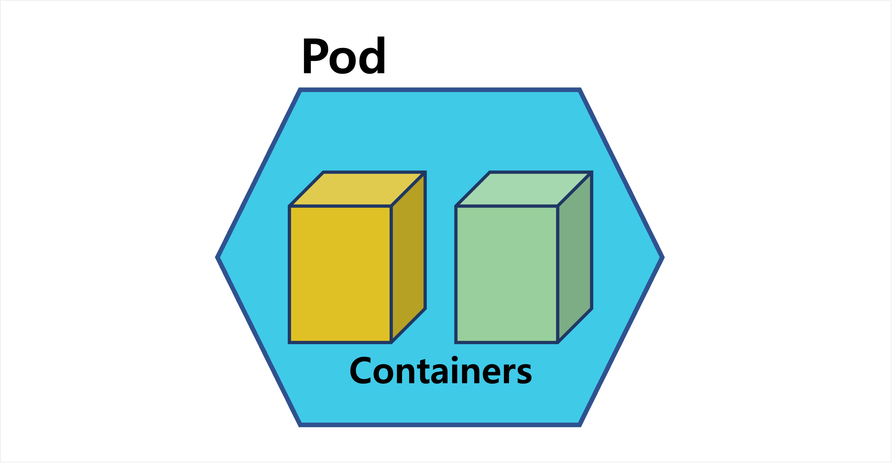
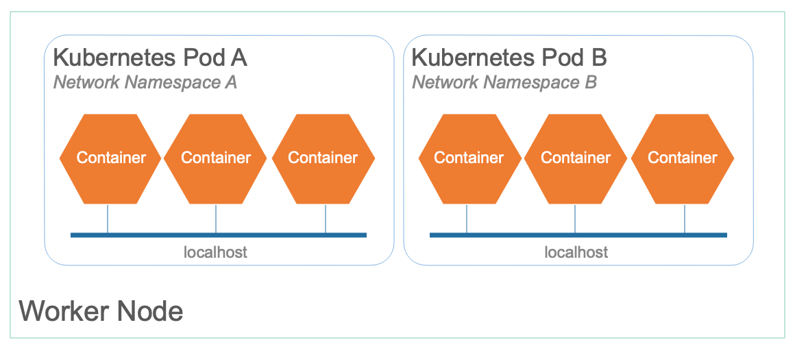
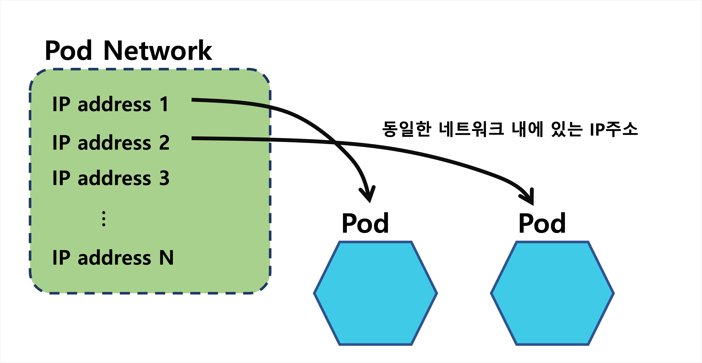
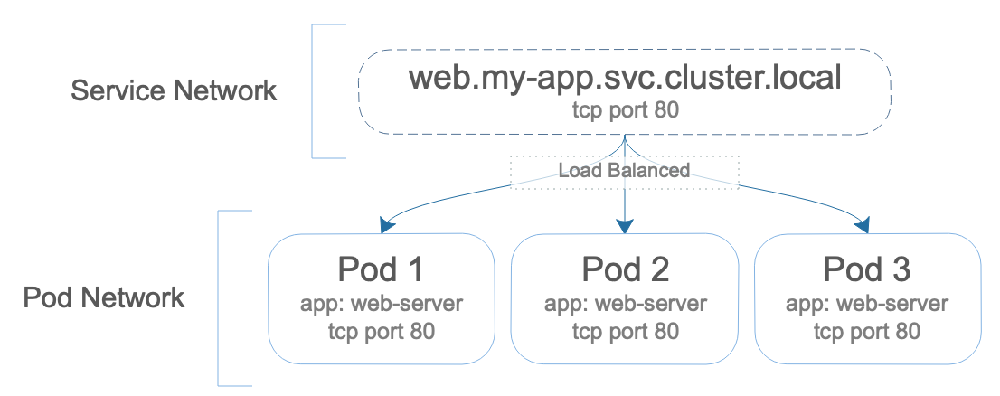
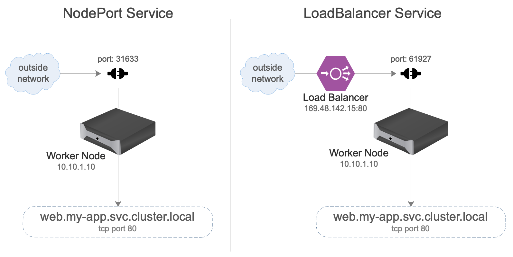

**Table of Contents**
{: #toc }
*  TOC
{:toc}

---

[원문: Kubernetes networking for developers - IBM developers](https://developer.ibm.com/articles/kubernetes-networking-what-you-need-to-know/){:target="_blank"}   


불과 몇 년 전까지만 하더라도 개발자들이 네트워크에 대해 알아야 할 지식은 그렇게 많지 않았습니다. 그들은 그들의 코드를 작성하고 로컬에서 동작하는지 확인한 후 테스트나 서비스를 위한 서버에 배포할 수 있었으면 됐었습니다.  

그러나 시간이 지나면서 컨테이너 기술이 점점 발전되어가며 이런 추세가 약간 변하기 시작했습니다. 이번 글을 통해 컨테이너 기반의 배포환경에서 개발자들이 알아두면 좋은 네트워크 지식에 대해 알아보도록 하겠습니다.  

# Kubernetes Basics

컨테이너는 한 개의 어플리케이션 또는 프로세스로 이들을 실행시키기 위해 필요한 모든 것들이 포함되어 있습니다. 어플리케이션 관점에서 컨테이너는 마치 서버위에 동작중인 하나의 운영체제처럼 보입니다. 컨테이너는 컨테이너만의 네트워크 인터페이스, 파일 시스템 등 필요한 모든 것들을 갖추고 있습니다.  

쿠버네티스는 이러한 컨테이너의 집합으로 컨테이너는 쿠버네티스의 워커 노드 안에서 돌아갑니다. 만약 항상 함께 설치되어야 하는 두 개의 어플리케이션이 있다면 이 두 개의 어플리케이션을 가진 컨테이너 두 개를 하나의 **파드(Pod)**로 정의할 수 있습니다. (파드는 확장가능한 단위로 보통 특정 노드에 장애가 발생할 경우 파드에 문제가 생기는 경우를 대비해, 여러 워커 노드에 파드를 분산 배포합니다.)  




# Localhost (IP address 127.0.0.1)
같은 파드내에 있는 컨테이너들은 같은 노드 안에서 실행됩니다. 쿠버네티스는 이러한 구조의 장점을 이용해 파드에 **공유되는 네트워크 네임스페이스**를 각각 제공합니다. 네트워크 네임스페이스는 리눅스 커널의 특징 중 하나로 네트워크 자원들을 그룹으로 만들 수 있습니다.  

이러한 그룹내에서 실행되는 프로세스들은 그룹 안에 정의된 네트워크 리소스만 볼 수 있습니다. 예를 들어, 파드 A는 네트워크 네임스페이스가 A인 네트워크 리소스만 볼 수 있습니다. 이것이 바로 쿠버네티스가 파드들을 각각 독립시킬 수 있는 방법입니다. 예를 들어, 파드 A가 포트 80번으로 리스닝하는 것과 파드 B가 포트 80번으로 리스닝하는 것은 서로 독립되어 있습니다.  


  

파드 안의 컨테이너들은 같은 네트워크 네임스페이스를 공유하기 때문에 localhost를 통해 서로 통신할 수 있습니다. 그러므로 컨테이너들이 같은 포트 번호로 리스닝하면 트래픽이 컨테이너들에 모두 전송됩니다. 따라서 같은 트래픽을 받기를 원치 않는 다른 역할의 컨테이너들이라면 포트 번호를 서로 다르게 지정해야 합니다.  


# Pod network
파드안의 컨테이너들은 파드 IP를 통해 묶여지고 포트를 통해 구분됩니다. 이러한 점에서 파드는 마치 하나의 가상 서버와 같다고 볼 수 있습니다.  

사용되는 IP 주소는 **파드 네트워크**라고 알려진 주소 블록에서 가져온 것입니다. 파드가 새로 기동될 때 마다 쿠버네티스는 파드 네트워크에서 사용 가능한 IP 주소를 가져와 파드에 할당한 후 실행합니다. 파드는 모두 동일한 네트워크에 있으며 이 네트워크를 통해 서로 통신할 수 있습니다. 파드가 통신할 수 있는 대상을 제한할 수 있는 네트워크 정책이 있지만 기본적으로 서로 자유롭게 통신할 수 있습니다.  

   

파드는 새로 기동될 때마다 파드 네트워크에서 IP주소를 새로 할당받습니다. 반면에 파드안의 컨테이너는 컨테이너가 파드 안에서 다시 기동되더라도 같은 IP주소를 갖게 됩니다.  

만약 특정 노드에 장애가 발생해 노드 안에 있던 파드들이 다른 노드 안에서 다시 기동되었다면 파드는 모두 새로운 IP주소를 받게 될겁니다. 만약 우리가 개발하는 상황이 IP 주소에 의존적이라면 이러한 쿠버네티스의 특징은 큰 단점이 될 수 있습니다.  

# Service network
쿠버네티스에서는 이러한 단점을 해결해주는 리소스를 제공합니다. 쿠버네티스의 **Service 리소스는 파드의 IP주소에 상관 없이 도메인 네임을 통해** 트래픽을 전송하도록 해줍니다.  

```yaml
kind: Service
apiVersion: v1
metadata:
  name: web
  namespace: my-app
spec:
  selector:
    app: web-server
  ports:
  - name: web
    protocol: TCP
    port: 80
    targetPort: 80
```

위의 서비스 리소스는 서비스 네트워크의 IP 주소로 확인되는 web.my-app.svc.cluster.local DNS 항목을 생성합니다. 할당된 서비스 IP는 서비스 spec.selector와 일치하는 모든 파드에 대한 트래픽 로드 밸런싱을 수행합니다. 위의 리소스 서비스는 metadata.labels.app가 web-server인 모든 파드가 포트 80으로 트래픽을 전송받도록 해줍니다.   


  

Service 리소스의 기본 타입은 ClusterIP이며 다음과 같은 종류의 타입들을 제공합니다.  

- ClusterIP
- NodePort
- LoadBalancer
- ExternalName  

  
