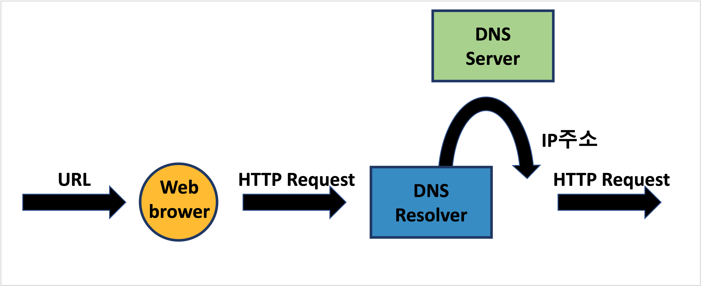
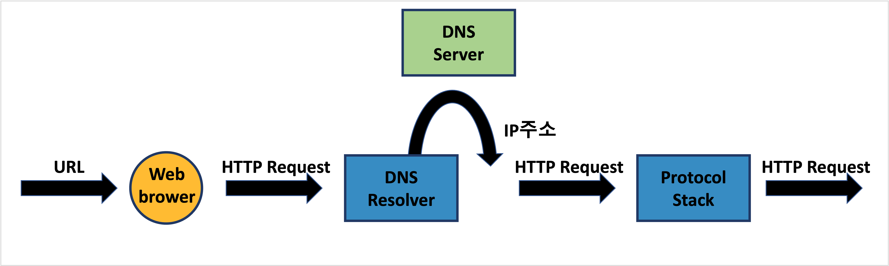

---
**Table of Contents**
{: #toc }
*  TOC
{:toc}
---
# 어플리케이션 계층(Application Layer)

어플리케이션 계층은 인터넷으로 연결 가능한 두 디바이스의 OSI layer 가장 끝단에 있는 계층으로, **웹 브라우저, 게임, 메일**과 같은 것들이 있습니다. 그 중에서도 웹 브라우저(사파리, 크롬 등)는 웹 서버로의 접근, 파일 업로드/다운로드, 메일 전송과 같은 다양한 클라이언트 기능을 겸비한 복합적인 클라이언트 소프트웨어입니다. 그래서 저는 이번 포스트에서 웹 브라우저의 동작원리에 대해 집중적으로 알아보도록 하겠습니다.  

디바이스간 연결을 위해서는 계층별로 지켜야 규약들이 있습니다. 만약 이러한 규약들이 없다면 세상에 존재하는 다양한 디바이스들을 연결시키기 어렵습니다. 어플리케이션에서도 이러한 규약들이 있는데 대표적으로 다음과 같은 것들이 있습니다.  

**Application Layer Protocols**  

- **HTTP**: HyperText Transfer Protocol의 약자. 하이퍼링크로 연결된 html 문서(사실상 거의 모든 데이터)를 전송할 때의 규약
- **FTP**: File Transfer Protocol의 약자. 파일을 업로드/다운로드 할 때 사용되는 규약
- **SMTP**: Simple Mail Transfer Protocol의 약자. 메일을 전송할 때 사용되는 규약


# 웹 브라우저의 동작원리
우리가 웹 브라우저(크롬, 사파리 등)에서 뉴스 보기를 클릭하거나 유튜브 비디오를 시청할 때 내부적으로 어떤 일들이 일어나는지 한 번 알아보겠습니다.  

## HTTP 리퀘스트 작성
우리는 보통 웹 브라우저에서 URL을 입력하거나 어떤 버튼을 클릭하는 식으로 웹 서버와 상호작용 하게 되는데 이 때 **웹 브라우저는 내부에서 HTTP 리퀘스트라는 것을 웹 서버에 전송**합니다.  

### URL 입력


### URL에 관한 문법

```sh
# URL 문법
scheme://[userinfo@]host[:port][/path][?query][#fragment]

예: https://www.google.com/search?q=hello&hl=ko


# scheme
예: https
- 주로 프로토콜이 사용됩니다.
- 프로토콜: 어떤 방식으로 자원에 접근할 것인가 하는 약속 규칙 (https, http, ftp)
- 포트가 생략되어 있을 때 https가 사용되면 443포트, http가 사용되면 80포트가 디폴트
- https는 http에 보안 추가 (HTTP Secure)

# host
예: www.google.com
- 도메인명 또는 IP주소

# port
예: 8888
- 접속 포트

# path
예: /search
- 리소스 경로 (계층적 구조)
- 디렉토리명/파일명

# query
예: ?q=hello&hl=ko
- key=value 형태
- ?로 시작, &로 추가 가능
- query parameter 또는 query string으로 보통 불림

# fragment
예: #getting-started-introducing-spring-boot
- html 내부 북마크 등에 사용
- 서버에 전송하는 정보는 아님
```

### HTTP 리퀘스트 작성
URL을 입력하고 나면 웹 브라우저는 URL을 바탕으로 HTTP 리퀘스트 메시지를 만듭니다.  
HTTP 리퀘스트 메시지의 형태는 다음과 같습니다.  
  
[(joie-kim님 블로그 참고)](https://joie-kim.github.io/HTTP/){:target="_blank"}  

## DNS 서버에 웹 서버의 IP주소 조회
HTTP 리퀘스트를 작성하고 나면 이제 OS에게 이것을 웹 서버로 전송해달라고 요청합니다. (웹 브라우저가 직접 전송하지 않는 이유는 메시지를 송신하는 기능은 하나의 애플리케이션에만 종속되는 기능이 아니므로 OS에서 전송 기능을 담당하는 것이 더 좋다고 합니다.)  

OS에서는 리퀘스트 메시지를 전송하기 전에 먼저 **도메인 네임을 IP 주소로 변환**하는 과정을 거칩니다. 이를 **네임 레졸루션(name resolution)**이라고 합니다.  

### DNS Resolver를 이용해 DNS 서버 조회
네임 레졸루션을 시행하는 것이 **DNS 리졸버(DNS Resolver)**입니다. 리졸버는 Socket 라이브러리에 들어있는 부품화된 프로그램입니다. Socket 라이브러리는 네트워크 관련 기능을 하는 프로그램을 모아놓은 라이브러리입니다.  

  

## 프로토콜 스택에 메시지 송신 요청
DNS Resolver가 IP주소를 찾아오면 이제 진짜 웹 서버로 보낼 준비가 완료되었습니다. 이렇게 준비된 HTTP Request 메시지는 OS의 내부에 포함된 프로토콜 스택을 호출하여 실행을 요청합니다.  

  

# 참고
- [성공과 실패를 결정하는 1%의 네트워크 원리 책](http://www.kyobobook.co.kr/product/detailViewKor.laf?mallGb=KOR&ejkGb=KOR&barcode=9788931556742){:target="_blank"}  
- [imperva 블로그](https://www.imperva.com/learn/application-security/osi-model/){:target="_blank"}