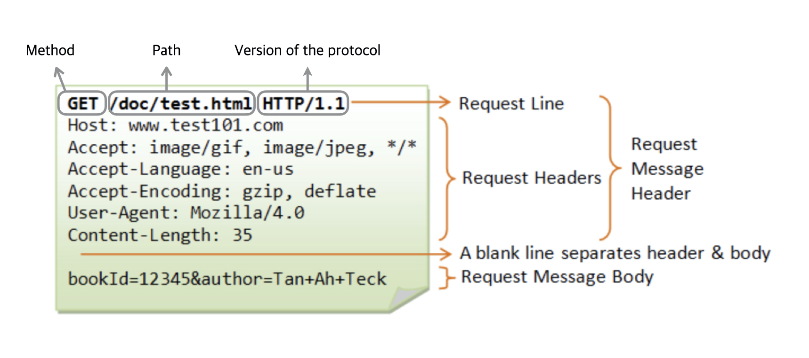

---
**Table of Contents**
{: #toc }
*  TOC
{:toc}
---

# HTTP

**HTTP(HyperText Transfer Protocol)는 응용 계층(Application layer)에서 압도적으로 많이 사용되는 프로토콜**입니다. 요즘에는 모든 데이터(텍스트, 이미지, 음성, 영상, 파일, JSON 등)를 HTTP 메시지에 담아서 전송합니다.  

HTTP가 하는 역할은 무엇일까요? 저희는 응용 계층에서 데이터를 주고받기 위해(크롬, 사파리와 같은 웹 브라우저에서 뉴스, 사진, 동영상을 보고 물건을 주문하는 것과 같은 행위) 클라이언트는 요청(request), 서버는 응답(response)하는 방식을 사용합니다.  이 때 응용 계층에 있는 단말기(우리의 핸드폰, 노트북 그리고 구글이 가지고 있는 웹 서버와 같은 것들)들이 서로 일관된 방법으로 데이터를 주고받기 위해 규약이 필요했는데 이때 생긴 규약이 바로 HTTP입니다.  

이 때 클라이언트는 **HTTP 메세지를 작성하기 위해 두 가지를 사용**합니다. 바로 **URL**과 **HTTP 메소드**입니다. 

## HTTP 버전 차이

- HTTP/1.1: 1997년에 등장해서 현재까지 가장 많이 사용하는 버전
- HTTP/2:
- HTTP/3: UDP기반으로 개발됨 

## HTTP의 특징

- 클라이언트/서버 구조로 동작 
  - 클라이언트가 request를 보내면 서버가 response를 돌려주는 구조
- 무상태(Stateless) 프로토콜
  - 서버가 클라이언트의 상태를 보존하지 않음 (그래서 클라이언트가 알아서 자신의 상태를 잘 업데이트해서 서버에 전달하게 됨)
  - 장점: 서버 확장성 높음(서버가 중간에 바뀌어도 된다. 어차피 클라이언트가 부담하게 되므로)
  - 장점: 특정 서버에 의존하지 않게 되므로 서버 장애에 강인하다
  - 단점: 클라이언트가 추가 데이터 전송해야함
  - 로그인이 필요한 서비스의 경우 로그인 상태를 서버에 유지해야하므로 이 때는 브라우저의 쿠키와 서버의 세션을 조합해서 보완해야함
- 비연결성
  - 서버와 클라이언트가 계속 연결을 유지하게 된다면 클라이언트가 늘어날때마다 서버의 리소스 부담 계속 커지게 됨
  - 클라이언트가 request를 보내고 서버가 response를 보낸 후 요청을 끊는다 -> 서버는 최소한의 자원만 사용하게 됨
  - HTTP는 기본적으로 연결을 유지하지 않는 모델
  - 연결하는데 시간이 별로 소요되지 않나? -> TCP/IP 연결 새로 맺어야함 -> 3-way handshake 시간이 추가된다
  - 그리고 네이버 검색을 예로 들때, 우리가 HTTP 메세지를 보내고 response를 돌려줄 때 검색 결과만 돌려주는게 아니라 그안에 포함된 HTML, CSS, 이미지 등을 함께 돌려줘야 한다 -> 이런 문제를 HTTP Persistent Connection으로 해결
  - Persistent Connection은 내부 메커니즘에 의해 보통 하나의 웹 페이지를 띄울 동안 연결을 계속 지속시킨다
  - HTTP/2, HTTP/3 오면서는 HTTP Persistent Connection이 더욱 발전됨
    
- HTTP 메시지

# URL


URL은 Uniform Resource Locator의 약자입니다. URL은 URI(Uniform Resource Identifier)를 표현하기 위한 방법 중 하나입니다. URL말고도 URN이라는 것이 있지만 지금은 거의 URL만 사용하기 때문에 URN은 생략하도록 하겠습니다.  

인터넷에서 어떤 **자원(회원 정보, 주문서, 사진, 동영상 등)을 유일하게 표현하기 위해 URI라는 개념이 등장**했고 이를 위한 방법으로 URL을 사용하는 것입니다. **URL은 이러한 자원들에게 부여된 고유한 주소**를 말합니다.  

```
인터넷에서는 모든 자원에 URL이라는 고유한 주소를 부여해 이들을 식별한다
```

URL의 예시를 보겠습니다.  

```
https://google.co.kr/search?q=hello&hl=ko

https://order.kyobobook.co.kr/order/orderStepOne
```

URL 문법은 아래와 같습니다.  

```sh
# URL 문법
scheme://[userinfo@]host[:port][/path][?query][#fragment]

예: https://www.google.com/search?q=hello&hl=ko


# scheme
예: https
- 주로 프로토콜이 사용됩니다.
- 프로토콜: 어떤 방식으로 자원에 접근할 것인가 하는 약속 규칙 (https, http, ftp)
- 포트가 생략되어 있을 때 https가 사용되면 443포트, http가 사용되면 80포트가 디폴트
- https는 http에 보안 추가 (HTTP Secure)

# host
예: www.google.com
- 도메인명 또는 IP주소

# port
예: 8888
- 접속 포트

# path
예: /search
- 리소스 경로 (계층적 구조)
- 디렉토리명/파일명

# query
예: ?q=hello&hl=ko
- key=value 형태
- ?로 시작, &로 추가 가능
- query parameter 또는 query string으로 보통 불림

# fragment
예: #getting-started-introducing-spring-boot
- html 내부 북마크 등에 사용
- 서버에 전송하는 정보는 아님
```

URL에서 유의할 점은 **URL은 자원을 식별하는 용도로만 써야 한다**는 것입니다. 예를 들어 어떤 물건을 주문할 때는 주문(order)만을 URL로 표현해야지 주문 확인(order-check), 주문 취소(order-cancel) 이런 **행위까지를 포함시키면 안됩니다**.

# HTTP Method
이러한 **행위를 나타내기 위해 사용하는 것이 바로 HTTP 메소드**입니다.


인터넷에서 발생하는 행위는 크게 CRUD(Create-Read-Update-Delete)로 나눌 수 있습니다. CRUD를 HTTP에서 제공하는 메소드로 구현할 수 있습니다.   

|**HTTP Method**|**설명**|
|GET|읽기(리소스 조회)|
|POST|쓰기(리소스 등록)|
|PUT|업데이트(리소스 완전 대체)|
|PATCH|부분 업데이트(리소스 부분 대체)|
|DELETE|삭제(리소스 삭제)|


# HTTP 메세지
클라이언트와 서버는 URL과 HTTP 메소드를 이용해서 HTTP 메세지를 만들어 통신한다고 했습니다. HTTP 메세지는 바이너리로 표현할 수 있는 모든 데이터를 전송할 수 있습니다. (**HTML, TEXT, JSON, XML, 이미지, 영상 파일** 등)  

서버간에 데이터를 주고받을 때에도 대부분 HTTP를 사용한다고 합니다.  

HTTP 메세지의 구조는 다음과 같습니다.  

{: width="70%"} 

## 시작 라인

### 요청 메세지인 경우

- HTTP 메소드
  - 종류: GET, POST, PUT, DELETE ...
  - 서버가 수행해야 할 동작 지정
    - GET: 리소스 조회
    - POST: 요청 내역 처리 

- 요청 대상
  - 절대경로[?쿼리]
  - 절대경로="/"로 시작하는 경로  

- HTTP 버전  


### 응답 메세지의 경우

- HTTP 버전  

- HTTP 상태 코드
  - 200: 성공
  - 400: 클라이언트 요청 오류
  - 500: 서버 내부 오류

## HTTP 헤더

- 용도
  - HTTP 전송에 필요한 모든 부가정보
  - 메세지 바디의 내용, 메세지 바디의 크기, 압축, 클라이언트 정보, ..

## HTTP 바디

- 실제 전송할 데이터
- HTML, 이미지, 영상, JSON 등 byte로 표현 가능한 모든 데이터 전송 가능

이렇게 HTTP 메세지를 통해서 두 단말기가 응용계층에서 쉽게 통신할 수 있도록 하는 API(Application Program Interface)를 **REST(Representational State Transfer) API**라고 합니다.  

## 예시

### 요청 메세지

{: width="70%"} 

### 응답 메세지

{: width="70%"} 

# 웹 브라우저의 동작원리
우리가 웹 브라우저(크롬, 사파리 등)에서 뉴스 보기를 클릭하거나 유튜브 비디오를 시청할 때 내부적으로 어떤 일들이 일어나는지 한 번 알아보겠습니다.  

## HTTP 리퀘스트 작성
우리는 보통 웹 브라우저에서 URL을 입력하거나 어떤 버튼을 클릭하는 식으로 웹 서버와 상호작용 하게 되는데 이 때 **웹 브라우저는 내부에서 HTTP 리퀘스트라는 것을 웹 서버에 전송**합니다.  

### URL 입력

```
https://www.google.com/search?q=hello&hl=ko
```


### HTTP 리퀘스트 작성
URL을 입력하고 나면 웹 브라우저는 URL을 바탕으로 HTTP 리퀘스트 메시지를 만듭니다.  
HTTP 리퀘스트 메시지의 형태는 다음과 같습니다.  
  
[(joie-kim님 블로그 참고)](https://joie-kim.github.io/HTTP/){:target="_blank"}  

## DNS 서버에 웹 서버의 IP주소 조회
HTTP 리퀘스트를 작성하고 나면 이제 OS에게 이것을 웹 서버로 전송해달라고 요청합니다. (웹 브라우저가 직접 전송하지 않는 이유는 메시지를 송신하는 기능은 하나의 애플리케이션에만 종속되는 기능이 아니므로 OS에서 전송 기능을 담당하는 것이 더 좋다고 합니다.)  

OS에서는 리퀘스트 메시지를 전송하기 전에 먼저 **도메인 네임을 IP 주소로 변환**하는 과정을 거칩니다. 이를 **네임 레졸루션(name resolution)**이라고 합니다.  

### DNS Resolver를 이용해 DNS 서버 조회
네임 레졸루션을 시행하는 것이 **DNS 리졸버(DNS Resolver)**입니다. 리졸버는 Socket 라이브러리에 들어있는 부품화된 프로그램입니다. Socket 라이브러리는 네트워크 관련 기능을 하는 프로그램을 모아놓은 라이브러리입니다.  

  

## 프로토콜 스택에 메시지 송신 요청
DNS Resolver가 IP주소를 찾아오면 이제 진짜 웹 서버로 보낼 준비가 완료되었습니다. 이렇게 준비된 HTTP Request 메시지는 OS의 내부에 포함된 프로토콜 스택을 호출하여 실행을 요청합니다.  

  


# 참고
- [인프런에서 제공하는 이영한님의 모든 개발자를 위한 HTTP 웹 기본 지식 강의](https://www.inflearn.com/course/http-웹-네트워크/dashboard){:target="_blank"}
- [REST 논문을 정리한 자료](https://restfulapi.net/resource-naming/){:target="_blank"}
- [사바라다는 차곡차곡: [REST API] REST에서의 Resource](https://sabarada.tistory.com/27){:target="_blank"}