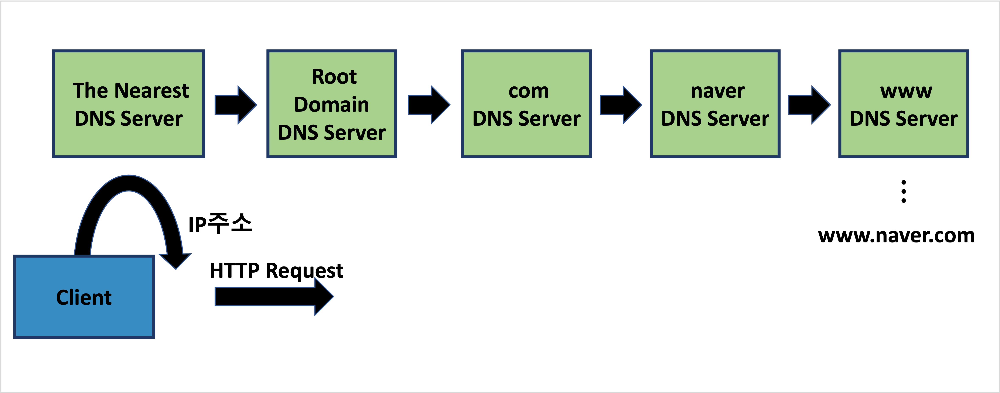

---
**Table of Contents**
{: #toc }
*  TOC
{:toc}
---
# IP(Internet Protocol) 주소

## IP 주소
IP 주소는 인터넷에 연결하고자 하는 **디바이스가 가지고 있는 NIC(Network Interface Controller)의 고유한 주소**를 뜻합니다. 편지를 주고 받기 위해서는 서로의 주소가 필요한 것처럼 디바이스간 통신을 위해서는 IP주소가 필요합니다. IP주소는 **네트워크 번호와 호스트 번호로 이루어진 32비트 숫자**입니다.(IPv4 기준)  
## 서브넷 마스크(Subnet Mask)

# DNS(Domain Name System) 서버  
DNS 서버는 도메인 네임을 IP주소로 매핑하여 보관하고 있는 서버입니다. 하지만 모든 도메인 정보를 저장할 수는 없고 저장한다고 해도 IP주소를 가지고 오는데 많은 시간이 소요됩니다. 이를 해결하기 위해 DNS 서버를 계층적으로 구성해 IP 주소를 가져오도록 했으며 한 번 가져온 정보는 캐시에 저장해둡니다. 하지만 캐시에 저장된 후 정보가 변경될 수 있기 때문에 캐시에 저장된 정보는 유효기간이 지나면 캐시에서 삭제됩니다.  
 
  