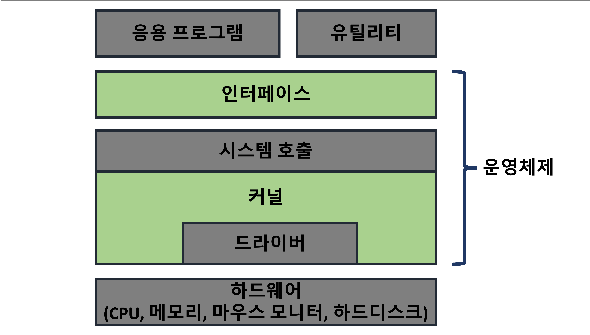

**Table of Contents**
{: #toc }
*  TOC
{:toc}
---
# 운영체제 소개
운영체제는 컴퓨터 전원을 켜면 가장 먼저 만나게 되는 소프트웨어로, 대표적인 예로 컴퓨터의 윈도우와 맥, 리눅스, 모바일의 iOS, 안드로이드가 있습니다. 이뿐만 아니라 스마트 워치, 스마트 TV에도 성능은 낮지만 임베디드 운영체제가 있습니다.  

운영체제가 하는 역할은 크게 다음과 같습니다.  
- 프로세스 관리
- 자원(CPU, 메모리) 관리 및 분배
- 파일시스템 관리
- 사용자 인터페이스 제공 (CLI, GUI) 
- 하드웨어 인터페이스 제공  

🦊 **인터페이스**  
응용 프로그램이나 하드웨어는 굉장히 다양하고 어려운 분야이기에 사용자가 직접 접근하는 것은 어렵게 느껴집니다. 이러한 문제를 해결하고자 컴퓨터 분야에서는 인터페이스라는 것을 제공하고 있으며 운영체제라는 소프트웨어에도 인터페이스가 있습니다. 

# 운영체제의 구조
## 커널과 인터페이스  

# 컴퓨터의 기본 구성

# CPU와 메모리

# 컴퓨터 성능 향상 기술

# 병렬 처리