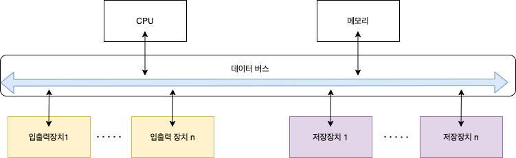
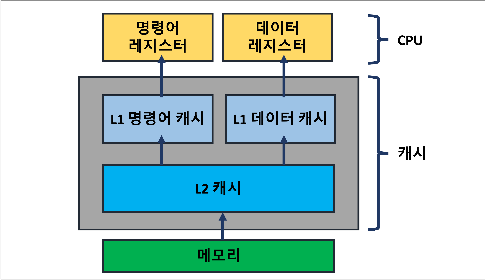

---
**Table of Contents**
{: #toc }
*  TOC
{:toc}
---

# 컴퓨터의 기본 구성

## 하드웨어의 구성
컴퓨터 하드웨어는 크게 **CPU, 메모리, 메인보드, 저장장치, 입출력장치**로 구성됩니다. 이 중에 CPU와 메모리는 필수장치로 구분되고 나머지는 주변장치로 구분됩니다. 

## 폰 노이만 구조
오늘날 대부분의 컴퓨터는 **CPU, 메모리, 저장장치, 입출력장치가 버스로 연결되어 있는 폰 노이만 구조**를 따르고 있습니다. 폰 노이만 구조 이전에는 컴퓨터가 하드와이어링(hard wiring) 형태로 용도에 맞게 매번 컴퓨터의 전선을 새로 연결해야 했습니다. 이러한 문제를 해결하기 위해 수학자 존 폰 노이만(John von Neumann)은 **프로그램만 교체하여 메모리에 올리는 방법**을 제안했습니다. 이러한 폰 노이만 구조 덕분에 오늘날에는 프로그래밍 기술을 이용해 컴퓨터로 다양한 작업을 할 수 있게 되었습니다.  

폰 노이만 구조의 가장 중요한 특징은, **모든 프로그램은 메모리에 올라와야 실행할 수 있다**는 것입니다. 예를 들어 하드디스크에 워드 프로그램과 문서가 저장되어 있어도 실행을 하기 위해서는 메모리에 올라와야 합니다. 운영체제 또한 프로그램이기 때문에 메모리에 올라와야 실행이 가능합니다. 



## 하드웨어 사양 관련 용어
- **CPU 클럭(clock)**: 초당 CPU내의 트랜지스터가 열고 닫히는 횟수(사이클 수) 하나의 사이클에 여러 개의 명령어가 완료되는 경우도 있고, 하나의 명령어가 여러 사이클에 걸쳐서 완료되기도 함
- **바이트(byte)**: 저장장치의 기억 용량 단위  

    |**용량 단위**|**용량**|
    |1B|1byte|
    |1KB|2^10byte = 1024B|
    |1MB|2^20byte = 1024KB|
    |1GB|2^30byte = 1024MB|
    |1TB|2^40byte = 1024GB|  

- **버스(bus)**: **시스템 버스**는 메모리와 주변장치를 연결하는 버스로 메인보드의 클럭속도를 나타내는 지표이며, **CPU 내부 버스**는 CPU 내부 부품들을 연결하는 버스로 CPU 클럭 속도와 같음. CPU 버스 속도가 시스템 버스의 속도보다 훨씬 빠름  

# CPU  

CPU(Central Processing Unit)은 중앙처리장치라고 하며 **메모리에 올라온 프로그램의 명령어를 해석하여 실행하는 장치**입니다. 따라서 중앙 처리 장치(CPU)는 컴퓨터 부품과 정보를 교환하면서 컴퓨터 시스템 전체를 제어하는 장치로, 모든 컴퓨터의 작동과정이 중앙 처리 장치(CPU)의 제어를 받기 때문에 컴퓨터의 두뇌에 해당한다고 할 수 있습니다.  

🦊 **32bit CPU**  
흔히 CPU를 얘기할 때 32bit CPU, 64bit CPU라고 하는데 이 때 32bit는 CPU가 **메모리에서 데이터를 읽거나 쓸 때 한 번에 처리할 수 있는 데이터의 최대 크기**를 말합니다.  

## CPU의 기본 구성
- **산술논리 연산장치(ALU)**: 산술 연산(덧셈, 뺄셈 등)과 논리 연산(AND, OR 등)을 수행하는 부분
- **제어장치(control unit)**: 명령어를 해석해 제어 신호를 보냄으로써 작업을 지시하는 부분
- **레지스터(resister)**: CPU 내에 데이터를 임시로 보관하는 부분


## CPU의 명령어 처리 과정

CPU는 메모리에 올라온 프로그램을 실행하기 위해서는 컴파일러를 이용해 코드를 기계어로 바꿔줘야 합니다. 이 **기계어를 사람이 이해하기 쉽게 일대일 대응시켜 기호화한 어셈블리어**가 있는데 어셈블리어를 살펴보면 CPU가 어떤 식으로 명령어를 내리고 처리하는지 볼 수 있습니다.  

```c
# C언어
int D2 = 2, D3 = 3, sum;
sum = D2 + D3;
```

```sh
# 어셈블리어
LOAD mem(100), register 2; # 메모리 100번지에 있는 값을 레지스터2에 로드
LOAD mem(120), register 3; # 메모리 120번지에 있는 값을 레지스터3에 로드
ADD register 5, resister 2, register 3; # 레지스터2와 레지스터3에 저장된 값을 더해 레지스터5에 저장
MOVE register 5, mem(160); # 레지스터5에 저장된 값(5)을 메모리 160번지로 이동
```
위의 명령어는 명령어 레지스터에 저장되고 제어장치는 저장된 명령어를 해석하고 알맞은 제어 신호를 보냄으로써 동작을 수행합니다. 이러한 제어 신호는 제어버스를 통해 메모리와 주변장치에 전달합니다. 

# 컴퓨터 성능 향상 기술
현재 컴퓨터 구조의 가장 큰 문제는 CPU와 다른 장치간의 작업 속도가 다르다는 것입니다. CPU 내부 버스의 속도가 시스템 버스의 속도보다 빠르기 때문에, 메모리를 비롯한 주변장치의 속도가 CPU의 속도를 따라가지 못하고 있습니다. 여기서는 이러한 속도 차이를 개선하기 위해 개발된 기술 중 운영체제와 관련된 기술을 살펴보겠습니다.  

## 버퍼
버퍼(buffer)는 속도에 차이가 있는 두 장치 사이에서 그 차이를 완화하는 역할을 합니다. 예를 들어 저장장치에서 메모리로 데이터를 읽어올 때 데이터를 하나씩 전송하는 것보다 **일정량의 데이터를 모아서 한꺼번에 전송**하면 속도를 향상시킬 수 있습니다. (일상생활에서 물건을 하나씩 나르는 것보다 바구니에 물건을 일정량 담아서 옮기는 것이 더 빠릅니다. 특히 거리가 먼 경우에는 그 차이가 더 클 것입니다.) **버퍼는 이러한 바구니 역할**을 합니다.  

## 캐시
캐시(cache)는 메모리와 CPU간의 속도 차이를 완화하기 위한 용도로 메모리의 데이터를 미리 가져와 저장해두는 임시 장소입니다. 캐시 또한 버퍼의 일종으로 **CPU가 앞으로 사용할 것으로 예상되는 데이터를 미리 가져다 놓습니다(prefetch)**.  

캐시는 CPU 안에 있으며 CPU 내부 버스의 속도로 동작합니다. 캐시는 메모리의 내용 중 일부를 미리 가져오고, CPU는 메모리에 접근하기 전에 캐시를 먼저 방문해 원하는 데이터가 있는지 찾아봅니다. 캐시에서 원하는 데이터를 찾은 경우를 **캐시 히트(cache hit)**라고 합니다. 일반적인 컴퓨터의 캐시 적중률은 약 90%입니다.  

캐시 적중률을 높이기 위해 캐시는 내부적으로 현**재 위치와 가까이 위치한 데이터**를 가져옵니다. 캐시 용량이 높은 캐시를 구매할 수도 있지만 가격이 비쌉니다.  



## 인터럽트
초기의 컴퓨터 시스템에는 주변장치가 많지 않아 CPU가 직접 입출력장치에서 데이터를 가져오거나 보냈는데 이러한 방식을 폴링(polling)이라고 합니다. 오늘날에는 주변장치가 많아 CPU가 모든 입출력에 관여하면 작업 효율이 현저하게 떨어집니다. 이러한 문제를 해결하기 위해 등장한 것이 **인터럽트(interrupt) 방식**입니다.  

CPU는 데이터를 가져오거나 보낼 때 직접하지 않고, **입출력 관리자에게 명령**을 보냅니다. 입출력 관리자가 메모리에 가지고 오거나 메모리의 데이터를 저장장치로 옮기는 동안 CPU는 계속 다른 작업을 할 수 있습니다. **입출력 관리자가 데이터 전송을 완료하고 나면 완료 신호를 CPU에 보내는데 이를 인터럽트**라고 합니다. 

인터럽트 방식을 이용하면 데이터의 입출력이 이루어지는 동안 CPU는 다른 작업을 하고 있을 수 있습니다. 

# 참고  

- [쉽게 배우는 운영체제 책 참고](http://www.kyobobook.co.kr/product/detailViewKor.laf?mallGb=KOR&ejkGb=KOR&barcode=9791156644071){:target="_blank"}
- [i'm developer, not coder블로그 참고](https://math-coding.tistory.com/83){:target="_blank"}
- [인텔 홈페이지](https://www.intel.co.kr/content/www/kr/ko/gaming/resources/cpu-clock-speed.html){:target="_blank"}
- [위키백과](https://ko.wikipedia.org/wiki/중앙_처리_장치){:target="_blank"}