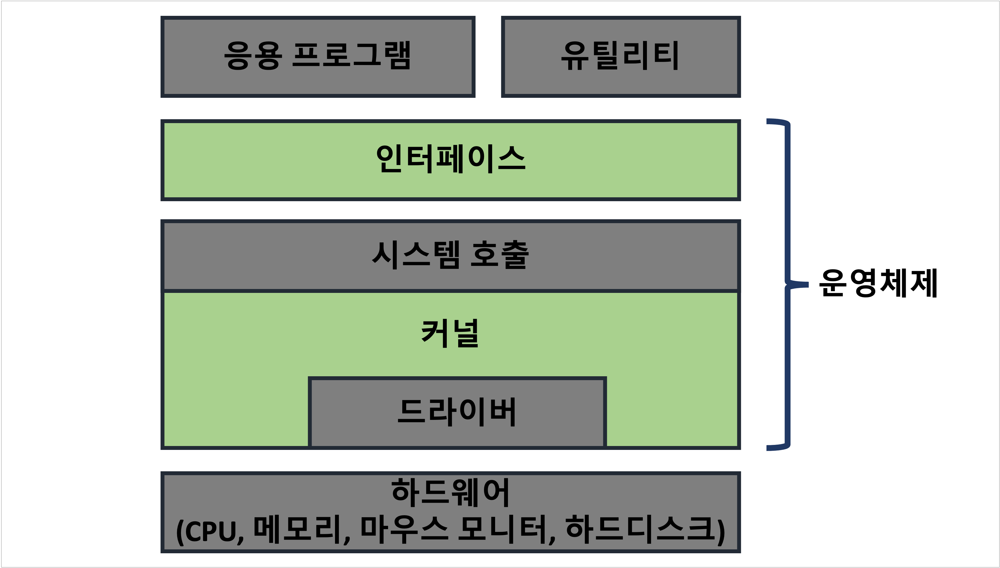

---
**Table of Contents**
{: #toc }
*  TOC
{:toc}
---
# 운영체제 소개

운영체제: **컴퓨터의 하드웨어와 소프트웨어 자원을 관리하는 시스템 소프트웨어**

운영체제는 컴퓨터 전원을 켜면 가장 먼저 만나게 되는 소프트웨어로, 대표적인 예로 컴퓨터의 윈도우와 맥, 리눅스, 모바일의 iOS, 안드로이드가 있습니다. 이뿐만 아니라 스마트 워치, 스마트 TV에도 성능은 낮지만 임베디드 운영체제가 있습니다.  

# 운영체제의 역할

- CPU 스케줄링과 프로세스 관리: CPU 소유권을 어떤 프로세스에 할당할지, 프로세스의 생애주기를 관리
- 메모리 관리: 한정된 메모리를 어떤 프로세스에 얼마나 할당할지 관리
- 파일시스템 관리: 파일을 디스크에 어떤 방법으로 보관할지 관리
- 사용자 인터페이스 제공 (CLI, GUI) 
- 하드웨어 인터페이스 제공  

🦊 **인터페이스**  
인터페이스는 사용자가 컴퓨터를 더욱 편하게 사용할 수 있도록 제공하는 것으로 크게 두 가지 기능을 제공합니다.  

- 사용자에게 사용 편의성 제공
- 하드웨어로의 무분별한 접근으로 생길 수 있는 장애를 차단

# 운영체제의 구조

## 커널과 인터페이스  
- **커널(kernel)**: 프로세스 관리, 메모리 관리, 저장장치 관리와 같은  운영체제의 핵심적인 기능을 모아놓은 것입니다.
- **인터페이스(interface)**: 커널과 사용자 사이에서 명령을 전달하고, 실행 결과를 보여주는 역할을 합니다.   

운영체제는 커널과 인터페이스로 구분되어 있으며, 같은 커널에도 다양한 형태의 인터페이스를 사용할 수 있습니다. 예를 들어 **리눅스에서는 인터페이스를 쉘(shell)**이라고 하는데 쉘에는 배시쉘(bash), 지쉘(zsh)과 같은 여러 종류의 쉘이 있습니다.  

## 시스템 호출
시스템 호출(system call)은 커널에 있는 인터페이스 중 하나로 **시스템 자원의 사용과 관련한 함수를 제공**합니다. 응용 프로그램이 하드웨어 자원에 접근하려 할 때는 시스템 호출을 사용함으로써 (예를 들어 `read()`, `write()` 함수) **직접적인 접근을 막아줍니다**. 만약 직접적인 접근이 허용되게 된다면 두 응용 프로그램이 같은 위치에 데이터를 저장하게 될 수도 있고, 이로 인해 저장되어 있던 데이터가 지워질 수도 있습니다. 이러한 오류를 막아주기 위해 커널에서는 시스템 호출이라는 인터페이스를 제공합니다.  

## 드라이버

예전과 다르게 하드웨어의 종류도 다양해지고, 제품을 만드는 회사도 굉장히 많기 때문에 제품별로 각각 다양한 특징과 기능이 존재합니다. 이러한 변동성을 커널이 가지고 있는 기본적인 기능만으로는 해결하기가 힘들기 때문에, 각 회사에서는 자신의 **제품(하드웨어)과 운영체제의 커널이 잘 상호작용할 수 있도록 인터페이스를 제공**하고 있습니다. 이를 드라이버 또는 디바이스 드라이버라고 합니다. 위의 그림에 드라이버가 커널과 하드웨어의 사이 전체를 감싸고 있지 않는 이유는 모든 하드웨어가 드라이버를 필요로 하지는 않기 때문입니다.  

# 참고
- [쉽게 배우는 운영체제 책 참고](http://www.kyobobook.co.kr/product/detailViewKor.laf?mallGb=KOR&ejkGb=KOR&barcode=9791156644071){:target="_blank"}