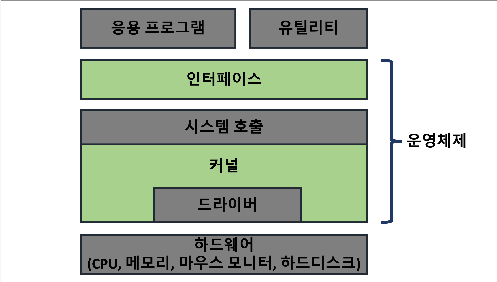

---
**Table of Contents**
{: #toc }
*  TOC
{:toc}
---
# 운영체제 소개
운영체제는 컴퓨터 전원을 켜면 가장 먼저 만나게 되는 소프트웨어로, 대표적인 예로 컴퓨터의 윈도우와 맥, 리눅스, 모바일의 iOS, 안드로이드가 있습니다. 이뿐만 아니라 스마트 워치, 스마트 TV에도 성능은 낮지만 임베디드 운영체제가 있습니다.  

**운영체제가 하는 역할**은 크게 다음과 같습니다.  
- CPU 스케줄링과 프로세스 관리: CPU 소유권을 어떤 프로세스에 할당할지, 프로세스의 생애주기를 관리
- 메모리 관리: 한정된 메모리를 어떤 프로세스에 얼마나 할당할지 관리
- 파일시스템 관리: 파일을 디스크에 어떤 방법으로 보관할지 관리
- 사용자 인터페이스 제공 (CLI, GUI) 
- 하드웨어 인터페이스 제공  

🦊 **인터페이스**  
인터페이스는 사용자가 컴퓨터를 더욱 편하게 사용할 수 있도록 제공하는 것으로 크게 두 가지 기능을 제공합니다.  

- 사용자에게 사용 편의성 제공
- 하드웨어로의 무분별한 접근으로 생길 수 있는 장애를 차단

# 운영체제의 구조
## 커널과 인터페이스  
- **커널(kernel)**: 프로세스 관리, 메모리 관리, 저장장치 관리와 같은  운영체제의 핵심적인 기능을 모아놓은 것입니다.
- **인터페이스(interface)**: 커널과 사용자 사이에서 명령을 전달하고, 실행 결과를 보여주는 역할을 합니다.   

운영체제는 커널과 인터페이스로 구분되어 있으며, 같은 커널에도 다양한 형태의 인터페이스를 사용할 수 있습니다. 예를 들어 **리눅스에서는 인터페이스를 쉘(shell)**이라고 하는데 쉘에는 배시쉘(bash), 지쉘(zsh)과 같은 여러 종류의 쉘이 있습니다.  

### 시스템 호출
시스템 호출(system call)은 커널에 있는 인터페이스 중 하나로 **시스템 자원의 사용과 관련한 함수를 제공**합니다. 응용 프로그램이 하드웨어 자원에 접근하려 할 때는 시스템 호출을 사용함으로써 (예를 들어 `read()`, `write()` 함수) **직접적인 접근을 막아줍니다**. 만약 직접적인 접근이 허용되게 된다면 두 응용 프로그램이 같은 위치에 데이터를 저장하게 될 수도 있고, 이로 인해 저장되어 있던 데이터가 지워질 수도 있습니다. 이러한 오류를 막아주기 위해 커널에서는 시스템 호출이라는 인터페이스를 제공합니다.  

### 드라이버
예전과 다르게 하드웨어의 종류도 다양해지고, 제품을 만드는 회사도 굉장히 많기 때문에 제품별로 각각 다양한 특징과 기능이 존재합니다. 이러한 변동성을 커널이 가지고 있는 기본적인 기능만으로는 해결하기가 힘들기 때문에, 각 회사에서는 자신의 **제품(하드웨어)과 운영체제의 커널이 잘 상호작용할 수 있도록 인터페이스를 제공**하고 있습니다. 이를 드라이버 또는 디바이스 드라이버라고 합니다. 위의 그림에 드라이버가 커널과 하드웨어의 사이 전체를 감싸고 있지 않는 이유는 모든 하드웨어가 드라이버를 필요로 하지는 않기 때문입니다.  

### 커널의 구조

- 단일형 구조
- 계층형 구조
- 마이크로 구조

# 참고
- [쉽게 배우는 운영체제 책 참고](http://www.kyobobook.co.kr/product/detailViewKor.laf?mallGb=KOR&ejkGb=KOR&barcode=9791156644071){:target="_blank"}