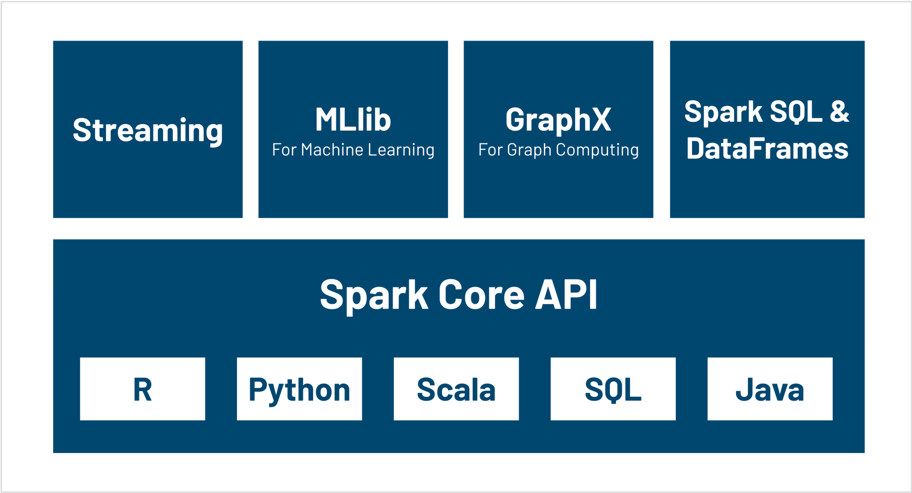
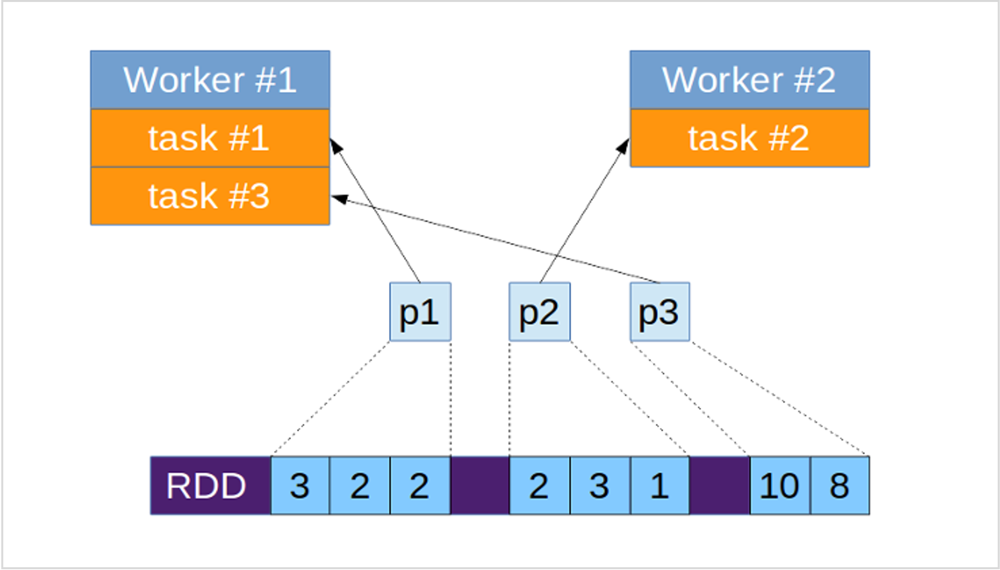
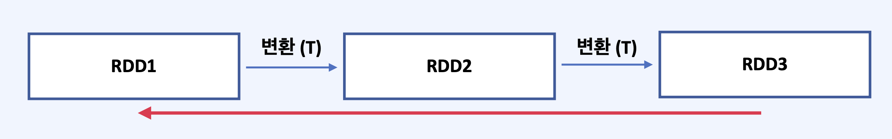
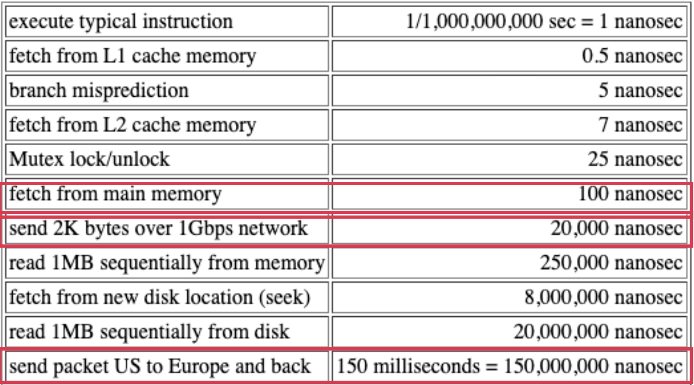
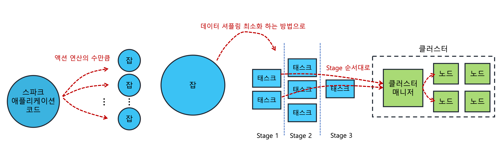

---
**Table of Contents**
{: #toc }
*  TOC
{:toc}

---

# Spark Introduction
__스파크는 클러스터 기반의 분산 처리 기능을 제공하는 오픈소스 프레임워크입니다.__ 쉽게 말해 대용량 데이터를 여러 컴퓨터에 나누어서 동시에 처리한다고 할 수 있습니다. 이런 방법이 스파크 이전에 없었던 것은 아닙니다. 스파크 이전에 하둡(Hadoop)이 이와 유사한 기능을 제공했었습니다. 
참고로 하둡은 더그 커팅(Doug Cutting)이라는 사람이 구글이 발표했던 두 개의 논문([__The Google File System_2003__](https://static.googleusercontent.com/media/research.google.com/ko//archive/gfs-sosp2003.pdf){:target="_blank"}, [__MapReduce: simplified data processing on large clusters_2008__](https://dl.acm.org/doi/10.1145/1327452.1327492){:target="_blank"})을 직접 구현해 만든 프레임워크입니다. 이처럼 구글에서는 예전부터 대용량의 데이터를 고속 분산처리 하기 위해 노력했었고, 현재 스파크는 대부분의 기업들이 사용하고 있는 소프트웨어입니다.  

  

지금부터는 스파크와 하둡을 비교하며 스파크의 특징에 어떤 것이 있는지 알아보겠습니다.  

|__차이점__|__하둡__|__스파크__|
|기반|디스크 기반|메모리 기반|
|처리방식|Map-Reduce|RDD|
|프로그래밍언어|자바|스칼라, 자바, 파이썬, R|
|라이브러리|-|다양한 라이브러리(Spark streaming, MLlib, GraphX 등) 제공|

- Hadoop의 MapReduce는 기본적으로 Disk I/O를 많이 발생시켰기 때문에 Batch 처리에만 적합
- Spark는 머신러닝과 같이 반복 작업을 많이 하는 알고리즘이 메모리 상에서 바로 수행될 수 있게 해주는 프레임워크

처리방식에 대해 조금 더 이야기 해보겠습니다. 맵리듀스(MapReduce)는 2004년 구글에서 대용량 데이터 처리를 분산환경에서 처리하기 위한 목적의 소프트웨어 프레임워크입니다. 맵리듀스는 함수형 프로그래밍에서 일반적으로 사용되는 Map과 Reduce라는 함수를 기반으로 만들어졌습니다. Map은 각각의 분산된 환경에서 독립적으로 실행되는 함수의 일종, Reduce는 분산 환경에서의 데이터를 하나로 모으는 함수라고 생각할 수 있습니다.  


맵리듀스는 분산된 환경에서 데이터가 처리되는데 필요한 많은 함수들을 제공해주지만, 현업에서 필요한 기능들을 모두 커버하기에는 무리가 있었습니다. 그래서 이러한 단점을 보완하기 위해 2009년 UC Berkeley 대학에서 연구를 시작해 2012년 미국 NSDI 학회에서 스파크의 핵심 개념인 __RDD(Resilient Distributed Dataset)__ 에 대한 논문을 발표하였습니다.  

# RDD
> RDD is a fault-tolerant collection of elements that can be operated on in parallel.  

[(아파치 스파크 공식문서 참고)](https://spark.apache.org/docs/3.2.0/rdd-programming-guide.html#resilient-distributed-datasets-rdds){:target="_blank"}

다시 말하면 RDD란 스파크에서 정의한 **분산 데이터 모델로서 병렬 처리가 가능한 요소**로 구성되며 데이터를 처리하는 과정에서 **장애가 발생하더라도 스스로 복구할 수 있는 능력**을 가진 **데이터 모델**이라는 뜻입니다. RDD는 분산 데이터에 대한 모델로서 단순히 값으로 표현되는 데이터만 가리키는 것이 아니고, 분산된 **데이터를 다루는 방법까지 포함**하는 일종의 클래스와 같은 개념입니다.  

RDD에서 중요한 특징은 다음과 같습니다.    

- **파티션(Partition)**: 분산 처리 기능 제공
- **불변성**: 장애 복구 기능 제공
- **게으른 연산(Lazy operation)**: 연산 최적화 기능 제공   


## 파티션(Partition)
RDD는 분산 데이터 요소로 구성된 데이터 집합입니다. 여기서 **분산 데이터 요소를 파티션**이라고 합니다. 스파크는 작업을 수행할 때 바로 이 **파티션 단위로 나눠서 병렬로 처리**합니다. 여기서 제가 헷갈렸던 것은 파티션이 분산처리와 병렬처리 중 어떤 것을 기준으로 나뉘어진 단위인가 라는 것 이었습니다. 공식문서[(아파치 스파크 공식문서 참고)](https://spark.apache.org/docs/3.2.0/rdd-programming-guide.html#parallelized-collections){:target="_blank"}를 살펴본 결과 파티션은 병렬 처리가 되는 기준이었습니다. 여러 서버에 분산할 때 보통 하나의 서버 당 2~4개 정도의 파티션을 설정합니다. 이 기준은 개인의 클러스터 환경에 따라 기본 설정 값이 다르며 이 값은 원하는 값으로 바꿀 수 있습니다. 구글에서 이미지를 살펴보았을 때는 다들 task당 한개의 파티션이라고 합니다.  

  

## 불변성(Immutable)  
한 개의 RDD가 여러 개의 파티션으로 나뉘고 다수의 서버에서 처리되다 보니 작업 도중 일부 파티션 처리에 장애가 발생해 파티션 처리 결과가 유실될 수 있습니다. 하지만 스파크에서 RDD는 불변성이기 때문에 **생성 과정에 사용되었던 연산들을 다시 실행하여 장애를 해결할 수 있습니다.** 여기서 불변성이라는 말은 RDD에서 어떤 연산을 적용해 다른 RDD가 될 때 __무조건 새로 RDD를 생성합니다(RDD는 불변이다).__ 이러한 방식 덕분에 장애가 발생해도 기존의 RDD 데이터에 다시 연산을 적용해 장애를 해결할 수 있는 것입니다(RDD는 회복 탄력성이 좋다(resilient)). 

  

## 게으른 연산(Lazy Operation)  

RDD의 연산은 크게 __트랜스포메이션__ 과 **액션**이라는 두 종류로 나눌 수 있습니다.  
- 트랜스포메이션: RDD1 -> RDD2 이런식으로 새로운 RDD를 만들어내는 연산, 대표적으로 map 함수
- 액션: RDD -> 다른 형태의 데이터를 만들어내는 연산, 대표적으로 reduce 함수  
[(아파치 공식문서 참고)](https://spark.apache.org/docs/3.2.0/rdd-programming-guide.html#transformations){:target="_blank"}  

트랜스포메이션 연산은 보통 분산된 서버 각각에서 독립적으로 수행할 수 있는 연산입니다. 그리고 액션은 분산된 서버에 있는 데이터가 서로를 참조해야 하는 연산입니다. 그래서 액션은 서버 네트워크간의 이동이 발생하게 됩니다. 이런 현상을 셔플링(Shuffling)이라고 하고, 보통 네트워크에서 읽어오는 연산은 메모리에 비해 100만배 정도 느립니다.  

  

그렇기 때문에 셔플링이 발생하는 연산을 할 때에는 그 전에 최대한 데이터를 간추리는 것이 중요한데 스파크의 중요한 특징 중 하나가 바로 게으른 연산을 한다는 것입니다. 게으른 연산이라는 말은 **RDD가 액션연산을 수행할 때에 비로소 모든 연산이 한꺼번에 실행된다는 것입니다.** 이러한 방식의 장점은 데이터를 본격적으로 처리하기 전에 어떤 연산들이 사용되었는지 알 수 있고, 이를 통해 최종적으로 실행이 필요한 시점에 누적된 변환 연산을 분석하고 그중에서 가장 최적의 방법을 찾아 변환 연산을 실행할 수 있습니다. 이렇게 되면 **셔플링이 최대한 작은 사이즈로 발생할 수 있도록 합니다.**  

```
스파크는 RDD를 사용함으로써 처리 속도도 높이고, 장애 복구도 가능해졌다
```

# Spark Architecture  

Spark는 여러 모듈로 구성되어 있습니다. 크게 두 부분으로 나누어 보면, 컴퓨터 Cluster의 리소스를 관리하는 Cluster Manager와 그 위에서 동작하는 사용자 프로그램인 Spark Application(Driver Program과 여러 Executor 프로세스로 구성)으로 구분됩니다.  

  

- 드라이버 프로그램
- 클러스터 매니저
- 워커 노드


## 드라이버 프로그램  

> The process running the main() function of the application and creating the SparkContext

- 드라이버 프로그램의 역할은 다음과 같습니다.  
  - 클러스터 매니저(마스터 노드)와의 connection을 위한 스파크 컨텍스트 객체를 생성
  - SparkContext를 이용해 RDD 생성
  - SparkContext를 이용해 연산 정의
  - 정의된 연산은 DAG 스케줄러에게 전달되고 스케줄러는 연산 실행 계획 수립 후 클러스터 매니저에 전달
- 드라이버 프로그램은 어떤 노드에도 위치할 수 있습니다.
  - 클라이언트 모드: 클라이언트 노드로 따로 빼서 실행하는 경우, 클러스터 매니저가 있는 마스터 노드에서 실행하는 경우
  - 클러스터 모드: 워커 노드에서 실행하는 경우 (--deploy-mode cluster 옵션 필요)
- SparkContext는 스파크 어플리케이션 코드를 작성하기 위한 환경, 도구를 제공해주는 클래스입니다


## 클러스터 매니저  

> An external service for acquiring resources on the cluster (e.g. standalone manager, Mesos, YARN, Kubernetes)

- **Standalone**: Standalone은 마스터 노드에서 `./sbin/start-master.sh` 명령을 실행하면 된다
- **YARN**: Hadoop이 설치된 노드가 클러스터 매니저가 된다
- **Kubernetes**: Kubernetes가 설치된 노드가 클러스터 매니저가 된다

클러스터 매니저의 종류마다 지원하는 범위가 세부적으로 다르지만 대략적인 역할은 다음과 같습니다.  
- 스파크 컨텍스트 생성시 설정된 Executer의 개수, Executer의 메모리를 바탕으로 자원을 할당
- 이용 가능한 워커에 태스크를 할당하기 위해 노드를 모니터링


## (마스터 노드)
스파크 공식문서를 보면 스파크 아키텍처에서 마스터 노드에 대한 별다른 언급은 없다. 그 이유가 그냥 **클러스터 매니저가 실행되는 노드**를 지칭하기 때문이다. 위에서 Standalone을 클러스터 매니저로 사용할 때 실행한 명령어가 start-master.sh인 것만 봐도 클러스터 매니저와 마스터 노드는 차이가 없다. 

- Standalone일 때 마스터 명시: `--master spark://<클러스터 매니저를 실행 중인 노드의 호스트>:<포트>`
- Kubernetes일 때 마스터 명시: `--master k8s://https://<k8s-apiserver-host>:<k8s-apiserver-port>`

## 워커 노드
스파크 컨텍스트는 워커 노드에 Executer를 생성하도록 클러스터 매니저에 요청을 하고 클러스터는 그에 맞춰 Executer를 생성합니다. Executer가 생성되면 드라이버 프로그램은 정의된 연산을 수행합니다.  

이 때 작업을 실제로 수행하는 것은 아니고 액션 연산의 수만큼 잡(Job)을 생성하고 잡은 셔플링이 최대한 적게 일어나는 방향으로 스테이지(Stage)를 나눕니다. 나누어진 스테이지는 다시 여러 개의 태스크(Task)로 나누어진 후 워커 노드에 생성된 Executer에 할당됩니다. 워커 노드는 Executer를 이용해 태스크를 처리하고, 데이터를 나중에 재사용 할 수 있도록 메모리에 저장도 합니다.  

- **Executer**: 작업을 수행하기 위해 스파크에서 실행하는 프로세스, 자원할당 단위, 하나의 노드에 여러 개 Executer 가능
- **Job**: 액션 연산의 수
- **Task**: 잡을 적당한 단위로 나누어 실제로 익스큐터에 할당하는 작업 단위

  

# 알아두면 좋은 것들  

## Shuffling  

## Passing Functions to Spark

# 질문  

- RDD가 파티션으로 나뉘어지는 시점은 RDD가 생성되는 순간일까 아니면 연산이 실행되는 순간일까?
- 어떤 기준으로 RDD를 파티셔닝할까?
- 셔플링은 액션 연산에서만 발생할까?

# 참고
- [빅데이터 분석을 위한 스파크2 프로그래밍 책](http://www.kyobobook.co.kr/product/detailViewKor.laf?ejkGb=KOR&mallGb=KOR&barcode=9791158391034&orderClick=LEa&Kc=){:target="_blank"}
- [stackoverflow: Understand Spark: Cluster Manager, Master and Driver nodes (훌륭한 질문과 훌륭한 대답)](https://stackoverflow.com/questions/34722415/understand-spark-cluster-manager-master-and-driver-nodes){:target="_blank"}
- [How Applications are Executed on a Spark Cluster](https://www.informit.com/articles/article.aspx?p=2928186){:target="_blank"}
- [타다 테크 블로그, Hadoop대신 Spark를 선택한 이유](https://blog-tech.tadatada.com/2015-05-18-data-analysis-with-spark){:target="_blank"}