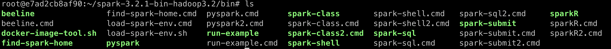
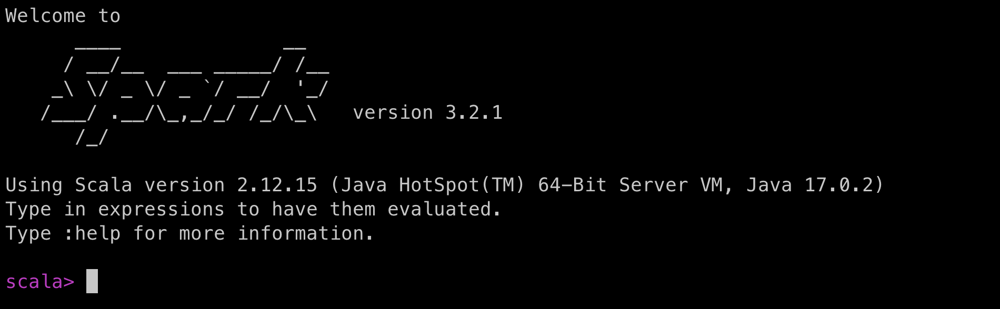
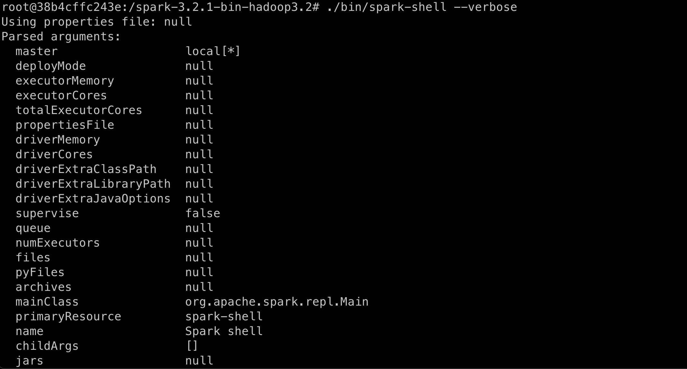
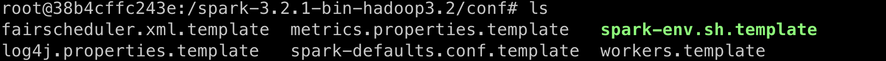

**Table of Contents**
{: #toc }
*  TOC
{:toc}

---

# 스파크 설치
스파크를 설치하는 과정 자체는 크게 복잡하지 않습니다. **자바와 스파크만 설치**하면 스파크를 사용할 수 있습니다. 자바가 필요한 이유는 스파크가 JVM 위에서 실행되기 때문입니다.  

하지만 실무에서는 대부분의 빅데이터 소프트웨어들이 클러스터 환경에서 동작하기 때문에 제대로 활용하기 위해서는 여러 가지 준비할 것도 많고 설정해야 할 것들도 많습니다. 그래서 스파크는 **개발/테스트를 위한 용도로 간단하게 사용할 때에는 단독 서버에서 동작하는 로컬 모드를, 배포를 위한 용도로 클라이언트, 클러스터 모드를 지원**합니다.  

스파크 애플리케이션 코드는 **자바, 스칼라, 파이썬, R**언어로 작성할 수 있습니다.  

## pyspark
우선 저는 파이썬을 주언어로 사용하기 때문에 pyspark를 이용해 파이썬으로 스파크 애플리케이션 코드를 작성할 예정입니다. pyspark의 장점은 만약 개발/테스트를 위한 목적으로만 스파크를 사용할 예정이라면 스파크를 설치할 필요가 없다는 것입니다. 스파크를 사용하는데 스파크를 설치할 필요가 없다? 무슨 뜻이냐면 pyspark를 설치하기만 해도 스파크를 실행하기 위해 필요한 최소한의 파일을 함께 설치해줍니다.  

하지만 여전히 자바는 설치해주어야 합니다.  

> To run Spark, you only require a Java runtime environment (JRE) but you may also download the Java development kit (JDK) which includes the JRE.  

저는 **파이썬이 설치되어 있는 도커 이미지를 이용해 컨테이너 안에서 실습**을 진행해 보았습니다.  


### 자바, 파이썬 설치
```sh
# 파이썬이 설치된 컨테이너 생성
docker run -it python:3.8-buster
```

```sh
# JDK 설치
apt-get update
apt-get install openjdk-11-jdk
```

```sh
# JAVA_HOME 변수 설정, 경로 추가


export JAVA_HOME=/etc/openjdk-11-jdk     # 본인의 자바 설치 경로
export PATH=$JAVA_HOME/bin:$PATH

. /etc/profile # bash쉘이면 source /etc/profile
```
### pyspark 설치
```sh
# pyspark 설치
pip install pyspark
```

```py
# 잘 설치되었는지 확인
import pyspark
sc = pyspark.SparkContext(appName="SparkContext")

sc
--------------------------------
SparkContext

Version
v3.2.1
Master
local[*]
AppName
SparkContext
```  

## Spark
이번에는 파이썬에 국한되지 않는 조금 더 일반적인 방법으로 스파크를 설치해보겠습니다. 이번에는 리눅스 운영체제만 가지는 컨테이너 위에서 실습을 진행하도록 하겠습니다.  

처음에는 우분투 이미지를 바로 컨테이너로 띄우고 그 위에서 자바를 설치하려 했지만, 오라클에서 다운받는 방법을 제한하고 있어서 아래의 방법으로 진행했습니다. (우분투 이미지에 로컬에서 다운받은 자바를 하나의 이미지로 새로 빌드)  

그래서 사실 위에서 진행한 pyspark만 설치하는 방법에서도 python이미지에 로컬 자바로 한 번 이미지를 빌드한 후 사용하는 것이 좋을 것 같습니다. 저도 아직 본격적으로 사용해보지는 않아서 에러가 있는지는 확인해보지 않았지만 로컬에서 자바를 다운 받고 빌드하는 방법은 확실히 안전합니다.  

🦊 **자바 설치**  
자바 라이센스를 소유하고 있는 오라클에서 2019년 4월부터 자바를 외부의 허용하지 않은 방법으로 다운받는 것을 금지시켰습니다. 그래서 wget과 같은 방식으로 자바8 버전을 더이상 다운받을 수 없게 되고 무조건 오라클에 로그인을 한 후 로컬에 먼저 다운을 받아야합니다. ~~자바 17은 가능한데 스파크에서 자바 17로 설치하니까 오류가 난다. 구글링에서는 자바를 다운그레이드 하라고 나와있다. 자바8로 해보니까 된다. 그래서 자바8을 지금 다운 받으려고 하는 것이다.~~그래서 저같은 경우에는 왠만한 작업들은 무조건 도커 컨테이너에서 진행하는 편이라 처음에는 도커허브에서 자바8이 설치되어 있는 이미지를 찾아봤지만 뭔가 세부설정들이 마음에 들지 않게 되어 있어서 이미지를 직접 빌드하기로 결정했습니다. 제가 사용한 방법의 과정은 다음과 같습니다.  

```sh
# 자바를 로컬에 다운로드
# 다운로드 페이지 접속
https://www.oracle.com/java/technologies/javase/javase8u211-later-archive-downloads.html

# 저는 M1 칩을 사용하고 있어서 ARM64 전용 파일을 다운로드 받았습니다.
jdk-8u311-linux-aarch64.tar.gz

# 다운로드 받은 폴더에서 압축해제
tar -xzvf jdk-8u311-linux-aarch64.tar.gz
```
```Dockerfile
# Dockerfile 작성
# 로컬에 설치한 자바를 컨테이너로 옮기고 스파크까지 설치해주었습니다
FROM ubuntu:latest

COPY jdk1.8.0_321 ./jdk1.8.0_321

RUN apt-get -y update \
&& apt-get -y install vim \
&& apt-get -y install wget \
&& wget https://dlcdn.apache.org/spark/spark-3.2.1/spark-3.2.1-bin-hadoop3.2.tgz \
&& tar -xzvf spark-3.2.1-bin-hadoop3.2.tgz
```

```sh
vim /etc/profile

# 환경 변수설정해줍니다. 이부분은 Dockerfile에서 ENV로 설정해 줄 수도 있습니다
export JAVA_HOME=/jdk1.8.0_321
export PATH=$JAVA_HOME/bin:$PATH

. /etc/profile
```


```sh
cd spark-3.2.1-bin-hadoop3.2
ls
--------------------------------------------------------------------------------------------------------------
LICENSE  NOTICE  R  README.md  RELEASE  bin  conf  data  examples  jars  kubernetes  licenses  python  sbin  yarn
```

```
# 스파크에서 제공하는 실행 파일
cd bin
ls
```

 

```sh
# 스파크 셸 실행
./bin/spark-shell

# 셸 종료
:q
```  

  


위의 과정은 이미지에서 매번 스파크를 다운받는 방식이기 때문에, 스파크를 다운받은 컨테이너를 다시 한 번 이미지로 만들면 그 다음부터는 새로 만든 이미지를 이용하면 컨테이너를 띄우는 속도가 더 빨라지게 됩니다. 그래서 `docker commit` 명령어를 이용해 한번 더 이미지를 빌드하는 것을 권장드립니다.  


```sh
# 로컬 터미널에서 docker commit 명령어로 이미지 생성
# dockere commit <원하는 컨테이너 이름> <생성할 이미지 이름>
docker commit thirsty_galois spark_container
```

# 로컬 개발 환경
위의 설치과정을 완료한 후 스파크의 설정 정보를 확인해 보겠습니다.  

```
./bin/spark-shell --verbose
```

  

다른 부분은 일단 신경쓰지 말고 master 부분만 보도록 하겠습니다. 현재 master가 `local[*]`로 설정되어 있습니다. 이는 현재 드라이버 프로그램을 실행하는 서버를 포함해 워커 노드까지 모두 로컬 서버를 이용하고 있다는 뜻입니다. `*`는 로컬 서버의 모든 스레드를 사용하겠다는 뜻입니다.  

따라서 여기까지만 설정하게 되면 로컬에서 테스트 목적으로 사용하기 위한 최소한의 준비는 끝난 것입니다. 이 외에도 여러 가지 설정들을 직접하고 싶을 때에는 `./conf`에 설정을 위한 여러가지 파일의 템플릿을 이용할 수 있습니다.  

  

# 클러스터 환경


# 참고  
- [Pyspark 코드는 어디서 실행되는가?](https://stackoverflow.com/questions/61816236/does-pyspark-code-run-in-jvm-or-python-subprocess){:target="_blank"}  
- [Pyspark만으로 스파크 애플리케이션 실행할 수 있나?](https://stackoverflow.com/questions/51728177/can-pyspark-work-without-spark){:target="_blank"}
- [Pyspark의 한계](https://stackoverflow.com/questions/58479357/pyspark-from-spark-installation-vs-pyspark-python-package){:target="_blank"}
- [bin/sh: 1: source: not found](https://askubuntu.com/questions/1363992/bin-sh-1-source-not-found){:target="_blank"}
- [[Linux] 우분투에 자바 설치](https://unit-15.tistory.com/114?category=521121#recentComments){:target="_blank"}
- [Unable to download Oracle JDK 8 using Wget command](https://superuser.com/questions/1466580/unable-to-download-oracle-jdk-8-using-wget-command){:target="_blank"}
- [자바(JDK, JRE) 모든 버전 다운로드( 6,7,8,9,10,11,12,13,14,15, 16, 17..)](https://nhj12311.tistory.com/37){:target="_blank"}
- [How to Set Up a Multi Node Apache Spark Cluster with Quobyte](https://www.quobyte.com/enterprise-analytics/howto-spark-quobyte-multinode){:target="_blank"}
- [Updating the Apache Spark configuration files](https://www.ibm.com/docs/en/zpfas/1.1.0?topic=structure-updating-apache-spark-configuration-files){:target="_blank"}
- [[spark] Spark 3 클러스터 설치](https://velog.io/@somnode/spark-cluster-install){:target="_blank"}