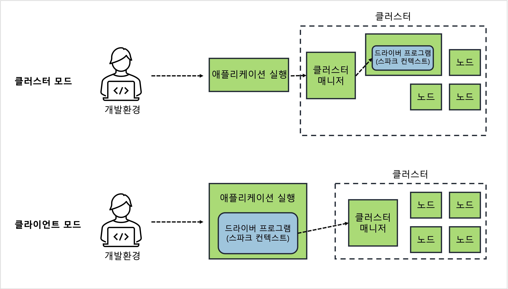

---
**Table of Contents**
{: #toc }
*  TOC
{:toc}

---
# 클러스터 환경
**스파크는 본질적으로 분산처리 프레임워크**입니다. 그래서 단순히 테스트를 위한 용도로는 단일 로컬 서버만으로도 가능하지만, 실제 배포 단계에서 스파크를 제대로 활용하기 위해서는 여러 대의 서버를 이용한 클러스터 환경을 구축할 필요가 있습니다.  

클러스터란 여러 대의 서버가 네트워크를 통해 연결되어 마치 하나의 서버인 것처럼 동작하는 방식을 의미합니다. 하지만 여러 서버들을 이 같은 방식으로 동작시키는 것은 쉬운 일이 아닙니다. 그래서 스파크에서는 전체 서버의 자원과 동작을 세밀하고 효율적으로 제어할 수 있는 별도 모듈이 필요한데, 이를 **클러스터 매니저**라고 합니다.  

스파크에서는 자체 구현한 클러스터 매니저도 제공하고 외부 클러스터 매니저를 임포트해서 사용할 수도 있습니다. 이렇게 여러 종류의 클러스터 매니저를 지원하게 되면 선택의 폭이 넓어진다는 장점도 있긴 하지만 클러스터 매니저마다 동작 방식이나 용어가 다르면 혼동이 될 수 있습니다. 스파크에서는 이런 혼란을 없애고자 추상화된 클러스터 모델을 제공함으로써 사용하는 클러스터의 종류에 관계없이 일관된 방법으로 프로그램을 작성하고 클러스터를 관리할 수 있게 해줍니다. 

내용에 들어가기 전에 한 가지 알아둘 것은 클러스터 환경이라고 해서 로컬 환경에서 사용하던 스파크 애플리케이션 **코드를 새로 작성해야 할 필요는 없습니다.** 다만 클러스터 환경에서는 여러 서버를 마치 하나의 서버인 것처럼 다뤄야 하기 때문에 하나의 작업을 여러 서버에 분산해서 실행하고 그 결과를 취합할 수 있는 **분산 작업 관리 기능이 추가**되어야 할 것입니다.  

따라서 이번 포스트의 목적은 **분산처리를 위한 시스템 아키텍처를 이해**하고, 이를 구현하기 위해 **필요한 설정과 매개변수를 이해**하는 것입니다.  

# 스파크의 분산처리 아키텍처  

아래 그림은 분산처리를 위한 스파크의 전형적인 아키텍처입니다.  

  

보시다시피 클러스터 매니저는 가운데에서 분산처리를 위한 매니저 역할을 하고 있습니다. 각각의 컴포넌트에 대한 설명은 [**앞의 포스트**](https://jaykim0510.github.io/spark-series1)에서 다룬 적이 있음으로 여기서는 간단하게만 요약하도록 하겠습니다.  

- **드라이버 프로그램**: 스파크 컨텍스트를 생성하고 클러스터 매니저와 연결시켜주는 프로그램
- **스파크 컨텍스트**: 클러스터와 연결되는 객체로 스파크 애플리케이션 코드를 작성하는데 필요한 거의 모든 기능을 제공
- **클러스터 매니저**: 워커 노드를 모니터링하며 최적의 자원(CPU, 메모리) 할당
- **워커 노드**: 분산된 데이터를 할당받고 요청된 작업을 처리하는 서버
- **익스큐터**: 작업을 수행하기 위해 스파크에서 실행하는 프로세스, 자원할당 단위
- **잡(Job)**: 액션 연산의 수
- **태스크**: 잡을 적당한 단위로 나누어 실제로 익스큐터에 할당하는 작업 단위

스파크 클러스터는 이와 같이 드라이버, 클러스터 매니저, 워커 노드의 조합으로 구성됩니다. 여기서 실행 모드, 클러스터 매니저의 종류에 따라 약간의 다른 점이 있지만 큰 맥락에서는 같습니다.  

# 스파크의 디플로이 모드

실행 모드의 경우 두 가지가 있습니다. 클러스터 모드, 클라이언트 모드입니다.

  

두 모드 가운데 어떤 것을 선택하든 수행 결과는 동일합니다. 하지만 **클러스터 모드의 경우** 드라이버 프로그램과 익스큐터 간의 네트워크 비용이 상대적으로 낮아져서 **성능 향상**을 기대할 수 있습니다. 하지만 스파크 셸과 같은 인터랙티브 환경을 이용한 **디버깅이 어려워**서 정형화된 작업에만 주로 사용하고, **클라이언트 모드의 경우** 사용성이 **편리**하지만 드라이버 프로그램과 워커 노드가 네트워크 상에서 너무 많이 떨어져 있으면 전체적인 성능에 영향을 줄 수 있으므로 **가급적 동일 네트워크 상에 존재하는 서버로 선택**하는 것이 좋습니다.  

# 스파크 애플리케이션 동작 순서
지금까지 스파크의 클러스터 환경에서 갖게되는 아키텍처와 컴포넌트에 대해 살펴봤습니다. 지금부터는 아키텍처에서 실제로 스파크 애플리케이션이 구동되는 과정을 살펴보도록 하겠습니다.

1. 가장 먼저 스파크 애플리케이션 코드를 작성합니다. 이 때 코드에는 스파크컨텍스트를 생성하는 드라이버 프로그램이 포함돼 있어야 합니다.  
2. 작성한 코드를 빌드하고 관련 라이브러리와 함께 `jar`나 `zip` 파일 등으로 패키징합니다.  
3. 패키지 파일을 스파크에서 제공하는 `spark-submit` 셸 스크립트를 이용해 클러스터에 배포하고 실행합니다.
4. 코드에 있는 드라이버 프로그램이 실행되고 스파크컨텍스트가 클러스터 매니저와 연동되어 워커 노드에 익스큐터를 생성합니다.
5. 드라이버 프로그램은 작성된 코드에서 액션 연산의 수만큼 잡(Job)을 생성합니다.
6. 잡(Job)은 DAG 스케줄러에게 전달되고 잡을 셔플링이 가장 적게 일어나는 방법으로 스테이지를 나누고 각 스테이지 단계를 여러 개의 태스크로 나누어 DAG를 생성합니다.
7. 생성된 DAG는 클러스터 매니저(마스터 노드)에게 전달됩니다.
8. 클러스터 매니저는 익스큐터에 DAG에 맞게 태스크를 전달합니다.
9. 스파크컨텍스트는 코드에 정의된 연산을 보고 RDD 데이터를 적당한 파티션으로 나눕니다.
10. 이렇게 나누어진 파티션은 태스크마다 1개씩 할당됩니다.
11. 태스크는 결과적으로 다수의 워커 노드에서 실행중인 익스큐터에 의해 분산 처리됩니다.

  

# 스파크 클러스터 시스템 구성

## 서버 종류

- 스파크 클러스터에는 크게 4가지 종류의 서버가 있다
- 1. 개발 서버: 코드 작성 및 간단한 테스트 목적
- 2. 애플리케이션 실행 서버: 애플리케이션을 배포 및 (실행)하는 서버 
  - (`spark-submit.sh` 스크립트를 실행하는 서버)
  - (`deploy-mode`가 `client`일 때 드라이버 프로그램이 실행되는 서버)
- 3. 마스터 서버: 클러스터 매니저가 실행되는 서버
- 4. 워커 서버: 실제 작업이 수행되는 서버
  - (`deploy-mode`가 `cluster`인경우 마스터 또는 워커 서버에서 드라이버 프로그램이 실행)
- (반드시 4개의 서버가 분리되야 하는 것은 아님. 다양한 형태로 합쳐질 수 있음)
- (실제 데이터를 처리할 때는 드라이버 프로그램과 워커 노드 사이에서 실행)

## 공통 적용

- 우선 모든 서버에 공통적으로 적용할 내용이 있다
- 네트워크 설정
  - 서버간에 서로 호스트명으로 접근할 수 있어야함
- `JAVA_HOME` 설정
  - 모든 서버에 자바가 설치되어 있어야하고, 설치된 경로를 `JAVA_HOME` 환경변수로 설정해야함
- `HADOOP_HOME` 설정
  - 필수는 아니지만, 만약 HDFS가 없다면 외부 라이브러리를 쓰려면 모든 서버에 설치해야 한다
  - 또한 출력 데이터를 저장하려면 HDFS와 같은 파일시스템을 갖춘 저장소가 필요하다
  - (꼭 HDFS 쓸 필요는 없고, HDFS, S3, Cassandra 등을 쓸 수도 있다)

## (스탠드얼론) 클러스터 매니저

- 애플리케이션간의 CPU나 메모리, 디스크와 같은 컴퓨팅 자원을 관리해주는 역할을 담당
- 워커 노드를 등록해야 한다 -> `$SPARK_HOME/conf` 에 `workers` 라는 파일을 생성하고 워커 노드의 호스트명을 입력한다
- 마스터 인스턴스와 워커 인스턴스를 실행한다
  - `$SPARK_HOME/sbin/start-all.sh` 파일을 실행한다
  - 만약 마스터와 워커를 따로 실행한다면
    - `$SPARK_HOME/sbin/start-master.sh` 실행
    - `$SPARK_HOME/sbin/start-workers.sh spark://<마스터 서버>:7077` 실행
    - `--properties-file` 옵션으로 스파크 설정 파일의 위치를 지정. 디폴트는 `spark-defaults.conf` 파일
      ```sh
      # Example:
      spark.master                     spark://master:7077
      spark.eventLog.enabled           true
      spark.eventLog.dir               hdfs://namenode:8021/directory
      spark.serializer                 org.apache.spark.serializer.KryoSerializer
      spark.driver.memory              5g
      spark.executor.extraJavaOptions  -XX:+PrintGCDetails -Dkey=value -Dnumbers="one two three"
      ```
    - ssh 설정 문제로 마스터에서 워커로 ssh 접속이 안되는 경우, 워커 서버에서 직접 `$SPARK_HOME/sbin/start-worker.sh spark://<마스터 서버>:7077`를 실행해주면 된다

## 애플리케이션 실행 서버

- `spark-submit.sh` 을 실행하는 서버
- (`deploy-mode`를 따로 설정하지 않으면 여기서 드라이버 프로그램이 실행된다)
- 실무에서 스파크 애플리케이션을 배포할 때 가장 많이 쓰는 방법
- 자바나 스칼라 언어로 애플리케이션 코드를 작성했으면 메이븐과 같은 도구로 빌드하면 외부 라이브러리를 따로 클래스패스에 정의하지 않고 jar 파일을 옵션으로 입력해주면 된다
    ```sh
    ./bin/spark-submit \
    --master <master-url> \
    --deploy-mode <deploy-mode> \
    --conf <key<=<value> \
    --driver-memory <value>g \
    --executor-memory <value>g \
    --executor-cores <number of cores>  \
    --jars  <comma separated dependencies>
    --class <main-class> \
    <application-jar> \
    [application-arguments]
    ```
- 파이썬 언어로 작성한 경우에는 다음과 같다
    ```sh
    ./bin/spark-submit \
    --master <master-url> \
    --deploy-mode <deploy-mode> \
    --conf <key<=<value> \
    --driver-memory <value>g \
    --executor-memory <value>g \
    --executor-cores <number of cores>  \
    --py-files file1.py,file2.py,file3.zip, file4.egg \
    wordByExample.py [application-arguments]
    ```

# 스파크 설정

- 스파크는 상황에 따라 다양한 방법으로 애플리케이션을 실행할 수 있게 다양한 설정 항목을 제공
- 설정값은 크게 **스파크 프로퍼티를 이용한 애플리케이션 단위의 설정**과, **환경 변수를 이용한 각 서버 단위 설정**으로 구분

## 스파크 프로퍼티

- 개별 애플리케이션 실행과 관련된 설정값들을 정의하는 곳
- `SparkConf` 인스턴스에 설정을 하고, 스파크 컨텐스트(`sc`)에 전달해 줄 수 있다
    ```python
    config = SparkConf()
    config.set("spark.sql.shuffle.partitions","300")
    spark = SparkSession.builder.config(config)
    ```
- (`set(key, value)`, `setMaster`, `setAppName` 과 같은 메서드 제공)
- (하지만 이 방법은 비즈니스 로직과 관련이 없는 익스큐터의 메모리 설정, 코어 수와 설정이 코드에 포함된다는 한계)
- 동적으로 제공해주는 방법 `spark-submit.sh`에 1. 옵션을 준다, 2. `spark-defaults.conf` 파일에 설정
- 우선순위는 1. SparkConf 2. 명령행 매개변수(옵션), 3. spark-defaults.conf 순이다

**애플리케이션 관련 설정**  

|옵션|설명|
|spark.app.name|애플리케이션 이름|
|spark.driver.memory|드라이버가 사용할 메모리 크기|
|spark.executer.memory|익스큐터 하나의 메모리 크기 (기본값: 1g)|
|spark.local.dir|RDD 데이터를 디스크에 저장하거나 셔플시 매퍼의 결과를 저장하는 디렉터리. 콤마를 이용해 여러 위치를 지정할 수 있으며, 성능에 큰 영향을 주므로 반드시 빠른 로컬 디스크를 사용해야 한다. (기본값: /tmp)|
|spark.master|클러스터 매니저 정보|
|spark.submit.deployMode|디플로이 모드|

**실행환경 관련 설정**  

|옵션|설명|
|spark.driver.extraClassPath|드라이버 클래스패스에 추가할 항목|
|spark.files.spark.jars|각 익스큐터의 실행 디렉터리에 위치할 파일들 또는 jar 파일들을 저장|
|spark.submit.pyFiles|PYTHONPATH에 추가될 .zip, .egg, .py 파일을 지정|
|spark.jars.packages|익스큐터와 드라이버의 클래스패스에 추가될 의존성 jar 정보|

이 밖에도, 셔플, 스파크 UI, 압축 및 직렬화, 메모리, 익스큐터, 네트워크, 암호화 관련 설정 등이 있다

```sh
# --conf 옵션을 주는 방법
./bin/spark2-submit \
--master yarn \
--deploy-mode cluster \
--conf "spark.sql.shuffle.partitions=20000" \
--conf "spark.executor.memoryOverhead=5244" \
--conf "spark.memory.fraction=0.8" \
--conf "spark.dynamicAllocation.maxExecutors=200" \
--conf "spark.dynamicAllocation.enabled=true" \
--conf "spark.executor.extraJavaOptions=-XX:+PrintGCDetails -XX:+PrintGCTimeStamps" \ 
--files /path/log4j.properties,/path/file2.conf,/path/file3.json \
--py-files file1.py,file2.py,file3.zip, file4.egg \
wordByExample.py [application-arguments]
```

```conf
# spark-defaults.conf 파일에 설정
spark.master    spark://master:7077
spark.eventLog.enabled    true
spark.driver.memory    5g
```

## 환경 변수

- 환경변수를 지정하는 가장 쉬운 방법은 `$SPARK_HOME/conf/spark-env.sh` 파일에 `export 변수=값` 형태로 환경변수를 설정하는 것. 주의할 점은 `spark-env.sh` 는 모든 서버에 동일하게 생성해둬야 한다.
- 환경변수는 모든 애플리케이션 실행 스크립트에 적용되는 값
- 클러스터 매니저의 종류에 따라 설정 방법이 달라질 수 있다
- (YARN은 클러스터 모드로 실행할 경우 `spark-env.sh`가 아닌, `spark-defaults.conf` 파일의 `spark.yarn.appMasterEnv.[환경변수명]` 을 이용해 환경변수를 설정해야 한다)

```sh
JAVA_HOME: 자바 설치 경로
PYSPARK_PYTHON: 파이썬 경로 (드라이버와 워커 모두에 적용)
PYSPARK_DRIVER_PYTHON: 파이썬 경로 (드라이버에만 적용)
SPARK_LOCAL_IP: 사용할 IP
SPARK_PUBLIC_DNS: 애플리케이션 호스트명
SPARK_CONF_DIR: spark-defaults.conf, spark-env.sh 파일 등 설정 파일이 놓인 디렉터리 위치
```

# 참고  
- [빅데이터 분석을 위한 스파크2 프로그래밍 책](http://www.kyobobook.co.kr/product/detailViewKor.laf?ejkGb=KOR&mallGb=KOR&barcode=9791158391034&orderClick=LEa&Kc=){:target="_blank"}
- [What is SparkContext? Explained](https://sparkbyexamples.com/spark/spark-sparkcontext/){:target="_blank"}
- [SparkBy, Spark Submit Command Explained with Examples](https://sparkbyexamples.com/spark/spark-submit-command/){:target="_blank"}
- [SparkBy, How to Spark Submit Python File?](https://sparkbyexamples.com/pyspark/spark-submit-python-file/){:target="_blank"}
- [Spark 공식문서, Spark Configuration](https://spark.apache.org/docs/latest/configuration.html){:target="_blank"}
- [Google Cloud, BigQuery 커넥터를 Spark와 함께 사용](https://cloud.google.com/dataproc/docs/tutorials/bigquery-connector-spark-example){:target="_blank"}