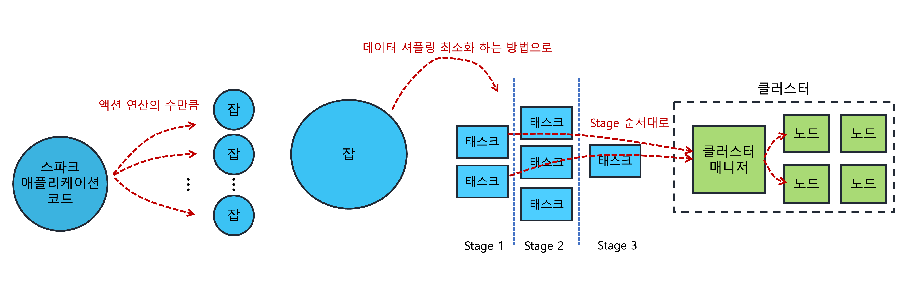

---
**Table of Contents**
{: #toc }
*  TOC
{:toc}

---
# 클러스터 환경
**스파크는 본질적으로 분산처리 프레임워크**입니다. 그래서 단순히 테스트를 위한 용도로는 단일 로컬 서버만으로도 가능하지만, 실제 배포 단계에서 스파크를 제대로 활용하기 위해서는 여러 대의 서버를 이용한 클러스터 환경을 구축할 필요가 있습니다.  

클러스터란 여러 대의 서버가 네트워크를 통해 연결되어 마치 하나의 서버인 것처럼 동작하는 방식을 의미합니다. 하지만 여러 서버들을 이 같은 방식으로 동작시키는 것은 쉬운 일이 아닙니다. 그래서 스파크에서는 전체 서버의 자원과 동작을 세밀하고 효율적으로 제어할 수 있는 별도 모듈이 필요한데, 이를 **클러스터 매니저**라고 합니다.  

스파크에서는 자체 구현한 클러스터 매니저도 제공하고 외부 클러스터 매니저를 임포트해서 사용할 수도 있습니다. 이렇게 여러 종류의 클러스터 매니저를 지원하게 되면 선택의 폭이 넓어진다는 장점도 있긴 하지만 클러스터 매니저마다 동작 방식이나 용어가 다르면 혼동이 될 수 있습니다. 스파크에서는 이런 혼란을 없애고자 추상화된 클러스터 모델을 제공함으로써 사용하는 클러스터의 종류에 관계없이 일관된 방법으로 프로그램을 작성하고 클러스터를 관리할 수 있게 해줍니다. 

내용에 들어가기 전에 한 가지 알아둘 것은 클러스터 환경이라고 해서 로컬 환경에서 사용하던 스파크 애플리케이션 **코드를 새로 작성해야 할 필요는 없습니다.** 다만 클러스터 환경에서는 여러 서버를 마치 하나의 서버인 것처럼 다뤄야 하기 때문에 하나의 작업을 여러 서버에 분산해서 실행하고 그 결과를 취합할 수 있는 **분산 작업 관리 기능이 추가**되어야 할 것입니다.  

따라서 이번 포스트의 목적은 **분산처리를 위한 시스템 아키텍처를 이해**하고, 이를 구현하기 위해 **필요한 설정과 매개변수를 이해**하는 것입니다.  

# 스파크의 분산처리 아키텍처  

아래 그림은 분산처리를 위한 스파크의 전형적인 아키텍처입니다.  

  

보시다시피 클러스터 매니저는 가운데에서 분산처리를 위한 매니저 역할을 하고 있습니다. 각각의 컴포넌트에 대한 설명은 [**앞의 포스트**](https://jaykim0510.github.io/spark-series1)에서 다룬 적이 있음으로 여기서는 간단하게만 요약하도록 하겠습니다.  

- **드라이버 프로그램**: 스파크 컨텍스트를 생성하고 클러스터 매니저와 연결시켜주는 프로그램
- **스파크 컨텍스트**: 클러스터와 연결되는 객체로 스파크 애플리케이션 코드를 작성하는데 필요한 거의 모든 기능을 제공
- **클러스터 매니저**: 워커 노드를 모니터링하며 최적의 자원(CPU, 메모리) 할당
- **워커 노드**: 분산된 데이터를 할당받고 요청된 작업을 처리하는 서버
- **익스큐터**: 작업을 수행하기 위해 스파크에서 실행하는 프로세스, 자원할당 단위
- **잡(Job)**: 액션 연산의 수
- **태스크**: 잡을 적당한 단위로 나누어 실제로 익스큐터에 할당하는 작업 단위

스파크 클러스터는 이와 같이 드라이버, 클러스터 매니저, 워커 노드의 조합으로 구성됩니다. 여기서 실행 모드, 클러스터 매니저의 종류에 따라 약간의 다른 점이 있지만 큰 맥락에서는 같습니다.  

실행 모드의 경우 두 가지가 있습니다. 클러스터 모드, 클라이언트 모드입니다.

  

두 모드 가운데 어떤 것을 선택하든 수행 결과는 동일합니다. 하지만 **클러스터 모드의 경우** 드라이버 프로그램과 익스큐터 간의 네트워크 비용이 상대적으로 낮아져서 **성능 향상**을 기대할 수 있습니다. 하지만 스파크 셸과 같은 인터랙티브 환경을 이용한 **디버깅이 어려워**서 정형화된 작업에만 주로 사용하고, **클라이언트 모드의 경우** 사용성이 **편리**하지만 드라이버 프로그램과 워커 노드가 네트워크 상에서 너무 많이 떨어져 있으면 전체적인 성능에 영향을 줄 수 있으므로 **가급적 동일 네트워크 상에 존재하는 서버로 선택**하는 것이 좋습니다.  

클러스터 매니저에 대해서는 다음 포스트에서 조금 더 자세히 다루도록 하겠습니다.  

# 스파크 애플리케이션 동작 순서
지금까지 스파크의 클러스터 환경에서 갖게되는 아키텍처와 컴포넌트에 대해 살펴봤습니다. 지금부터는 아키텍처에서 실제로 스파크 애플리케이션이 구동되는 과정을 살펴보도록 하겠습니다.

1. 가장 먼저 스파크 애플리케이션 코드를 작성합니다. 이 때 코드에는 스파크컨텍스트를 생성하는 드라이버 프로그램이 포함돼 있어야 합니다.  
2. 작성한 코드를 빌드하고 관련 라이브러리와 함께 `jar`나 `zip` 파일 등으로 패키징합니다.  
3. 패키지 파일을 스파크에서 제공하는 `spark-submit` 셸 스크립트를 이용해 클러스터에 배포하고 실행합니다.
4. 코드에 있는 드라이버 프로그램이 실행되고 스파크컨텍스트가 클러스터 매니저와 연동되어 워커 노드에 익스큐터를 생성합니다.
5. 드라이버 프로그램은 작성된 코드에서 액션 연산의 수만큼 잡(Job)을 생성합니다.
6. 잡(Job)을 셔플링이 가장 적게 일어나는 방법으로 스테이지를 나누고 각 스테이지 단계를 여러 개의 태스크로 나눕니다.
7. 태스크를 익스큐터에 적절히 분배하여 분산 처리합니다.

  

# 참고  
- [빅데이터 분석을 위한 스파크2 프로그래밍 책](http://www.kyobobook.co.kr/product/detailViewKor.laf?ejkGb=KOR&mallGb=KOR&barcode=9791158391034&orderClick=LEa&Kc=){:target="_blank"}
- [What is SparkContext? Explained](https://sparkbyexamples.com/spark/spark-sparkcontext/){:target="_blank"}