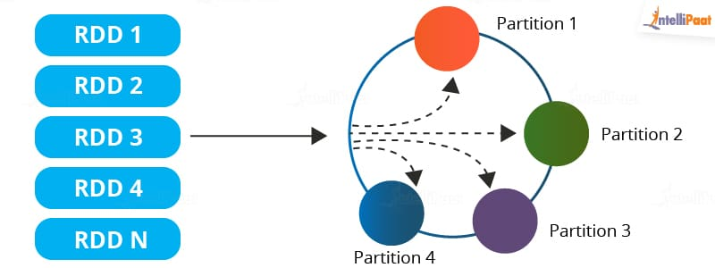
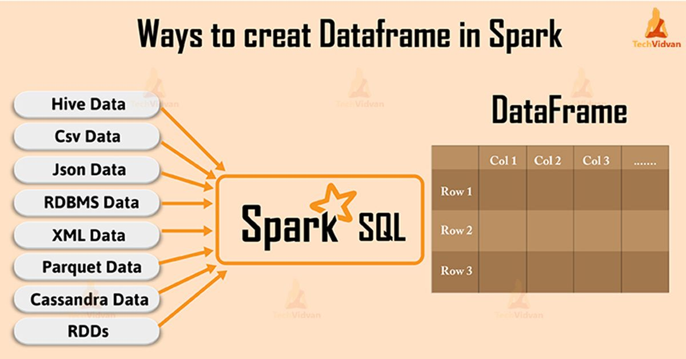
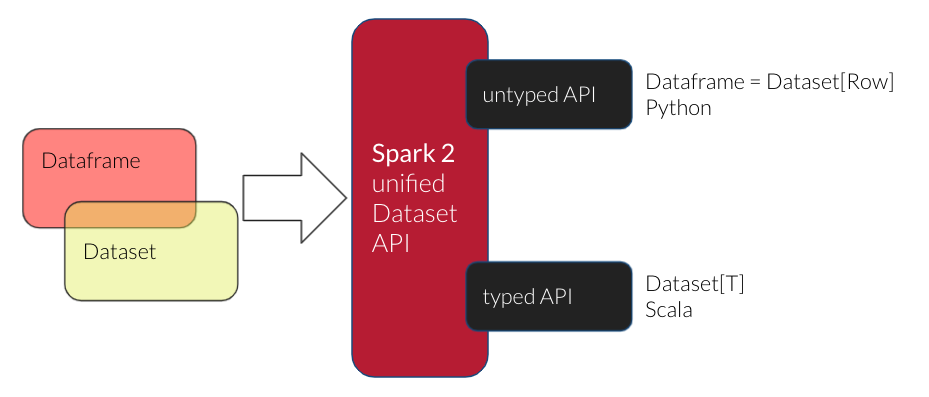

---

**Table of Contents**
{: #toc }
*  TOC
{:toc}

---

# RDD, Dataframe, Dataset

## RDD  

  

Spark Core에 RDD가 있다면 Spark SQL에는 Dataframe과 Dataset이 있습니다. 기존의 RDD를 이용해 스파크 애플리케이션 코드를 작성할 때에는 RDD가 가지고 있는 메서드나 특성을 알아야지만 코드를 작성할 수 있었습니다. 그래서 RDD에 대한 이해도가 높아야 분산 환경에서 높은 처리 성능을 이끌어 낼 수 있었습니다.  

## Dataframe

  

그러던 중 Spark 1.3버전에서 Dataframe이라는 새로운 데이터 모델이 공개되었습니다. Dataframe은 개발자들에게 친숙한 SQL과 비슷한 방식으로 작성할 수 있도록하는 API를 제공해 진입 장벽을 낮췄으며 코드의 가독성 또한 높여주었습니다. Dataframe도 마찬가지로 low-level에서는 RDD로 코드가 동작하는데 Spark SQL은 내부적으로 Catalyst Optimizer를 통해 최적의 RDD 코드로 변환됩니다. 따라서 쉬운 코드 작성과 높은 성능을 모두 얻게되었습니다.  

그러나 Dataframe에도 아쉬운 점이 있었는데, 바로 RDD에서 가능했던 컴파일 타임 오류 체크 기능을 사용할 수 없다는 점이었습니다.  

## Dataset
Spark 1.6버전에서 RDD의 장점과 Dataframe의 장점을 합친 새로운 데이터 모델인 Dataset이 등장했습니다.  

그리고 Spark 2.0 이후부터는 Dataframe이 Dataset 안에 포함되었습니다.  

```sh
# 데이터셋은 데이터를 처리할 때 데이터의 타입을 있는 그대로 활용할 수 있습니다.
데이터셋: Dataset[String], Dataset[Int]

# 데이터프레임은 데이터를 처리할 때 데이터 타입을 무조건 org.apache.spark.sql.Row로 감싸줘야 합니다.
데이터프레임: Dataset[Row]
```

  

이렇게 Dataframe은 원래 데이터가 가지고 있던 타입의 특성은 사용하지 않기 때문에 Dataframe API은 비타입 트랜스포메이션 연산(untyped operations)으로 분류됩니다.  

|**데이터 모델**|**사용 가능한 연산**|
|Dataframe|기본 연산, 액션 연산, 비타입 트랜스포메이션 연산|
|Dataset|기본 연산, 액션 연산, 타입 트랜스포메이션 연산|

저는 파이썬을 주언어로 사용하고 있으며 파이썬 언어는 Dataframe API만 제공하기 때문에 이번 포스트에서는 액션 연산과 비타입 트랜스포메이션 연산에 대해서만 다루도록 하겠습니다.  

# Dataframe

## Dataframe 생성
Dataframe은 SparkSession을 이용해 생성합니다. 생성 방법은 **파일이나 데이터베이스와 같은 스파크 외부**에 저장된 데이터를 이용할 수도 있고, **스파크 내에서의 RDD나 Dataframe**을 이용해 새로운 Dataframe을 생성할 수도 있습니다.  

**외부 데이터 소스**  

파일이나 데이터베이스같은 외부 저장소의 데이터를 읽어와서 Dataframe을 생성할 때는 SparkSession의 `read()`메소드를 이용하면 됩니다. `read()`메소드는 DataFrameReader 인스턴스를 생성하고 이를 이용해 다양한 유형의 데이터를 읽고 Dataframe을 생성할 수 있습니다.  

```py
from pyspark.sql import SparkSession

spark = SparkSession.builder.appName("sample").master("local[*]").getOrCreate()

df = spark.read.format("json").option("allowComments", "true").load("<spark_home_dir>/test.json")  
```

전체적인 생성 과정은 크게 다음과 같습니다.  

```
1. Spark Session의 read() 메소드를 호출해 DataFrameReader 인스턴스 생성
2. format() 메소드로 데이터소스의 유형을 지정
3. option() 메소드로 데이터소스 처리에 필요한 옵션을 지정
4. load() 메소드로 대상 파일을 읽고 데이터프레임을 생성
```

다음은 DataFrameReader가 제공하는 주요 메소드입니다.  

```
- format()
    읽어들이고자 하는 데이터 소스의 유형을 문자열로 지정("kafka", "csv", "json", "parquet", "text" 등)
    이 밖에도 지원하지 않는 데이터소스는 라이브러리를 클래스패스에 추가해서 사용할 수 있습니다

- option/options()
    데이터소스에 사용할 설정 정보를 지정
    데이터소스에  따라 다름

- load()
    데이터소스로부터 실제 데이터를 읽어서 Dataframe을 생성

- json()
    JSON 형식을 따르는 문자열로 구성된 파일이나 RDD로부터 Dataframe 생성

- parquet()
    파케이 형식응로 작성된 파일을 읽어서 Dataframe 생성

- text()
    일반 텍스트 형식으로 작성된 파일을 읽어서 Dataframe 생성

- csv()
    CSV 파일을 읽어 Dataframe 생성 
```

**RDD, Dataframe**  

```py
from pyspark.sql import SparkSession

spark = SparkSession.builder.appName("sample").master("local[*]").getOrCreate()

row1 = Row(name="kim", age=20, job="student")
row2 = Row(name="mike", age=17, job="student")

data = [row1, row2]

df = spark.createDataFrame(data)
```

## 기본 연산
- persist()
- printSchema()
- columns
- dtypes
- createOrReplaceTempView()
- explain()  


## 액션 연산
- show()
- head()
- take()
- count()
- describe()  


## 비타입 트랜스포메이션 연산

**Dataframe에서 제공하는 비타입 트랜스포메이션 연산**  
- select()
- filter()
- agg()  
- orderBy()
- groupBy()
- withColumn()

**org.apache.spark.Column에서 제공하는 비타입 트랜스포메이션 연산**  

- !==, ===
- alias()
- isin()
- when()
- like()

**org.apache.spark.sql.functions에서 제공하는 비타입 트랜스포메이션 연산**  

(왜 트랜스포메이션이지?)

- max(), mean(), sum()
- count(), countDistince()
- explode()
- when()
- col()
- lit()


## 함수가 아닌 SQL문

- createOrReplaceTempView()

# 참고
- [빅데이터 분석을 위한 스파크2 프로그래밍 책](http://www.kyobobook.co.kr/product/detailViewKor.laf?ejkGb=KOR&mallGb=KOR&barcode=9791158391034&orderClick=LEa&Kc=){:target="_blank"}
- [loustler, [Apache Spark] Spark RDD, Dataframe and DataSet](https://loustler.io/data_eng/spark-rdd-dataframe-and-dataset/){:target="_blank"}
- [Apache Spark 공식문서: Spark SQL on PySpark](https://spark.apache.org/docs/latest/api/python/reference/pyspark.sql.html){:target="_blank"}